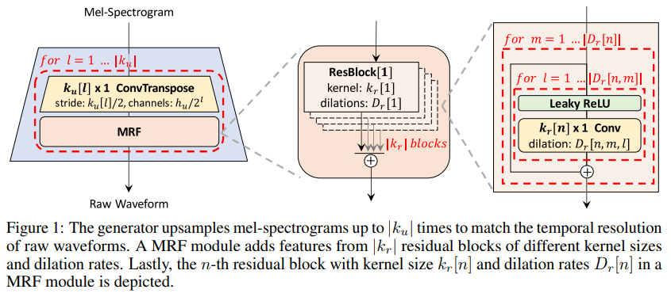
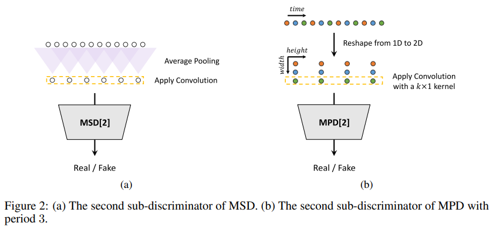
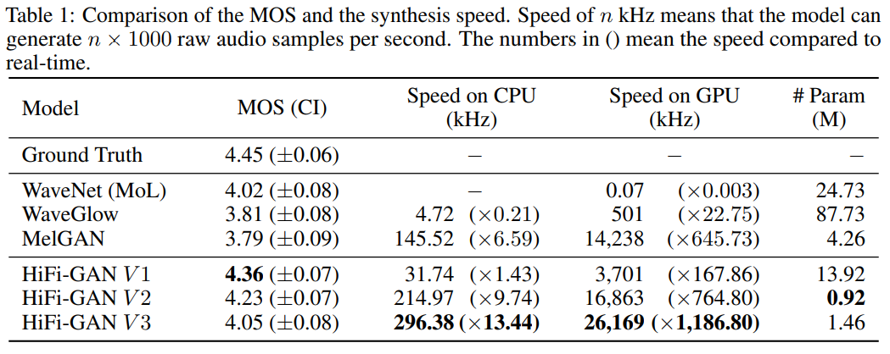
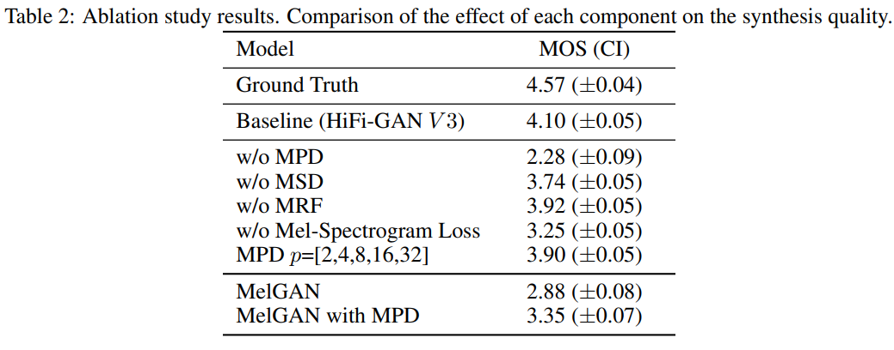
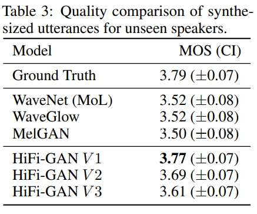
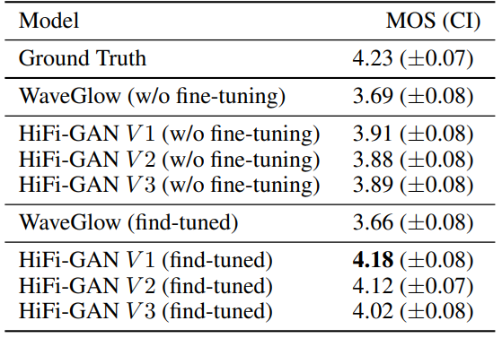

# HiFi-GAN

HiFi-GAN은 이름에서 유추가 가능하듯 GAN기반의 Vocoder이다. WaveGlow보다 빠르면서도 더 좋은 품질의 raw audio를 만들 수 있다.

크게 보면 여느 GAN과 마찬가지로 Generator와 Discriminator로 구성되어있다. Generator는 그 구조가 간단하며 특별하지 않다. HiFi-GAN의 차별점은 사실상 Discriminator와 이에 대한 Loss구성에 있다.

HiFi-GAN의 Discriminator는 Multi-Period Discriminator(MPD)와 Multi-Scale Discriminator(MSD) 두개로 이루어진다. 각각은 disjoint sample, smoothed waveform을 담당한다.

Generator부터 자세하게 살펴보자.

## Generator

Generator는 기본적으로 Mel-spectrogram을 input으로 받아 Raw Waveform을 output하며 전부 Convolutional layer로 이루어져있다.

inference를 위해서는 Generator에 Mel-spectrogram을 넣으면 된다.

### ConvPre

아키텍쳐에는 없지만 원래 `(batch_size, n_mels, sequence_length)`의 shape을 가지는 Mel-spectrogram을 `(batch_size, upsample_initial_channel(512), sequence_length)`의 shape으로 바꾸는 conv가 하나 있다.

### Upsample

WaveGlow와 마찬가지로 sequence_length를 매칭되는 raw audio의 sequence_length와 같게 맞춰주는 작업이다. (`ConvTranspose1d`사용.) 한번에 수행하지는 않고 MRF와 번갈아 가며 수행한다. 이 때 채널 수는 layer를 지날 때 마다 절반씩 줄어든다.

### MRF

여러개의 Residual Block으로 이루어져있다.  
하나의 Residual Block안에는 dilation이 있는 conv layer들이 있고 마지막에는 Leaky ReLU를 사용한다.

### ConvPost

generator는 최종적으로 Raw Waveform을 만들어야하기 때문에 채널 수를 1로 만들어주는 과정이 필요하다. ConvPost는 `Conv1d`를 이용하여 해당 작업을 수행한다. (**ConvPre**와 마찬가지로 아키텍쳐 그림에는 없다.)

## Discriminator

앞서 말했듯 Discriminator는 Multi-Period Discriminator(MPD)와 Multi-Scale Discriminator(MSD) 두가지가 있다. 그리고 각각은 또다시 작은 sub-discriminator로 이루어져있다. MPD와 MSD는 각각 5개와 3개의 sub-discriminator를 가진다.

MSD와 MPD의 sub-discriminator 중 하나를 그림으로 보면 아래와 같다.

기본적으로 Discriminator는 true raw audio와 generated raw audio를 받아 진위여부를 확인한다. Mel-spectrogram을 input으로 받지 않는다는 것을 염두에 두고 내용을 살펴보자.

### Multi-Period Discriminator (MPD)

오른쪽에 있는 MPD부터 살펴보자.

우선 1d array형태인 raw audio를 (width x height)의 2d형태로 reshape한다. 이 때 height만을 결합하는 형태의 `Conv2d`(`kernel_size=(k, 1)`)를 사용한다. 이렇게하면 연속적인 내용을 학습하기보단 주기적인(periodic) 내용을 학습할 수 있다.

MPD는 5개의 sub-discriminator로 이루어져 있는데 각각이 input으로 받는 2d array는 width가 [2, 3, 5, 7, 11]로 다 소수이다. 이는 주기를 최대한 다양하게 포착하기 위함이다.

### Multi-Scale Discriminator (MSD)

MPD의 sub-discriminator는 각각 disjoint sample만을 받기 때문에, 오디오 시퀀스를 연속적으로 evaluate하기 위해 MSD가 필요하다.

MSD는 각각 다른 input scale에 대해 작동하는 세개의 sub-discriminator들로 구성된다. (각각 raw audio, ×2 average-pooled audio, ×4 average-pooled audio에 대해 작동한다.) 각각의 sub-discriminator는 stride와 group을 적용한 `Conv1d`와 leaky ReLU로 이루어져있다.

## Loss

대부분 GAN의 Loss는 크게 Discriminator Loss와 Generator Loss 두가지로 나뉜다.

Discriminator Loss는 Discriminator가 true와 generated를 얼마나 잘 구분하는지, Generator Loss는 Generators가 만든 것을 Discriminator가 얼마나 true라고 생각하는지라고 생각하면 이해하기 쉽다.

자세히 살펴보자.

### Discriminator Loss

Discriminator Loss는 간단하다.

$$
\mathcal{L}_{D} = \mathcal{L}_{Adv}(D;G)
$$

#### GAN Loss (For Discriminator)

$$
\mathcal{L}_{Adv}(D;G) = \mathbb{E}_{(x,s)}\Bigg[ (D(x)-1)^2 + (D(G(s)))^2 \Bigg]
$$

수식을 한글로 풀어 써보자면.

true raw audio를 Discriminator가 true라고 생각하는 정도 + generated raw audio를 Discriminator가 fake라고 생각하는 정도.

### Generator Loss

HiFi-GAN의 Generator Loss는 세가지 파트로 나뉜다.  
GAN Loss (For Generator), Feature Matching Loss, Mel-Spectrogram Loss.

$$
\mathcal{L}_{G} = \mathcal{L}_{Adv}(G;D) + \lambda_{fm}\mathcal{L}_{FM}(G;D) + \lambda_{mel}\mathcal{L}_{Mel}(G)
$$

$\lambda_{fm}$과 $\lambda_{mel}$는 hyperparameter로 논문에서는 각각 2와 45를 사용했다.

#### GAN Loss (For Generator)

$$
\mathcal{L}_{Adv}(G;D) = \mathbb{E}_{s}\Bigg[ (D(G(s)) - 1)^2 \Bigg]
$$

where $s$ denotes the input condition, the mel-spectrogram of the ground truth audio.

역시나 한글로 풀어보자면 다음과 같다.

Generator가 Mel-spectrogram을 input으로 받아 생성한 generated raw audio를 Discriminator가 true raw audio라고 생각하는 정도.

#### Feature Matching Loss

$$
\mathcal{L}_{FM}(G;D) = \mathbb{E}_{(x,s)}\Bigg[ \sum_{i=1}^T \dfrac{1}{N_i} \| D^i(x) - D^i(G(s)) \|_1 \Bigg]
$$

where $T$ denotes the number of layers in the discriminator; $D^i$ and $N_i$ denote the features and the number of features in the $i$-th layer of the discriminator, respectively.

true raw audio와 generated raw audio에 대해 모든 Discriminator layer의 output이 얼마나 비슷한지.

#### Mel-Spectrogram Loss

$$
\mathcal{L}_{Mel}(G) = \mathbb{E}_{(x,s)}\Bigg[ \| \phi(x) - \phi(G(s)) \|_1 \Bigg]
$$

where $\phi$ is the function that transforms a waveform into the corresponding mel-spectrogram.

true raw audio를 Mel-spectrogram으로 변환한 것과 Generator가 생성한 raw audio를 Mel-spectrogram으로 변환한 것이 얼마나 비슷한지.

### Final Loss

다시한번 정리하면 다음과 같다.

$$
\begin{align*}
& \mathcal{L}_{D} = \sum_{k=1}^K \mathcal{L}_{Adv}(D_k;G) \\
& \\
& \mathcal{L}_{G} = \sum_{k=1}^K \Bigg[ \mathcal{L}_{Adv}(G;D_k) + \lambda_{fm}\mathcal{L}_{FM}(G;D_k) \Bigg] + \lambda_{mel}\mathcal{L}_{Mel}(G)
\end{align*}
$$

where $D_k$ denotes the $k$-th sub-discriminator in MPD and MSD

## Experiment

WaveNet, WaveGlow, MelGAN 세가지와 Ground Truth 그리고 HiFi-GAN의 3가지 버전의 모델에 대해 MOS를 비교한다.

HiFi-GAN의 3가지 버전은 hyperparameter들의 수정으로 이루어진다.

### Audio Quality and Synthesis Speed

HiFi-GAN의 모든 variation이 기존의 다른 vocoder들에 비해 속도도 빠르고 MOS도 높다.

### Ablation Study

MPD, MSD, MRF, Mel-spectrogram loss, MPD의 width에 소수 사용.  
위 다섯가지에 대해 Ablation Study를 진행했고 모두 효과가 있었음을 확인했다.

### Generalization to Unseen Speakers

딥러닝 기반 vocoder는 기본적으로 모든 화자 데이터를 이용하여 학습하는 것은 아니기 때문에 학습에 쓰이지 않은 화자에 대한 테스트 또한 필요하다.

HiFi-GAN은 Unseen Speakers에 대해 generalize가 잘 되었음을 확인했다.

### TTS

Text to Mel-spectrogram & Mel-spectrogram to Waveform의 전체 프로세스에 HiFi-GAN을 적용했을 때의 실험결과 또한 공유한다. Text to Mel-spectrogram에는 전혀 수정하지 않은 [Tacotron2](https://arxiv.org/pdf/1712.05884.pdf)를 사용하며 HiFi-GAN과의 비교대상은 WaveGlow이다.

훈련된 HiFi-GAN을 이용하여 Tacotron2가 output한 Mel-spectrogram을 Waveform으로 바꾸었을 때는 Ground Truth와 MOS가 상당히 많이 차이난다. 이는 Tacotron2가 output한 Mel-spectrogram 자체가 noisy하기 때문이다. 이를 개선하기 위해 Tacotron2가 output한 Mel-spectrogram과 원래의 Ground Truth Waveform을 이용하여 fine-tuning을 진행하였고 그 결과 상당히 만족할만한 결과를 얻을 수 있었다고 한다.
