# VITS (Conditional Variational Autoencoder with Adversarial Learning for End-to-End Text-to-Speech)

VITS는 Glow-TTS와 HiFi-GAN이 결합된 모델로 둘을 한번에 훈련하기 위한 방법으로 VAE를 제안한다. (본 문서는 [Glow-TTS](https://ta.wiki.42maru.com/doc/glow-tts-9ssnf4o6yq), [HiFi-GAN](https://ta.wiki.42maru.com/doc/hifi-gan-iJ9dtiuF5j), [VAE](https://ta.wiki.42maru.com/doc/about-autoencoder-2Nvglo0kqN)를 이해하고 있다는 전제 하에 작성되었다.) 또한 Glow-TTS의 Deterministic Duration Predictor보다 성능이 좋은 Stochastic Duration Predictor를 추가로 소개한다.

## Architecture

전체 아키텍쳐를 보고 세부적으로 하나씩 뜯어보며 접근하도록 하자.

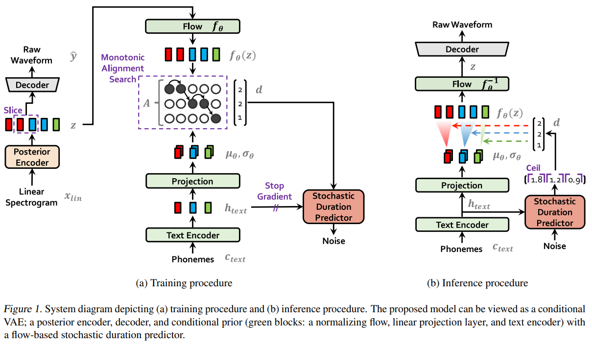

Generative Model 인 만큼 Training 과정과 Inference 과정이 다르다.

## Training

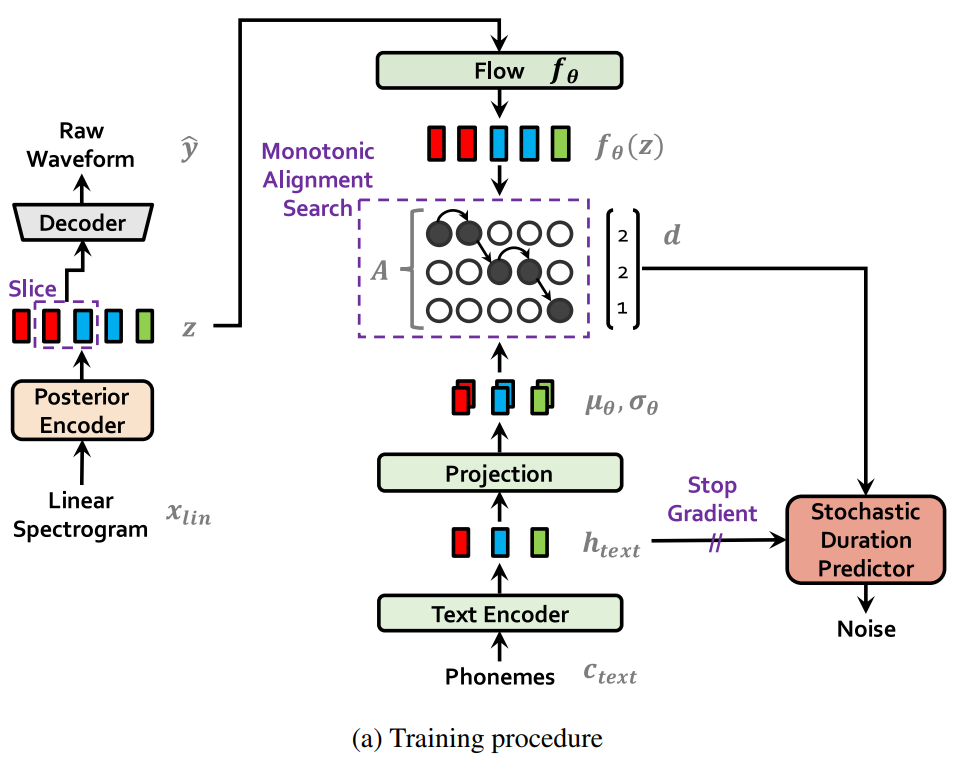

VITS는 GAN, VAE, Flow 세가지의 Generative model을 모두 사용한다.

우선은 Traning 과정에서 어떤 부분이 VAE인지, 어떤 부분이 GAN인지, 어떤 부분이 Flow인지부터 살펴보자.

### VAE

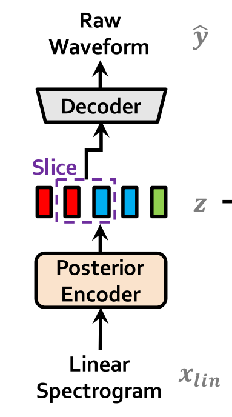

위 부분이 VAE이다. Ground Truth Waveform의 Linear Spectrogram을 latent variable $z$로 만들었다가 다시 Raw Waveform으로 복원하는 것에 초점이 있다.

VITS는 TTS sample의 High resolution을 위해 Mel Spectrogram대신 Linear Spectrogram을 input으로 사용한다.

### GAN

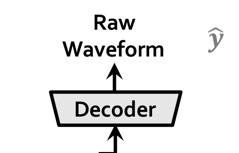

여기 Decoder가 HiFi-GAN의 Generator이다. 생성된 Raw Waveform을 Mel-Spectrogram으로 변환한 것과 원래의 Ground Truth를 Mel-Spectrogram으로 변환한 것을 구분하도록 Discriminator는 훈련된다.

### Flow-based Generative Model

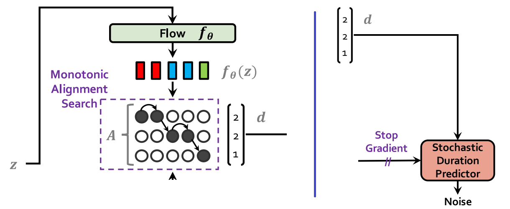

Flow는 두개의 부분에 적용되었다. 위 그림의 파란 선 기준 왼쪽 부분은 Glow-TTS와 똑같다. 하지만 한가지 큰 차이점이 있는데. 바로 VAE의 latent variable인 $z$를 생성하도록 훈련된다. 이때 Flow의 latent variable을 똑같이 $z$로 표기하면 오해가 있을 수 있기 때문에 논문에서는 $f_{\theta}(z)$로 표기한다.

파란 선 기준 오른쪽 부분은 Stochastic Duration Predictor이다. 아키텍쳐 그림만으로는 판단하기 힘들지만 Stochastic Duration Predictor에도 Flow가 적용되었다.

## Loss

Architecture와 마찬가지로 Loss도 전체 구성을 먼저 보고 세세하게 짚도록 하자.

Adversarial Training을 해야하기 때문에 Loss는 Discriminator Loss와 그 대척점에 있는 Loss(통상 Generator Loss라고 칭하는 Loss) 두가지로 나뉜다. 이 중 후자는 VAE의 모든 Loss를 포함하는 형태이며, 논문에서는 Final VAE Loss라는 이름으로 표기한다. (Generator Loss라는 명칭을 사용하면 HiFi-GAN의 Generator Loss와 혼동을 유발하니 이 뒤로 본 문서에서 Generator Loss라는 단어는 HiFi-GAN의 Generator Loss만을 의미한다.)

### Discriminator Loss

훨씬 간단한 Discriminator Loss부터 살펴보자. HiFi-GAN의 Discriminator Loss를 그대로 사용한다. Discriminator는 생성된 Raw Waveform과 원래의 Ground Truth Raw Waveform을 구분하도록 훈련된다. 이 과정에서 Fake는 0, Real은 1로 예측하도록 Loss를 구성한다.

$$
L_{adv}(D) = \mathbb{E}_{(y, z)}\Big[ (D(y)-1)^2 + (D(G(z)))^2 \Big]
$$

### Final VAE Loss (Generator Loss)

VAE의 Reconstruction Loss와 KL Divergence, Glow-TTS의 Duration Loss, HiFi-GAN의 Generator Loss를 모두 결합한 형태이다. 수식으로 보면 다음과 같다.

$$
L_{vae} = L_{recon} + L_{kl} + L_{dur} + L_{adv}(G) + L_{fm}(G)
$$

#### Generator Loss

우선 $L_{adv}(G)$와 $L_{fm}(G)$는 HiFi-GAN과 같으므로 간단하게 수식만 보고 넘어간다.

$$
\begin{align*}
& L_{adv}(G) = \mathbb{E}_z \Big[ (D(G(z))-1)^2 \Big]  \\
& L_{fm} = \mathbb{E}_{(y, z)} \Big[ \sum_{l=1}^{T} \dfrac{1}{N_l} || D^l(y) - D^l(G(z)) ||_1 \Big]
\end{align*}
$$

#### Reconstruction Loss

HiFi-GAN 논문의 Generator Loss 중 Mel-Spectrogram Loss와 완벽히 일치한다. 하지만 VAE 관점에서는 Reconstruction Loss에 해당하므로 Reconstruction Loss라고 부르도록 하자. 수식은 다음과 같다.

$$
L_{recon} = || x_{mel} - \hat{x}_{mel} ||_1
$$

Generate된 Raw Waveform과 Ground Truth Raw Waveform을 둘 모두 Mel-Spectrogram으로 변환하고 둘 사이의 element-wise L1 Loss를 계산한다. Mel-Spectrogram의 각 element들이 [Laplace Distribution](https://en.wikipedia.org/wiki/Laplace_distribution)을 따름을 가정했을 때 Likelihood를 Maximize한다.

#### KL Divergence

$$
KL(q_{\phi}(z|x) || p(z))
$$

위 수식은 보통 VAE에서 흔하게 표기하는 KL Divergence 항이다. $p(z)$(Generate를 위한 값)와 $q_{\phi}(z|x)$(VAE의 Encoder로 Encoding된 값)가 비슷하길 바란다는 관점에서 바라보자.

Text가 주어졌을 때의 Raw Waveform을 생성해야하는 Conditional VAE인 현재의 Task에서 위의 $p(z)$와 $q_{\phi}(z|x)$는 각각 $p_{\theta}(z|c_{text}, A)$, $q_{\phi}(z|x_{lin})$과 대응된다. ($A$는 Glow-TTS에서의 Alignment Function과 같다.)

따라서 현재 Task에서의 KL Divergence 수식은 다음과 같다.

$$
L_{kl} = \log q_{\phi}(z|x_{lin}) - \log p_{\theta}(z|c_{text}, A)
$$

#### Duration Loss

앞서 말했듯 VITS의 Duration Predictor는 Glow-TTS의 Duration Predictor와 구조가 다르다. VITS의 Duration Predictor는 Flow-based Generative Model이므로 명시적인 Negetive Log-Likelihood를 Loss로 사용한다. (수식은 다른 Flow-based Generative Model과 다르지 않으므로 생략.) Stochastic Duration Predictor는 뒷부분에서 추가적으로 설명한다.

## Training Detail

여기까지 이해가 됐다면 전체적인 Training 구조는 눈에 들어올 것이다.  
이제 Architecture의 각 부분들의 세부적인 요소를 살펴보자. 대부분의 구조를 Glow-TTS와 HiFi-GAN에서 그대로 가져왔기 때문에 자세한 내용은 크게 다르지 않다.

### Posterior Encoder

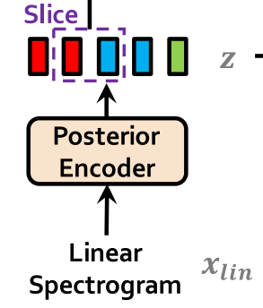

VAE의 Encoder라고 생각하면 편하다. Linear Spectrogram으로부터 $\mu, \sigma$를 뽑아내고 reparametrize를 통해 $z$를 생성한다.

Layer 구조는 각종 `Conv1d`들의 집합이다. 이 과정에서 seq_len은 바뀌지 않고 channel 수는 조정된다.

### Decoder

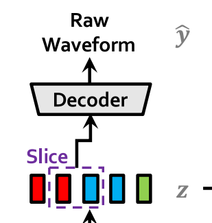

HiFi-GAN의 Generator와 같다. MRF(Multi Receptive Field)형태를 취하고 있다.

다만 큰 차이가 하나 있는데 HiFi-GAN에서 Generator가 받는 input은 Mel-Spectrogram이었다면 VITS에서는 VAE의 latent variable $z$이다. 이를 input으로 받아 Raw Waveform을 생성한다.

좀 더 구체적인 구조가 궁금하다면 [HiFi-GAN - MRF](https://ta.wiki.42maru.com/doc/hifi-gan-iJ9dtiuF5j#h-mrf-multi-receiptive-field) 참고.

### Flow

Flow는 invertible이라는 제약조건이 붙은만큼 그 구조가 비슷하다. 평범한 Affine Coupling Layer 들의 연속으로 Glow-TTS보다도 단순한 구조를 가지고있다.

### Text Encoder and Projection

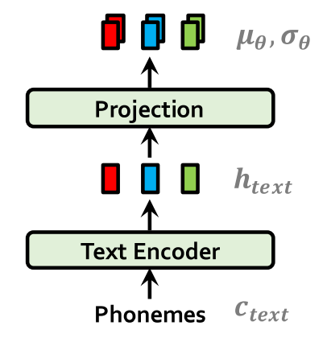

Glow-TTS와 똑같은 구조이다.

TextEncoder는 Transformer Encoder의 구조를 따왔으며 MultiHeadAttention - LayerNorm - Conv1d - LayerNorm의 형태이다. 이를 통해 Text를 Encoding한다.

Projection은 `kernel_size=1`의 Conv1d이다. 이를 통해 $\mu, \sigma$를 뽑는다.

### MAS (Monotonic Alignment Search)

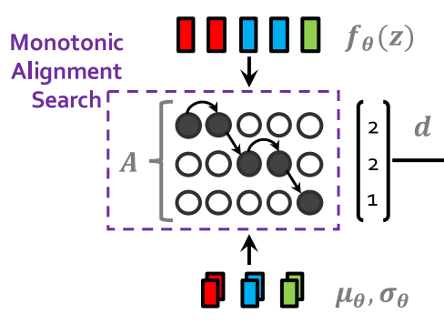

Glow-TTS의 MAS를 그대로 따온 구조이다.  
하지만 Glow-TTS와 VITS의 objective function이 다르기 때문에 차이가 하나 발생한다. 

Glow-TTS는 $z_j$에 대해 $\mu_{A(j)}, \sigma_{A(j)}$ ($A(j) = i$)를 따를 때의 Likelihood를 Maximize하는 방향으로 $\hat{A}$를 업데이트 해 나갔다.  
하지만 VITS의 objective function은 명시적인 Likelihood가 아니라 ELBO이다. 따라서 Glow-TTS의 방식을 똑같이 따르되, ELBO를 Maximize하는 방향으로 $\hat{A}$를 업데이트 해 나간다.

사실 ELBO를 Maiximize한다는 것은 곧 Likelihood를 Maximize하는 것과 같기 때문에 계산 식만 달라질 뿐 MAS의 결과는 다르지 않다.

$$
\begin{align*}
& \argmax_{\hat{A}} \log p_{\theta}(z | c_{text}, \hat{A}) \\
=& \argmax_{\hat{A}} \log p_{\theta}(x_{mel} | z) - \log \dfrac{q_{\phi}(z | x_{lin})}{p_{\theta}(z | c_{text}, \hat{A})} \\
=& \log \mathcal{N}(f_{\theta}(z) ; \mu_{\theta}(c_{text}, \hat{A}), \sigma_{\theta}(c_{text}, \hat{A}))
\end{align*}
$$

### Stochastic Duration Predictor (SDP)

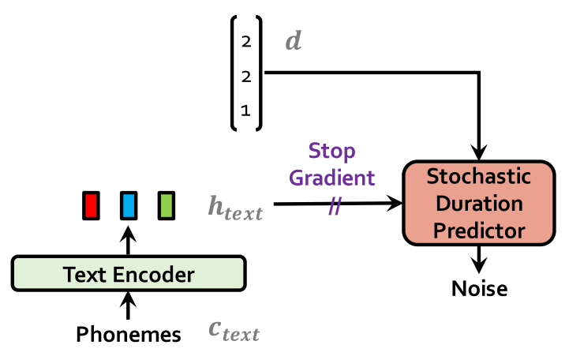

Glow-TTS의 Deterministic Duration Predictor (DDP)는 input text에 따라 Duration이 하나로 정해지기 때문에 다양한 발화의 길이나 속도, 리듬 등을 생성해낼 수 없었다. 하지만 Stochastic Duration Predictor (SDP)는 DDP와 다르게 Noise를 통한 Duration의 다양성을 실현할 수 있게 해준다.

Text Encoder로 Encoding 된 Text를 이용하여 MAS에서 추정된 Duration 값을 output하도록 설계되어 있는 것은 DDP와 같다. 하지만 SDP는 Flow를 사용한다. 내부 구조는 매우 복잡하지만 결국은 Text를 condition, Duration을 $x$로 받아 $\mathcal{N}(0, I)$를 따르는 $z$를 만든다는 Flow의 틀에서 벗어나지 않는다.

좀 더 자세한 구조는 아래와 같다.

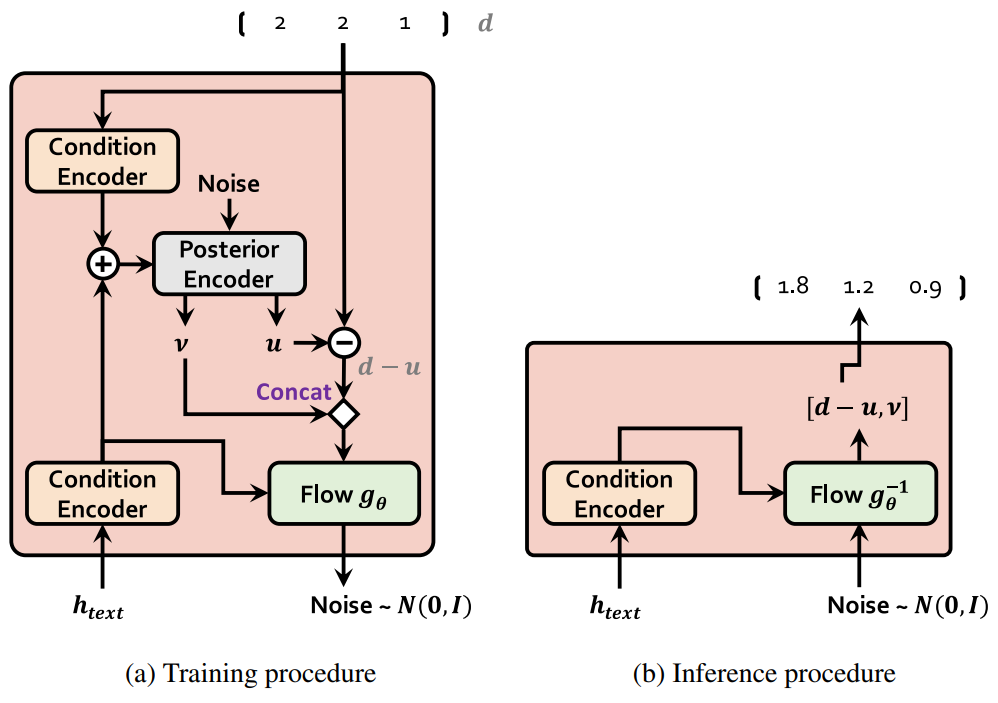

Inference시에는 Text Encoder로 Encoding된 Text를 condition으로 이용하여 $\mathcal{N}(0, I)$에서 sampling한 Noise를 통해 Duration을 생성하게 된다.

### Discriminator

아키텍쳐 그림에는 등장하지 않지만 당연하게도 Discriminator가 있다. HiFi-GAN의 Discriminator보다 간소화된 형태를 띄고있다.

HiFi-GAN의 Discriminator는 5개의 MPD(Multi-Period Discriminator) Sub-Discriminator와 3개의 MSD(Multi-Scale Discriminator) Sub-Discriminator로 이루어져있었다. VITS의 Discriminator는 5개의 MPD Sub-Discriminator는 그대로 사용하지만 MSD는 한개의 Sub-Discriminator만을 사용한다.

그리고 HiFi-GAN과 마찬가지로 각 Sub-Discriminator는 모든 layer의 출력값을 전부 output하고 이를 feature map이라는 이름으로 Discriminator Loss 및 Generator Loss계산에 사용한다.

## Inference

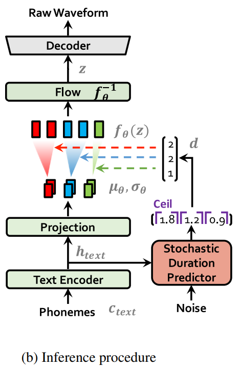

Inference 과정은 Training 과정에 비해 이해가 쉽다.

- Phonemes(Text)를 Text Encoder에 넣어 Encoding한다.
- 해당 값을 이용하여 각 Phonemes(Text)에 대한 $\mu, \sigma$를 뽑는다.
- Encoding 된 Phonemes(Text)를 condition으로 이용하여 SDP에 Noise를 넣어 각 Phonemes(Text)마다의 Duration을 계산한다.
- 각 Phonemes(Text)의 Duration으로 $\mu, \sigma$의 길이를 늘리고, 이를 이용하여 reparameterize를 진행, $f_{\theta}(z)$를 뽑는다.
- $f_{\theta}(z)$를 $f_{\theta}^{-1}$에 넣어 VAE의 latent variable $z$를 뽑는다.
- $z$를 VAE의 Decoder(Hifi-GAN의 Generator)에 넣어 Raw Waveform을 얻는다.

## Experiment

### Single Speaker TTS

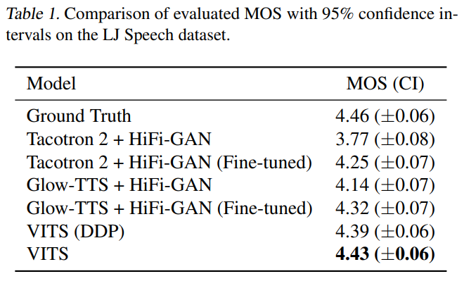

기존 Text-to-Mel, Mel-to-Wave(Vocoder)의 Two-stage Model과의 MOS 비교이다. Text-to-Mel에는 Tacotron2와 Glow-TTS를 사용했고, Vocoder로는 HiFi-GAN을 사용했다. 뿐만 아니라 DDP(Deterministic Duration Predictor(Glow-TTS의 Duration Predictor))를 사용한 VITS와도 MOS를 비교했다.

위 실험이 시사하는 바는

- VITS의 End-to-End training method(VAE 활용)가 기존의 Two-stage Model보다 좋은 TTS 샘플을 만들 수 있다.
- SDP(Stochastic Duration Predictor)가 효과가 있었다.

정도로 요약이 가능하다.

### Multi Speaker TTS

Multi Speaker setting에서는 다른 모델들보다 더 큰 격차의 좋은 MOS를 얻었다.

### Speech Variation

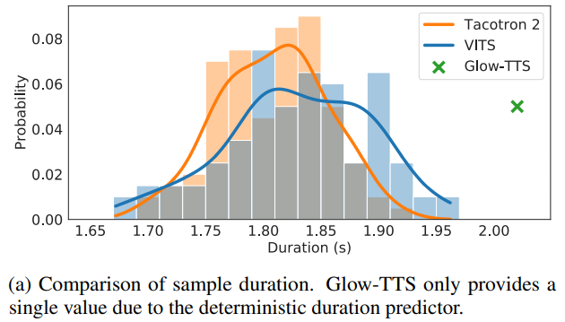

Stochastic Duration Predictor의 효과를 보여준다. 위 그림은 같은 문장을 100번 생성했을 때의 Duration을 분포형태로 나타낸 것으로 Glow-TTS는 하나의 Duration 밖에 가지지 못하는 반면 VITS는 하나의 문장에 대해서도 다양한 Duration을 가진다.

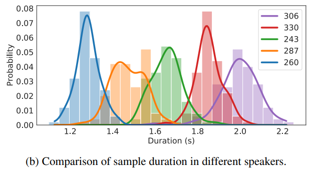

이를 Multi Speaker setting으로 보면 다음과 같다. Speaker-dependent한 Duration을 학습함을 확인할 수 있다.

### Synthesis Speed

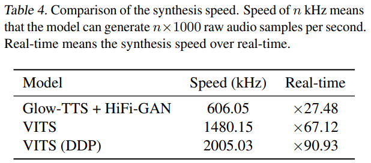

음성을 합성하는 속도 또한 빠르다. (SDP보다 DDP가 빠르긴 하다.)

## Demo

- <https://jaywalnut310.github.io/vits-demo/index.html>
- https://colab.research.google.com/drive/1CO61pZizDj7en71NQG_aqqKdGaA_SaBf?usp=sharing
