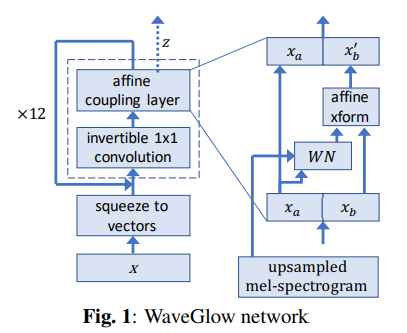
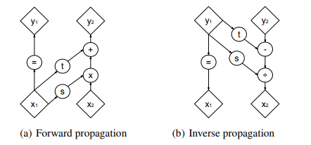

# WaveGlow (Flow-Based Generative Model)

[WaveGlow](https://arxiv.org/pdf/1811.00002.pdf)는 TTS의 두가지 task Text-to-Mel과 Mel-to-RawAudio중 두번째에 해당하는 task를 처리하는 Vocoder이다.

WaveGlow는 [WaveNet](https://arxiv.org/pdf/1609.03499.pdf)과 [Glow](https://arxiv.org/pdf/1807.03039.pdf)에서 영감을 받아 만들어졌다고 한다. 이 중 WaveNet은 깊게 다루지 않는다. Glow는 [Generative Model](https://ta.wiki.42maru.com/doc/generative-model-I9wNzGFeJX)에서 다룬 세가지 모델중 Flow-Based Generative Model을 사용했다. 우선 Flow-Based Generative Model에 대해 좀 더 자세히 알아보자.

## Flow-Based Generative Model

Flow-Based Generative Model은 원래의 데이터 $\mathrm{x}$의 분포를 찾기 위해 $\mathrm{x}$를 latent feature $\mathrm{z}$(multivariate normal distribution 가정)로 transform하는 함수 $f$를 학습하고 해당 $f$의 역함수를 사용해 generate하는 모델이다. $\mathrm{x}$분포의 likelihood를 maximize하도록 optimize가 진행된다.

이를 수식으로 나타내면 다음과 같다.

### Likelihood

$$
x \sim p(x)  \\
z \sim \mathcal{N}(0, I)  \\
x = f(z) = f_0 \circ f_1 \circ \cdots \circ f_k(z)
$$

이를 통해 x의 log-likelihood를 정리하면 다음과 같다.

$$
\log p_{\theta}(x) = \log p_{\theta}(z) + \sum_{i=1}^{k} \log \Big| \det (J(f_i^{-1}(z_i))) \Big|
$$

결국 이 값을 최대화 하는 함수 f를 찾고 해당 f의 역함수를 이용해 generate를 수행하면 된다.

우선 위 x의 log-likelihood 수식을 이해해보자.

$p(x)$를 $x$의 PDF, $\pi(z)$를 $z$의 PDF로 생각하면 데이터 $x$가 주어졌을 때의 likelihood를 다음과 같이 유도하여 정리 할 수 있다.

$$
x \sim p(x) \qquad z \sim \pi(z) \\
x = f(z) \qquad z = f^{-1}(x)
$$

$$
\begin{align*}
& \int p(x) \mathrm{d}x = \int \pi(z) \mathrm{d}z = 1 \\
& \int p(x) \mathrm{d}x = \int \pi(f^{-1}(x)) \mathrm{d}f^{-1}(x) = 1 \\
& \dfrac{\mathrm{d}}{\mathrm{d}x} \int p(x) \mathrm{d}x =\dfrac{\mathrm{d}}{\mathrm{d}x} \int \pi(f^{-1}(x)) \mathrm{d}f^{-1}(x) \\
& p(x) = \pi(f^{-1}(x)) \bigg| \det \dfrac{\mathrm{d}f^{-1}(x)}{\mathrm{d}x} \bigg| \\
& p(x) = \pi(f^{-1}(x)) \bigg| \det J(f^{-1}(x)) \bigg|
\end{align*}
$$

(절대값은 transformation에서의 기울기 부호 변화를 고려해서 필요, $\det$은 $x$와 $z$가 벡터이기 때문에 필요하다.)

$$
z = h_0  \qquad z \sim \pi(z) \qquad h_0 \sim p_0(h_0) \\
\; \\
f_1(h_0) = h_1 \qquad f_1^{-1}(h_1) = h_0 \qquad h_1 \sim p_1(h_1) \\
f_2(h_1) = h_2 \qquad f_2^{-1}(h_2) = h_1 \qquad h_2 \sim p_2(h_2) \\
\vdots \\
f_i(h_{i-1}) = h_i \qquad f_i^{-1}(h_i) = h_{i-1} \qquad h_i \sim p_i(h_i) \\
\vdots \\
f_k(h_{k-1}) = h_k \qquad f_k^{-1}(h_k) = h_{k-1} \qquad h_k \sim p_k(h_k) \\
\; \\
h_k = x \qquad h_k \sim p_k(h_k) \qquad x \sim p(x) 
$$

라고 하면 $h_i$에 대해 다음과 같은 일반화가 가능하다.

$$
p_i(h_i) = p_{i-1}(h_{i-1})\bigg| \det J(f_i^{-1}(h_i)) \bigg|
$$

$$
\begin{align*}
\log p_i(h_i)& = \log p_{i-1}(h_{i-1}) + \log \bigg| \det J(f_i^{-1}(h_i)) \bigg|  \\
\log p_i(h_i)& = \log p_{i-2}(h_{i-2}) + \log \bigg| \det J(f_{i-1}^{-1}(h_{i-1})) \bigg| + \log \bigg| \det J(f_i^{-1}(h_i)) \bigg|  \\
& \bigg( \because \log p_{i-1}(h_{i-1}) = \log p_{i-2}(h_{i-2}) + \log \bigg| \det J(f_{i-1}^{-1}(h_{i-1})) \bigg| \; \bigg) \\
& \qquad\qquad\qquad\qquad\qquad\vdots \\
\log p_i(h_i)& = \log p_{0}(h_{0}) + \sum_{j=1}^{i} \log \bigg| \det J(f_j^{-1}(h_j)) \bigg|  \\
\end{align*}
$$

이를 이용하여  $\log p(x)$를 다시 정리하면 아래와 같다.

$$
\log p(x) = \log \pi(z) + \sum_{i=1}^{k} \log \Big| \det (J(f_i^{-1}(h_i))) \Big|
$$

위와 같이 데이터 분포의 likelihood를 $z$를 통해 단순하게 표현할 수 있다.  
그리고 위 과정을 **Normalizing Flow**라고 부른다.

전혀 단순해 보이지 않을 수 있는데, $x$분포의 likelihood를 생으로 계산하는건 사실상 불가능이지만 위 식은 계산이 가능하다.  
어떻게 계산이 가능한지 알아보자.

### 제약조건

우선 딥러닝 모델에서의 backpropagation과 generate를 위해서는 제약조건 두가지가 필요하다.

- $f$는 invertible해야한다. (역함수가 존재해야한다.)  
  ($f^{-1}$을 사용해 generation을 수행할 예정이기 때문에 해당 조건이 필요하다.)
- $f$의 $\det J$는 계산하기 쉬워야한다.  
  (Jacobian matrix의 determinant를 계산하는 것은 computational cost측면에서 요구량이 많기 때문에 계산이 단순해야한다.)

위 방법을 어떻게 실현할 것인가가 [Glow](https://arxiv.org/pdf/1807.03039.pdf)의 사실상 핵심 내용이다.  

## WaveGlow

WaveGlow가 위의 제약조건에 어떻게 대처했는지 network 아키텍쳐 그림에서 데이터의 흐름과 함께 자세히 살펴보자.

### squeeze to vectors

우선 위 아키텍쳐에서 가장처음(왼쪽 아래) $\mathrm{x}$는 raw audio를 나타낸다.

**squeeze to vectors**에서는 `(batch, time)`의 shape을 가진 raw audio를 `(batch, n_group, time//n_group)`의 shape으로 바꾸는 역할을 한다. `time//n_group`의 sequence 길이를 가지는 `n_group`차원 벡터들로 단순히 reshape 하는 과정이라고 생각하면 된다.

앞으로는 이 reshape된 raw audio를 $x$로 표기한다.

### invertible 1x1 convolution

1x1 convolution이라고 표현했지만 정확히말하면 `in_channels`와 `out_channels`가 같은 `kernel_size=1`, `bias=False`인 `Conv1d`이다.  
잘 생각해보면 `kernel_size=1`인 `Conv1d`는 작용하는 dim을 제외하면 `Linear`와 완전히 같은 방식으로 작동함을 알 수 있다.  
이를 수식으로 나타내보면

$$
h = f_{conv}(x) = Wx \\
x = f_{conv}^{-1}(h) = W^{-1}h  \\
\ \\
where\ h\ denotes\ outputs\ of\ invertible\ 1\times1\ convolution.
$$

이때 `in_channels`와 `out_channels`가 같으므로 $W$가 invertible하다면 그 자체로 해당 layer의 inverse를 명시적으로 구할 수 있다.  
$W$를 invertible하게 만드는 방법은 임의의 orthogonal(orthonormal) matrix를 이용해 init하면 된다. (임의의 matrix에 대한 QR Decomposition을 이용한다.)

해당 방법을 이용하면 본 layer의 제약 조건 두가지를 모두 해결 할 수 있다.  
이유는 orthogonal matrix의 다음 특징들 때문이다.

- 모든 orthogonal matrix $Q$에 대해 $Q^{-1} = Q^T$ 가 성립한다.
- orthogonal transformation의 $\det J$는 1이다. (-1일 수도 있지만 $\det$의 기호를 바꾸는게 어렵지 않다.)
- 모든 square matrix $A$에 대해 $\det A^T = \det A$가 성립한다.
- linear transformation의 Jacobian은 해당 가중치 행렬과 같다.

따라서 해당 레이어를 $f$, 가중치 행렬을 $W$라 했을 때 다음이 성립하고, 이에 대한 계산이 쉽다.

$$
\det J(f_{conv}^{-1}(h)) = \det W
$$

### affine coupling layer

조금 복잡하므로 세부적으로 살펴본다.

우선은 **invertible 1x1 convolution**을 통과하기 전과 후의 data shape은 같음을 기억하고 있자.

위 그림을 수식으로 보자면 다음과 같다.

$$
\mathbf{x}_a, \mathbf{x}_b = split(h)
$$

$$
(log \ \mathbf{s}, \mathbf{t}) = WN(\mathbf{x}_a, \ mel\ spectrogram)
$$

$$
\mathbf{x}_b' = \mathbf{s} \odot \mathbf{x}_b + t
$$

$$
z = concat(\mathbf{x}_a, \mathbf{x}_b')
$$

affine coupling layer에서 가장 중요한 점은 $WN$이 어떤 형태의 transform이든 상관 없이 $z = f^{-1}(x)$ 는 쉽게 구할 수 있다는 점이다.  
이유는 결국 역함수를 구하는 과정에서 $WN$이 개입하지 않고 $s$와 $t$만 사용하기 때문이다.

#### split

$x$를 dim 1(`n_group`) 기준으로 절반씩 split하여 하나는 $x_a$ 다른 하나는 $x_b$로 칭한다.

#### WN

이건 WaveNet의 사상을 빌려온 layer로 컨셉 이해만을 위해서는 dilated convolutional layer를 적용하여 mel-spectrogram과 연산한다 정도만 알고 있어도 된다.  

좀 더 자세히는 다음과 같다. (해당 내용도 완전한 설명은 아님.)

- `ConvTranspose1d`를 적용하여 mel-spectrogram의 sequence 길이를 raw audio와 같게 맞춘다.
- $x_a$를 dilated convolutional layer를 사용하여 변환하고 upsampled mel-spectrogram과 element wise product를 수행한다.
- 위 값을 dim 1기준 절반씩 split, 하나는 sigmoid, 다른 하나는 tanh를 적용하여 둘을 곱한다.
- 해당 값을 1d conv를 이용, `n_group`의 채널 수를 가지도록 한다.

WN을 지난 값을 `acts`라고 칭하도록 하자.

#### affine

acts의 dim 1을 절반씩 split, 하나를 `log_s` 다른 하나를 `b`라고 칭한다.  
$x$를 dim 1(`n_group`) 기준으로 절반씩 split하고 남은 $x_b$에 대해 다음 연산을 수행한다.

$$
x_b' = \exp(\log s) \odot x_b + b
$$

#### concat

$x_a$와 $x_b'$를 concat한다.

본 값이 $z$가 된다.

affine은 element wise로 연산을 수행했기 때문에 각 scalar에 대해 다음 식이 성립함을 알 수 있다.

$$
\log \Big| \det(J(f_{coupling}^{-1}(z))) \Big| = \log |s|
$$

### 반복

**invertible 1x1 convolution**과 **affine coupling layer**를 통과하는 본 과정을 12번 반복한다. (skip connection과 early outputs등 자세한 내용은 생략.)

### Loss

Flow-Based Generative Model에 대한 첫 설명에서 언급했듯이 x데이터 분포의 likelihood를 maximize하도록 optimize를 진행한다.  
따라서 Loss는 Likelihood 그 자체를 사용한다.

앞서 $z$와 $f$로 표현한 Likelihood를 위에서 유도한 수식과 함께 다시 정리해보면 다음과 같다.

$$
\begin{align*}
\log p(x) =& \log \pi(z) + \sum \log \Big| \det (J(f_i^{-1}(h_i))) \Big| \\
= & - \dfrac{\mathbf{z}^T\mathbf{z}}{2\sigma^2} \\
& + \sum^{\#layers} \log \mathbf{s}_j \\
& + \sum^{\#layers} \log \det \bigg| W_k \bigg|
\end{align*}
$$

$$
\begin{align*}
because& \\
& \log \pi(z) = - \dfrac{\mathbf{z}^T\mathbf{z}}{2\sigma^2} \qquad \because \mathrm{z} \sim \mathcal{N}(0, I) \\
& \sum \log \Big| \det (J(f_i^{-1}(h_i))) \Big| = \sum^{\#layers} \log \mathbf{s}_j + \sum^{\#layers} \log \det \bigg| W_k \bigg|
\end{align*}
$$

위 수식에 음수를 취해 해당 값을 minimize하도록 학습을 진행한다.

### Inference

Vocoder(WaveGlow)의 최종 목적은 결국 Mel-spectrogram을 raw audio로 잘 만들어내는 것이다. 이는 $z$를 만들기 위한 과정을 그대로 역으로 수행하면 된다.  
**invertible 1x1 convolution**과 **affine coupling layer** 둘을 되돌리는 방법을 중점적으로 살펴보자.

#### input

우선 $\mathrm{z}$는 multivariate normal distribution을 만족하기 때문에 random sampling을 수행하여 해당 값을 역함수에 집어 넣게 된다.

#### invertible 1x1 convolution

$$
h = f_{conv}(x) = Wx \\
x = f_{conv}^{-1}(h) = W^{-1}h  \\
\ \\
where\ h\ denotes\ outputs\ of\ invertible\ 1\times1\ convolution.
$$

위에 써놓은 수식을 그대로 다시 가져왔다. 여기서 $W^{-1}$을 구하면 되는데, 설명했다시피 $W$가 orthogonal 이기 때문에 `W.inverse()`와 같이 역함수를 명시적으로 구할 수 있다. 해당 값으로 연산을 진행한다.

#### affine coupling layer

위 그림을 보면 쉽게 이해 된다. affine coupling layer 그대로 역 연산을 하면 된다.

$$
\mathbf{x}_b' = \mathbf{s} \odot \mathbf{x}_b + t \\
\mathbf{x}_b = (\mathbf{x}_b' - t) \oslash \mathbf{s}
$$

위 식의 $\mathbf{s}$를 구하는 과정에서 Mel-spectrogram을 condition으로써 사용한다. (이는 역연산이 필요없다.)  
위 내용을 한번에 모아서 수식으로 정리하면 다음과 같다.
$$
x_a,\ x_b' = split(\mathrm{z}) \\
x_b = (x_b'-t) \oslash s \\
h = concat(x_a,\ x_b) \\
\mathrm{x} = f_{conv}^{-1}(h) = W^{-1}h  \\
$$

이렇게 만들어진 $\mathbf{x}$를 1d array형태로 reshape을 해주면 raw audio가 생성된다.

#### 정리

한국말로 다시 풀어보자면 다음과 같다.

1. $\mathcal{N}(0, I)$ 에서 random sampling을 통해 $z$를 뽑는다.
1. 이를 dim 1 기준 절반으로 나누고, 하나는 $x_a$, 다른 하나는 $x_b'$로 명명한다.
1. $x_a$와 Mel-spectrogram을 이용하여 $t$와 $s$를 계산한다.
1. 계산된 $t$와 $s$를 이용하여 $x_b = (x_b' - t) / s$ 를 계산한다.
1. $x_a$와 $x_b$를 concat하여 $h$를 만든다.
1. `W.inverse()`를 이용하여 $W$의 역행렬을 추출, 이를 이용하여 $\mathrm{x}$를 계산한다.
1. 2~6을 반복한다.
1. 계산된 $\mathrm{x}$를 1d array 형태로 reshape하면 raw audio가 나온다.
