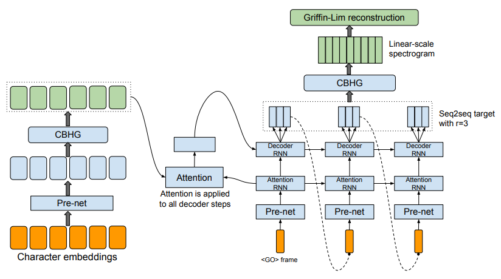
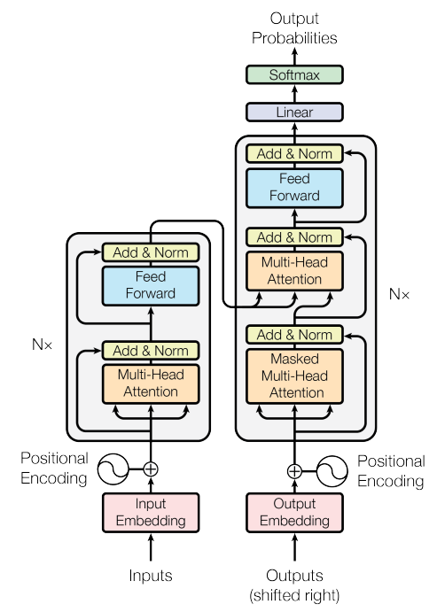
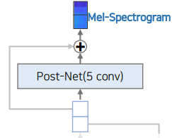

# Transformer TTS

## 딥러닝 등장 이전의 TTS

딥러닝 등장 이전의 TTS를 우리는 생각보다 많이 접해봤다. 옛날의 네비게이션 안내 목소리를 생각해보면 된다.  
해당 TTS는 등장해야하는 단어단위, 작게는 음소단위를 모두 녹음하고 적당한 후처리를 거친후 이어붙이는 형태로 사용되었다.  
이를 구현하기 위해서는 다양한 분야의 도메인 전문가들이 모두 합심해야했기 때문에 구현도 어려웠을 뿐더러, 그 결과물도 그리 자연스럽지 않았다.

하지만 딥러닝을 TTS에 활용하면서부터는 수많은 도메인 전문가들이 모이지 않아도 TTS를 구현할 수 있게 되었고, 그 결과물도 이전보다 훨씬 자연스러워졌다.  

## Tacotron

딥러닝 기반 TTS의 포문을 연 것이 대표적으로 [Tacotron](https://arxiv.org/pdf/1703.10135.pdf)이다.

Tacotron은 seq2seq 형태에 attention을 사용하여 Text를 Speech로 변환한다. 더 정확히 말하면 Character Embedding을 Linear-scale Spectrogram으로 변환한 후 Vocoder(Griffin-lim)를 통해 raw audio를 reconstruction한다.

보통 이런 과정을 Text-to-Speech라고 표현하지만 엄밀히 말하면 모델의 구조는 Text-to-Spectrogram이다. (Mel-Spectrogram을 사용한다면 Text-to-Mel이라고 표현하겠다.)  
그리고 앞으로 등장할 모든 아키텍쳐가 사실상 이 형태를 사용한다.

## Transformer

Tacotron 이후 Tacotron2 등 Transformer 아키텍쳐를 사용하지 않는 모델들도 있지만 대부분은 Transformer를 어떤식으로든 활용하며, 다른 것을 이해하는데도 도움이 되기 때문에 뒤에 이어질 내용을 이해할 수 있을정도로만 짚고 넘어가자.

앞으로의 내용을 이해하기 위해 필요한 요소들을 나열하면 다음과 같다.

- Model의 input(Encoder의 input, Decoder의 input)과 output은 모두 sequence가 있는 tokens이다.
- 각 token들은 `d_model`의 dim을 가지는 벡터로 Embedding 된다.
- Encoder와 Decoder의 구조로 이루어져있으며, Encoder와 Decoder의 output은 `sequence_length * d_model`이다.
- Decoder의 바로 뒤에 붙어 있는 `Linear`의 weigth matrix는 `d_model * vocab_size`의 shape을 가진다. 결과적으로 `Softmax`에 input 되는 data의 shape은 `seq_length * vocab_size`이다.
- 최종적으로 각 seq마다 가장 높은 등장 확률을 가지는 token들을 뽑는다.
- Decoder의 input은 `<sos>` token을 가지며 Model의 target은 `<sos>`를 가지지 않는다. (다른말로 하면 Decoder의 input은 Model의 target이 shifted right된 형태이다.) 따라서 바로 다음 sequence에 오는 token을 예측하는 형태이다.
- 최종적인 inference 수행시 Decoder의 input에는 `<sos>` token 하나만을 사용하며 Model의 output을 다시 Decoder의 input으로 활용하며 autoregressive하게 inference를 수행한다.
- 다음 sequence에서 등장 확률이 최대인 token이 `<eos>`인 경우 inference를 stop한다.

## Transformer TTS

[Transformer TTS](https://arxiv.org/pdf/1809.08895.pdf)는 이름에서도 볼 수 있듯이 TTS에 Transformer 아키텍쳐를 적용한 것이다.

아키텍쳐를 자세히 보기 전에 한가지를 짚고 넘어가자. Mel의 각 sequence는 token(하나의 int값)이 아니라 `n_mels` 차원상의 float 벡터이다. 이 때문에 Transformer로 Mel을 생성하게 되면 어떻게 해야할지 헷갈리는 부분이 몇가지 있다.

- Mel의 Embedding을 어떻게 진행해야할까.
- Decoder 뒤의 `softmax`는 어떻게 대체해야할까.
- `<sos>`, `<eos>`, `<pad>` 를 어떻게 표현할까.
- inference는 어떻게 stop을 시킬까.

하나씩 생각해보자.

### Mel의 Embedding을 어떻게 진행해야할까

결론부터 말하면 할 필요가 없다.  
어찌보면 당연한 내용인데 Embedding이라는게 하나의 int를 `emb_dim`차원에 있는 벡터로 mapping하는 것이기 때문에 `n_mels`의 차원을 가지는 Mel의 각 sequence는 이미 일종의 Embedding이 되어있는 것이라고 봐도 된다.

다만 Decoder의 input은 `sequence_length * d_model`의 shape을 가져야하기 때문에 `n_mels`를 `d_model`로 linear projection하는 과정이 필요하다.  
그 역할을 수행하는 것이 Decoder 바로 전에 있는 `Decoder Pre-net`이다. `Decoder Pre-net`은 간단한 MLP형태로 `sequence_length * n_mels`의 shape을 가지는 데이터를 `sequence_length * d_model`의 shape으로 바꾼다.

### Decoder 뒤의 `softmax`는 어떻게 대체해야할까

이것도 굳이 softmax의 역할이 필요하지 않다.  
예측하고자 하는 것이 token이 아니라 `n_mels`의 차원을 가지는 벡터(= Mel)이기 때문에 `Decoder Pre-net`이 shape을 바꾸듯이 `sequence_length * d_model`의 shape을 가지는 데이터를 `sequence_length * n_mels`의 shape으로 바꾸면 된다.

### `<sos>`, `<eos>`, `<pad>` 를 어떻게 표현할까

우선 `<sos>`는 생각보다 간단한데, 모든 element가 0인 `n_mels`차원 벡터를 사용하면 된다.

*'그럼 `<eos>`도 그러면 되는거 아닌가?'*  
아쉽지만 `<eos>`는 사실상 없다..

그렇다면 `<pad>`는? `<sos>`와 똑같이 모든 element가 0인 `n_mels`차원 벡터를 사용한다. 

### inference는 어떻게 stop을 시킬까

`<eos>`가 명확하지 않기 때문에 *'다음 seqence의 예측값이 `<eos>`면 stop'* 식의 방법이 불가능하다.  
그래서 사용하는 방법이 Decoder의 위 오른쪽에 있는 `Stop Linear`와 `Stop Token`이다.

padding을 수행하기 전 Mel의 마지막 Sequence는 1, 나머지 모든 Sequence는 0의 `Stop Token` label을 준다. 그리고 각 Sequence의 Mel 예측값에 `n_mels * 1`의 linear projection(`Stop Linear`)을 거친 뒤 `Stop Token` 예측값을 구하고 loss를 계산해 최종적인 loss와 합한다.

하지만 `Stop Token`은 하나의 Speech당 하나일 수 밖에 없다.  
굉장히 Imbalanced한 데이터이다. 논문에서는 binary cross entropy를 계산하는 과정에서 tail positive stop token에 가중치를 부여해서 이 문제를 해결했다.

결과적으로 inference 단계에서 각 Sequence의 Mel에 대해 `Stop Token` 예측값이 threshold 이상일 때 inference를 멈춘다.

좀 더 쉬운 다른방법도 있는데 그냥 stop을 하지 않고 max sequence length까지 생성하는 것이다.  
그러면 아무 소리 없는 부분이 뒤에 붙은 오디오가 나온다. 그 뒤에 생성된 오디오의 뒷부분을 잘라내는 방법이 있다.

위 아키텍쳐 그림에서 다루지 않은 두가지 내용이 남았다. **Encoder Pre-net**, **Post-net**.

### Encoder Pre-net

Encoder Pre-net은 3겹의 Conv1d 형태이다. 이런 구조가 포함된 이유는 매우 합리적이다.  
음소는 앞과 뒤 음소에 영향을 받는다. 한글을 예로들면 연음(무릎에 → 무르페), 자음동화(맏누이 → 만누이) 등 다양한 경우가 있다.  
이런 경우를 더 잘 고려하기 위한 장치가 Encoder Pre-net이다.

### Post-net

Decoder가 예측한 Mel-Spectrogram을 보정하기 위한 장치이다.  
5겹의 Conv1d 형태이며 해당 output값은 residual connection 형태로 Decoder가 예측한 Mel-Spectrogram과 더해진다.

## Transformer TTS의 한계

정확히는 Transformer TTS가 SOTA를 달성하고 있던 당시에 있던 다른 모델들 대부분도 모두 공유하는 한계점이다.

### Output Length 증가에 따른 Inference Time 증가

inference 수행 단계에서 Decoder의 input으로 `<sos>`만을 사용하여 `<eos>`가 나올 때까지 다음 sequence를 예측하는 것을 반복수행한다. (Transformer TTS상으로는 `Stop Token`예측값이 1이 나올때까지 반복수행한다.)  
이런 방법은 output length가 늘어남에 따라 반복수가 길어지며 inference time이 증가할 수 밖에 없다. 따라서 real-time service를 실현하기에는 무리가 있다.

### 부족한 Robustness

autoregressive model은 robustness 측면에서 안정적이지 못하다.  
대표적인 예시로 반복적인 단어가 등장한다면 attention이 꼬이고 갈곳을 잃는 경우가 많다.

### Vocoder 성능에 좌우되는 TTS Output

이건 사실 단점이라하기에는 애매할 수도 있다.  
다르게 말하면 Vocoder의 성능이 좋아지면 그만큼 TTS결과물도 좋아지기 때문이다. 그리고 실제로 시간이 지남에 따라 Vocoder의 성능은 점점 좋아지고 있다.

## 마무리

Transformer TTS 이후의 TTS는 여태까지 있던 문제들을 하나씩 해결해나가는 방향으로 발전했다.  
앞으로 이어질 내용에서는 TTS의 발전된 모델들(Vocoder 포함)을 다루게 될 것이다.
