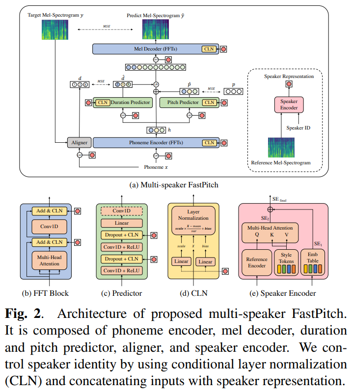
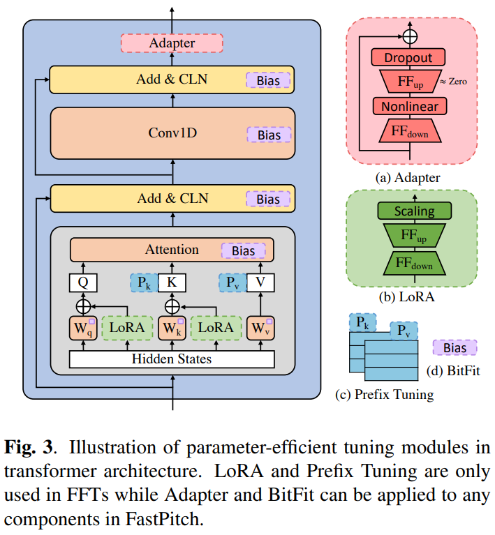
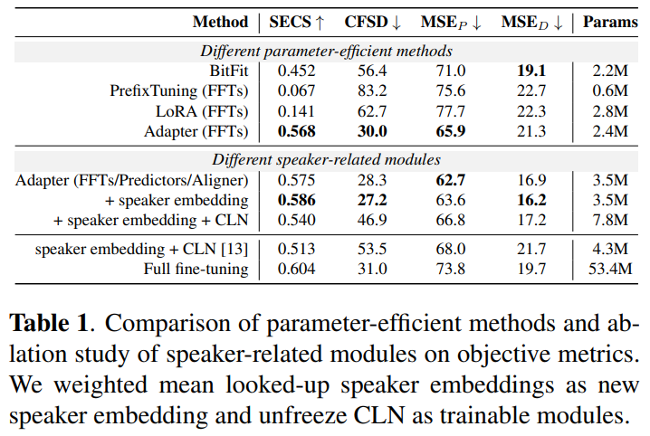

# ADAPTER-BASED EXTENSION OF MULTI-SPEAKER TEXT-TO-SPEECH MODEL FOR NEW SPEAKERS

<https://arxiv.org/pdf/2211.00585.pdf>

## Abstract

새로운 speaker에 대한 fine-tuning은 기존 speaker들에게 부정적인 영향을 미친다. 이에 따라 adapter modules를 추가한 새로운 방법을 제시한다.

## 1. Introduction

TTS 모델을 새로운 speaker에 대해 fine-tuning하는 것은 몇가지 이유로 challenging하다.

- 다른 녹음 컨디션을 가지는 새로운 화자에 대해 일반화 될 만큼 기존 모델은 큰 데이터로 학습되어야한다.
- 새로운 speaker마다 모델 전체를 fine-tuning하는 것은 parameter inefficient하다.

최근 adaptation of TTS를 more efficient하게 하기 위한 두가지 방법이 있다.

- modify only parameters directly related to speaker identity  
  ~~논문 참조 되어있는거 4개 무슨내용인지 정도는 파악하는게 좋을 듯 하다. [10](https://henrymoss.github.io/files/BOFFIN.pdf), [11](https://arxiv.org/pdf/2005.05642.pdf), [12](https://arxiv.org/pdf/1802.06006.pdf), [13](https://arxiv.org/pdf/2103.00993.pdf)~~
- using light voice conversion post-processing module  
  ~~여기도 논문 하나 [14](https://assets.amazon.science/ba/cf/51543bab499dab771d246b475c8b/voice-filter-few-shot-text-to-speech-speaker-adaptation-using-voice-conversion-as-a-post-processing-module.pdf)~~

The contributions of this paper are:

- adapter-based framework for efficient tuning of TTS model 을 제안
- 다양한 adapter module과 데이터에 대해 ablation study 진행
- adapter-based TTS가 fine tuning과 비슷하게 perform한다는 것을 증명

## 2. Method

### 2.1. Base multi-speaker TTS model

#### FastPitch

pretrained model로는 FastPitch를 사용했다. non-autoregressive TTS conditioned on speaker representation 모델이다.

#### Speaker Representation

naive way는 speaker embedding table을 사용하는 것이지만, 이 방법의 단점은 training 동안 못본 speaker에 대해 일반화할 수 없다는 것이다. 따라서 특정 speaker에 대해, look-up table의 speaker embeddings(SE1)와 reference spectrogram 혹은 global style tokens에서 얻은 speaker embeddings(SE2)를 결합한다. convolutional RNN reference encoder + multi-head attention layer는 spectrogram을 받아서 style tokens를 speaker representation embedding으로 준다. 이 방법의 장점은 명시적은 스타일이나 운율 labels 없이 token은 물론 a large range of acoustic expressiveness를 학습할 수 있다는 것이다.

#### Multi-Speaker FastPitch

speaker representation을 additional input으로 이용하여 condition을 만든다. 이 additional input은 inputs of each components와 concat된다. Following AdaSpeech[13](https://arxiv.org/pdf/2103.00993.pdf) we also leverage conditional layer normalization (CLN) to control our model with the corresponding speaker characteristics.

### 2.2. Adapter Modules

#### Vanilla Adapter

Adapter논문처럼 transformer 내부에 adapter를 삽입하는 것이 아니라 각 transformer layer의 output에 adapter를 이어붙이는 것을 제안한다.

#### Unified Adpaters

Adapter의 variants로 LoRA와 Prefix Tuning이 있다.  
LoRA는 trainable low-rank matrices를 transformer의 query와 key에 삽입한다.  
Prefix Tuning은 trainable vector를 transformer의 key와 value에 concatenate한다.  
추가로 BitFit을 사용하였다. BitFit은 weight은 고정하는 대신 bias만 update한다.

### 3. Experiments and results

Adapter가 성능이 가장 좋았다. Duration의 MSE에서 약간 뒤쳐지긴 했다.  
Speaker에 따라 달라지는 module에서는 Adapter에 Speaker embedding을 추가했을 때가 좋았다.

5분정도의 데이터로 GT와 거의 비슷한 수준의 sample을 얻었다.
