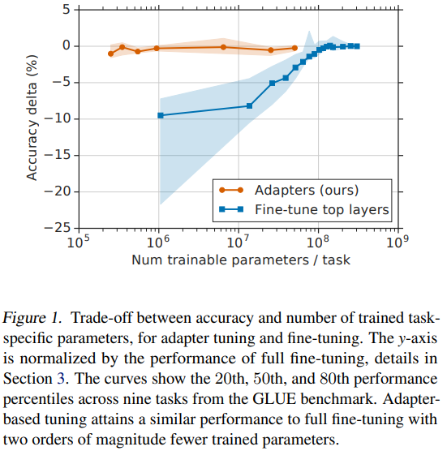
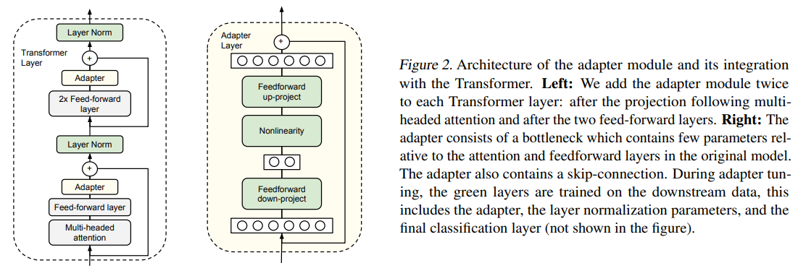
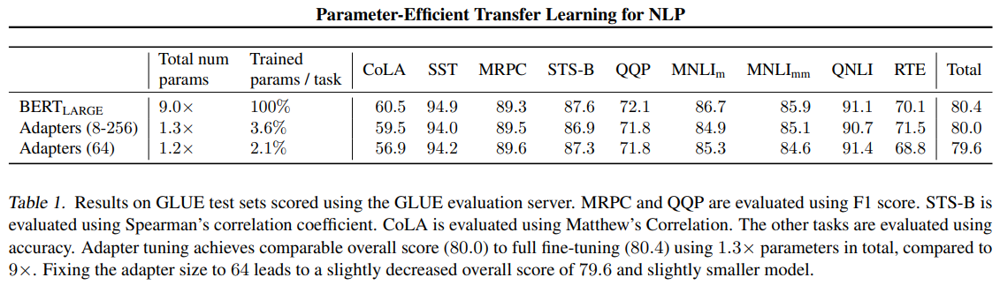
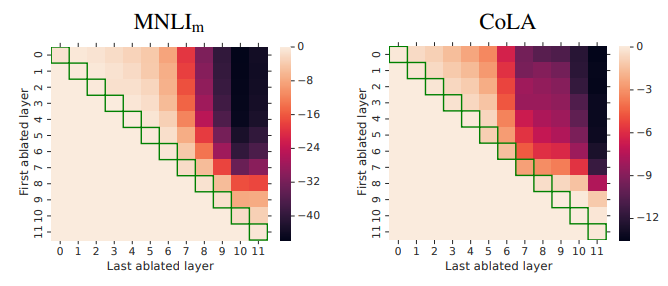
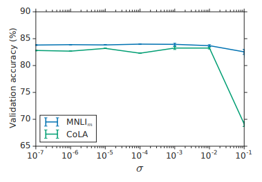

# Parameter-Efficient Transfer Learning for NLP

<https://arxiv.org/pdf/1902.00751.pdf>

## Abstract

fine-tuning은 parameter inefficient하다. 모든 새로운 task에 대해 새로운 모델이 필요하다. 이에 대한 대체로 transfer with adapter modules를 소개한다.

## 1. Introduction

fine-tuning만큼 performs well하면서도 모델을 새로이 훈련하지 않는 것을 목표로한다. 이에 따라 transfer learning 전략의 일종이면서 compact하고 extensible한 모델을 소개한다.

fig1에서 알 수 있듯 fine-tuning은 Num of trainable parameters가 늘어날 수록 Accuracy가 증가한다. 하지만 새로 제안한 Adapter는 Num of trainable parameters에 크게 관계없이 fine-tuning만큼 뛰어난 성능을 보인다.

Feature-based transfer는 원래 훈련된 parameters $w$에 의한 function $\phi_w$와 새로운 parameters $v$에 의한 function $\chi_v$을 이용하여 다음과 같이 표현이 가능하다.  
$\chi_v(\phi_w(x))$

반면에 Adapter는 다음과 같이 표현이 가능하다. 새로운 initial parameters $v_0$는 new function $\psi_{w, v_0}$을 original function $\phi_w$과 유사하게 작동하도록 만든다.  
$\psi_{w, v_0}(x) \approx \phi_w(x)$

For deep networks, defining $\psi_{w, v_0}$ typically involves adding new layers to the original network, $\phi_w$. 훈련중에는 $v$만 tuned된다.

Adapter-based tuning은 multi-task learning과 continual learning에 연관이 있다. multi-task learning 역시 compact models를 만들지만 multi-task learning에 필요한 simultaneous(동시) access to all tasks가 필요하지 않다. continual learning은 tasks에 대한 endless learn을 하는데 이는 challenging인게 re-training 이후 network는 previous tasks에 대해 잊기 때문이다.  
하지만 Adapter는 그럴일 없다.

The key innovation은 effective adapter module을 디자인하는 것과 base모델과의 integration이다. We propose a simple yet effective, bottleneck architecture.

GLUE 밴치마크에서 3%만의 task-specific parameters를 사용하여 100% task-specific parameters를 사용한 fine-tuned BERT와 비볐다. 또한 다른 과제들에서도 sota에 근접했다.

## 2. Adapter tuning for NLP

Our strategy has three key properties:  
- it attains good performance  
  좋은 퍼포먼스를 가진다.
- it permits training on tasks sequentially, that is, it does not require simultaneous access to all datasets  
  순차적인 학습을 허용한다. 즉 모든 데이터셋에 대해 한번에 학습하지 않아도 된다.
- it adds only a small number of additional parameters per task.  
  task당 적은 수의 parameters만을 추가한다.

To achieve these properties, we propose a new bottleneck adapter module.  
vanilla fine-tuning은 network의 top layer를 수정한다.  
adapter tuning strategy involves injecting new layers into the original network. 이때 adapter layers는 ramdom하게 initialized 된다.

Adapter modules have two main features:  
- a small number of parameters  
  적은 수의 parameters
- a near-identity initialization.  
  항등행렬에 가까운 초기화

A near-identity initialization is required for stable training of the adapted model. 이렇게 함으로써 original network가 학습시에 영향을 받지 않는다. Adapter 초기화가 항등함수에서 너무 멀리 벗어나면 모델이 훈련에 실패할 수 있음을 확인했다.

### 2.1. Instantiation for Transformer Networks

Bottle-neck architecture는 다음과 같다. adapter는 $d$-dimensional features를 smaller dimension $m$으로 projection한다. 이후 nonlinearity, 다시 $d$ dimension으로 복구한다. 총 parameters수는 $2md + d + m$이다. $m$은 $d$의 0.5%에서 8%를 사용한다. 이는 performance와 parameter efficiency의 trade-off로 결정한다. Adapter module은 내부적으로 skip-connection을 가지고있다. 따라서 projection layers가 initialized to near-zero라면 module은 approximate identity function이다.

Adapter module과 함께 task당 layer normalization parameters도 같이 훈련한다. 이때 layer당 $2d$개의 parameters만이 훈련되며 이 또한 parameter-efficient 하다.

## 3. Experiments

대체적으로 BERT의 full fine-tuning과 거의 비슷한(GLUE score {adapter: 80.0, full fine-tuning: 80.4}) performance를 보여주었다.  
데이터셋에 따라 optimal adapter size는 달라졌다. 대체로 작은 데이터셋일수록 작은 adapter size가 optimal로 보인다.
MNLI는 256, smallest dataset인 RTE는 8을 선택했다.
64로 고정했을 때는 79.6의 GLUE score를 얻었다.

실험 내용을 보면 각 dataset에 대해 optimal batch size와 learning rate를 찾았다는 내용이 있다. (물론 adatper size도 포함.)
논문만 읽어서는 hyper parameter tuning이 많이 필요할것같은 느낌을 개인적으로 많이 받았다.

### 3.6. Analysis and Discussion

#### Influence of Adapter for Full Network

single layer's adapter를 제거해가면서 각각의 영향을 파악하기 위한 ablation study를 진행했다.

First, removing any single layer's adapters는 performance에 작은 영향만을 미쳤다.
하지만 전체를 제거했을때는 performance drops substantially 했다. 이로써 알 수 있는 점은 each adapter has a small influence, but the overall effect is large.

Second, adapters on the lower layers have a smaller impact than the higher-layers.
이는 adapter가 prioritize higher layers 한 것으로 perform well 되었다고 볼 수 있다.
lower layers는 tasks 간에 공유되는 lower-level features를 추출하고, higher layers는 tasks에 따라 unique한 feature들을 만든다고 볼 수 있다.

#### Adapter Weight Initialization

결론은 $N(0, 10^{-2})$ 로 init하면 된다. $\sigma$가 $10^{-2}$보다 크면 문제가 생긴다

#### Size of Adapter

The quality of the model across adapter sizes는 stable했다. Adapter size를 fix해도 각 tasks들에 대해 약간의 performance에 대한 손실이 있을뿐 양호했다.  
크다고 무작정 좋지도 않다. 8이 64, 256보다 나은 경우도 있다.

#### Extension

Proposed original adapter architecture에 이것저것 붙여가며 실험해봤으나 performance상 큰 차이가 없었다. 그냥 original bottle neck architecture를 쓰는 것을 추천한다.

## 사견

Adapter weight init을 $N(0, 10^{-2})$로 하고 skip connection을 한다고 이게 identity function에 근접한다고 할 수 있을까. 행렬의 크기에 따라 달라질 것이라고 생각된다. 좀 더 디테일하려면 adapter module의 input dim에 따라 $\sigma$가 달라져야하지 않을까 하는 생각이 들지만 사실은 이정도 수치라면 영향이 거의 없을 것 같고 있어도 아주아주 사소할 것 같긴 하다.

시간이나 computing resource 측면에서 여유롭다면 결과적으로 fine-tuning보다 performance상의 이점이 딱히 없는 Adapter를 굳이 사용할까 싶긴하다. 하지만 fine-tuning된 모델과 원래의 모델 두개를 한번에 들고다니기가 어려워서, 혹은 각 task마다 이게 점점 쌓이게 될 상황이라던지, 그래서 새로운 모델이 original model weight를 기억하면 좋겠는 경우 쓸모가 있겠다. 예를들어 multi speaker tts의 speaker extension...
