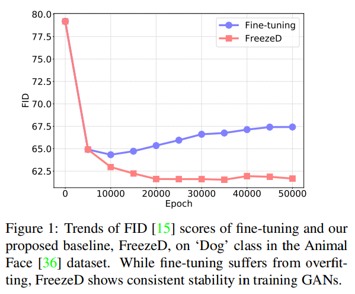
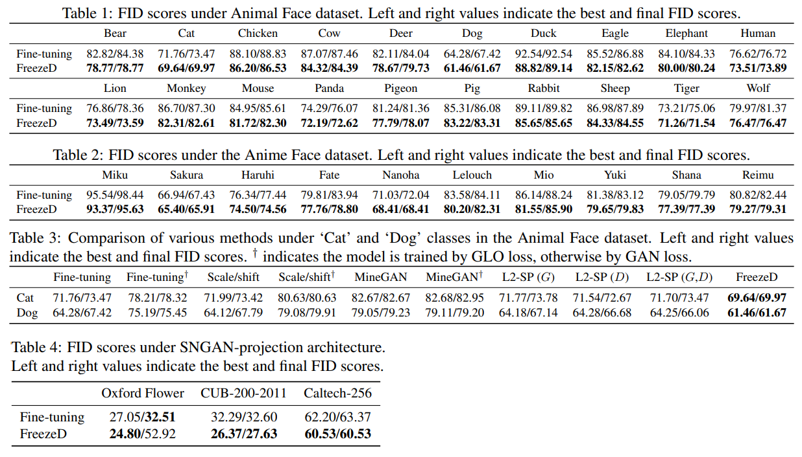

# Freeze the Discriminator: a Simple Baseline for Fine-Tuning GANs

https://arxiv.org/pdf/2002.10964.pdf

## Abstract

GAN은 많은 양의 데이터와 컴퓨터 리소스를 요구한다. 이런 문제 해결을 위해 GAN의 transfer learning technique이 제시되어왔지만 보통 이런 방법은 overfitting이 되기 쉽거나 small distribution shifts를 배우는것에 그쳤다. 이에 따라 discriminator의 lower layers만을 freeze 하여 진행하는 fine-tuning이 매우 잘 작동함을 소개한다.

## 1. Introduction

Image generator를 위한 GAN의 Discriminator는 lower layers가 generic한 feature를 배우고 upper layers는 그를 바탕으로 분류함을 직감적으로 생각할 수 있다. 이는 전혀 새로운 관점이 아니다.  
Image classifier의 fine-tuning 처럼 discriminator의 lower layers만을 freeze하여 fine-tuning을 진행했다.

FreezeD라는 별명을 붙이고 각종 아키텍쳐와 데이터셋에 적용해봤다. 실험결과 좋았다.

## 2. Methods

이전의 transfer learning of GANs를 간단하게 리뷰하자면.

- Fine-tuning  
  가장 직관적이고 효율적인 방법이다. 하지만 fine-tuning은 종종 overfitting되고 적절한 regularization이 요구되기도 한다.
- Scale/shift  
  오직 normalization layers만을 업데이트한다. 하지만 이 restriction때문에 inferior results를 보인다.
- Generative latent optimization(GLO)  
  GLO는 L1 loss와 perceptual loss<b>[1](#f1)</b>를 합하여 generator를 fine-tuning하는 것을 제안한다. overfitting을 방지하지만 lack of adversarial loss(and prior knowledge of the source discriminator) 로 인해 blurry images를 생성하는 경향이 있다.  
- MineGAN  
  generator의 overfitting을 막기위해 generator는 fix하고 latent codes만 수정한다. 분포가 비슷할때는 효율적일 수 있지만 그렇지 않을때는 generalized 되지 않는다.  
  ~~뭔소린지 잘 모르겠다. latent codes를 수정한다는게 무슨말이지. N(0, 1)을 수정? 그러고선 generator를 fix하면 생성이 제대로 되나? [논문](https://arxiv.org/pdf/1912.05270.pdf)읽어보고 수정할 것.~~

FreezeD와 함께 possible future directions 두가지도 추가로 소개한다. 목표는 sota달성이 아니라 simple and effective baseline을 set하는 것에 있다.

- FreezeD  
  freezing the lower layers of the discriminator. 그리고 나서 fine-tuning
- L2-SP  
  L2-SP는 target model이 source model에서 너무 멀어지지 않도록 L2-norm으로 regularize한다.
  이를 generator와 discriminator 모두에 적용시켜보았는데 결과가 만족스럽지 못했다.
- Feature distillation<b>[2](#f2)</b>  
  FreezeD의 twice computation으로 comparable results를 얻었다. advanced techniques를 조사해보는 것도 괜찮을듯하다.

> <b>1</b> **Perceptual loss** [↩](#a1)  
> 간단하게 설명하자면 Generated와 Ground truth를 모두 pre-trained CNN모델에 통과시켜 얻은 feature map을 비교하는 것이다.
> 
> <b>2</b> **Feature distillation** [↩](#a2)  
> Feature distillation의 한 종류인 Knowledge distillation을 간단하게 소개한다.  
> 논문: <https://arxiv.org/pdf/1503.02531.pdf>  
> 학습이 잘 된 기존 모델(Teacher model)에서 distillation(추출, 증류)을 수행하여 새로운 모델(Student model)을 학습하는 방법론이다.  
> Teacher model 예측값의 soft labels와 Student model 예측값의 soft predictions 간의 loss로 *Distillation loss*를 계산하고, Student model 예측값의 hard prediction과 ground truth 간의 loss로 *Student loss*를 계산하고 둘을 섞은 것을 최종 *Total loss*로 사용한다.
> 
> 

## 3. Experiments

FID(Frechet Inception Distance)<b>[3](#f3)</b>

Unconditional GAN과 Conditional GAN 모두에서 좋은 모습을 보였다.

> <b>3</b> **FID(Frechet Inception Distance)** [↩](#a3)  
> 생성된 이미지의 분포와 원래 이미지의 분포가 어느정도 비슷한지 측정하는 지표.
> 거리를 나타낸 것으로  작을수록 좋다.

## 사견

개인적으로 Generator의 freeze는 어떻게 하는 것이 좋을지에 대해서도 제시를 해주었다면 어땠을까 싶다. 실험을 안했던건지 했는데 결과가 안좋아서 안적은지는 모르겠다.  
또한 learning rate나 batch size에 대한 이야기도 없는데 이런 hyper params는 어떻게 설정했는지 궁금하다. 이전꺼 그대로 이어받아서 했나.
