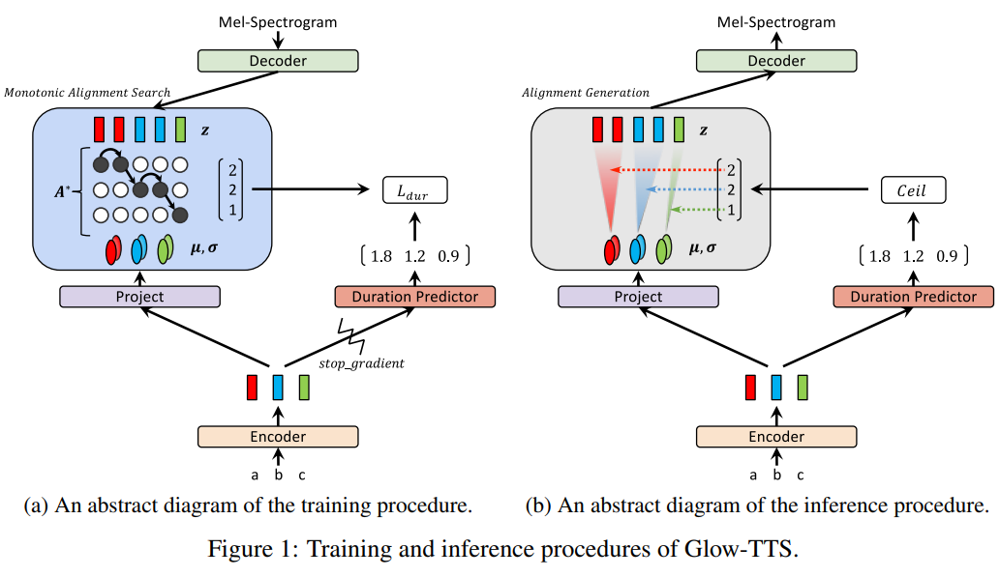

# Glow-TTS

## Autoregressive TTS models & Parallel TTS models

기존의 Autoregressive TTS(정확히는 Text-to-Mel을 의미. 본 문서에서는 TTS라는 용어로 통일한다.)는 seqence length가 길어짐에 따라 inference time이 선형적으로 함께 증가하는 현상이 있었다. 이는 inference time이 굉장히 길어지는 문제점을 낳았고 real-time을 실현하기에는 상당한 무리가 있었다.  
뿐만 아니라 학습과정에서 mispronouncing, skipping, or repeating words같은 문제점을 겪기도 했다.  
이를 극복하기 위해 parallel TTS model이 개발 되었다.

parallel TTS model의 대표적인 예시로는 [FastSpeech](https://arxiv.org/pdf/1905.09263.pdf)가 있다.  
본 모델은 학습된 Autoregressive TTS의 attention map을 활용하여 각 syllable의 duration을 미리 뽑아내고(external aligners), 이를 이용하여 sequence 길이에 상관 없이 병렬적으로 audio를 synthesize할 수 있었다.

하지만 이는 여전히 미리 학습된 Autoregressive TTS model이 필요했고, 이것의 성능에 지대한 영향을 받았다.

Glow-TTS는 이 문제들을 해결한 모델이다. external aligners가 필요하지 않고, Autoregressive TTS보다 15.7배 빠르게 Mel-spectrogram을 합성할 수 있다. 그리고 긴 발화에 대해 훨씬 robust하다.  
이를 어떻게 실현할 수 있었는지가 본 논문의 핵심이라고 할 수 있으며, 그의 핵심 key는  **Monotonic Alignment Search(MAS)** 와 **flow-based generative model**이다.

## FastSpeech

Glow-TTS는 FastSpeech의 Duration Predictor라는 핵심을 비롯한 많은 부분을 차용했다. 이를 이해하기 위해 FastSpeech를 간단하게 먼저 살펴보도록 하자.

FastSpeech의 아키텍쳐이다. 굉장히 직관적으로 잘 표현되어있어 그림만 보고도 상당부분 파악이 가능하다.

전체적인 구조를 보면 Phoneme이 들어가 Mel이 한번에 나오는 것을 볼 수 있는데 이 둘은 sequence length가 맞지 않는다. 그 말은 Phoneme length를 Mel length와 같게 변환하는 작업이 들어있다는 말이다. 그리고 이 역할을 수행하는 것이 **Length Regulator**이다.  (FFT는 특별할 것이 전혀 없으니 넘어가고, Length Regulator를 자세히 살펴보자.)

대부분 Phoneme length는 Mel length보다 짧다. 따라서 length를 늘려주는 작업이 필요하고 이를 **Duration**이라고 표현한다. Duration은 *하나의 Phoneme이 몇개의 Mel sequence에 걸쳐 발음되는지*라고 생각하면 직관적이다. (그림에서는 4개의 Phoneme이 각각 [2,2,3,1]의 Duration을 가진다.) 사람이 문장을 읽을 때 앞에서 뒤로 순서대로 읽으므로 각각의 duration은 monotonic하다고 가정한다. (섞이지 않는다.)

그리고 이 Duration을 예측하는 것이 Duration Predictor이다.  
각 FFT를 지난 각각의 Phoneme 벡터는 Duration Predictor(Conv1D+Norm+Linear)를 이용하여 하나의 scalar로 표현된다. 그리고 pre-trained autoregressive TTS models의 attention map에서 가져온 값을 label로 활용하여 학습하게 된다.

이렇게 예측된 Duration값들은 inference 과정에서 non-autoregressive를 가능하게 해준다. 즉, sequence에 따라 순서대로 inference를 수행하지 않아도 되기 때문에 훨씬 빠른 inference가 가능하며 attention의 monotonic한 alignment를 보장하기 때문에 mispronouncing, skipping, or repeating words같은 문제들로부터 autoregressive model에 비해 훨씬 자유롭다.  
(참고로 Duration의 prediction은 training과정에서는 사용되지 않는다. pre-trained autoregressive TTS models의 attention map에서 가져온 원래의 Duration을 사용하면 되기 때문.)

이렇게 parallel TTS model은 기존 autoregressive model의 많은 문제점들을 해결했지만 여전히 문제점을 가지고 있다. 바로 pre-trained well-aligned attention maps이 필요하다는 것.  
Glow-TTS는 이를 어떻게 해결했는지에 주목하면서 내용을 살펴보도록 하자.

## Glow-TTS

Glow-TTS의 핵심은 **Monotonic Alignment Search(MAS)** 와 **flow-based generative model**이다. 하지만 flow-based generative model은 원래 다뤘던 것이기도 하고 기존에 있던 것을 가져다 쓴 것이기 때문에 본 문서에서는 flow-based generative model에 대해 자세하게 설명하지 않는다. (자세한 내용이 궁금하다면 [WaveGlow - Detail](https://ta.wiki.42maru.com/doc/waveglow-flow-based-generative-model-detail-SPgWVHtf0U) 참고.)

아키텍쳐 그림을 따라가며 순서대로 살펴보면 *이걸 왜 계산하는거지?* 라는 의문점이 계속 생기게 되므로 Loss 구성부터 먼저 짚고, 그 이후에 그림을 따라가며 순서대로 살펴보도록 하자.

### Loss

Loss는 **Negative Log-Likelihood Loss**와 **Duration Loss** 두가지로 구성되어 있고, 둘을 더해 최종 Loss로 사용한다.

#### Negative Log-Likelihood Loss

우선 Glow-TTS는 flow-based generative model이기 때문에 Likelihood를 명시적으로 계산할 수 있다. 식은 다음과 같다.

$$
\log P_X(x|c) = \log P_Z(z|c) + \log \Bigg| \det \dfrac{\partial f_{dec}^{-1}(x)}{\partial x} \Bigg|
$$

where

- $P_X(x|c)$: conditional distribution of mel-spectrograms
- $P_Z(z|c)$: conditional prior distribution
- $f_{dec}: z \rightarrow x$: flow-based decoder
- $x$: input mel-spectrogram
- $c$: input text sequence

평범하게 생긴 flow-based generative model의 Log-Likelihood이다. ($f_{dec}$의 Jacobian determinant를 정확히 어떻게 계산하는지는 다루지 않는다. 자세한 내용은 [WaveGlow - Detail](https://ta.wiki.42maru.com/doc/waveglow-flow-based-generative-model-detail-SPgWVHtf0U) 참고.) 식만보고 한가지 알 수 있는 점은 mel로 $z$를 만들어낸다는 것이다. (당연)

하지만 궁금한점이 몇가지 있다.

- $P_Z(z|c)$는 어떻게 계산하는지. (정확히는 condition은 어떤식으로 주게 되는지.)
- $f_{dec}$는 어떻게 구성되어 있는지.

#### Duration Loss

$$
L_{dur} = MSE(f_{dur}(sg[f_{enc}(c)]), d)
$$

where

- $L_{dur}$: duration loss
- $f_{enc}$: text encoder
- $f_{dur}$: duration predictor
- $sg$: stop gradient
- $d$: duration label

한국말로 풀어보자면 $c$(text)를 encoder에 넣은 값을 이용하여 duration의 predict 값을 계산하고, duration label과의 MSE를 계산한다.

그리고 여기서도 궁금한점이 있다.

- $f_{enc}$는 어떻게 구성되어 있는지. ($f_{enc}$에서 나오는 값은 뭔지.)
- $sg$(stop gradient)는 왜 필요한지.
- pre-trained TTS model이 없는데 $d$(duration label)는 어디서 어떻게 구하는지.

Loss를 보고 생긴 모든 궁금증을 종합해보면

- $f_{enc}$는 어떻게 구성되어 있는지. ($f_{enc}$에서 나오는 값은 뭔지.)
- $P_Z(z|c)$는 어떻게 계산하는지. (정확히는 condition은 어떤식으로 주게 되는지.)
- $f_{dec}$는 어떻게 구성되어있는지.
- $sg$(stop gradient)는 왜 필요한지.
- pre-trained TTS model이 없는데 $d$(duration label)는 어디서 어떻게 구하는지.

위 궁금증들이 핵심 내용이다. 이에 주목하면서 모델을 살펴보자.

### Encoder (Text Encoder)

Text Encoder는 몇개의 Conv1d, ReLU, LayerNorm 그리고 Transformer Encoder로 구성되어있다. (FastSpeech의 많은 부분을 차용했다.)

Text Encoder의 모든 layer를 지나도 sequence length는 변하지 않고, `output_dim` 역시 `emb_dim`과 같은 값을 사용하여 input과 output의 shape이 완전히 같다.

***그냥 Phoneme token이 맥락를 고려한 `output_dim`차원 벡터값으로 변환된다*** 정도로 생각해도 무방하다.

### Project (Calculate mean and std)

Encoder를 통해 계산된 값을 `Conv1d` 두개에 따로(병렬적으로) 집어넣는다. 이후 두개의 layer에서 나온 각 값을 $c$의 $\mu$, $\sigma$로 정의한다.

수식으로 나타내면

$$
f_{enc}:\ c_{1:T_{text}} \rightarrow \mu_{1:T_{text}}, \sigma_{1:T_{text}}
$$

여기서 계산된 $\mu$와 $\sigma$는 다음과 같이 사용된다.

$$
z_j \sim \mathcal{N}(\mu_i, \sigma_i)
$$

where

- $j$: index of mel
- $i$: index of text

해석하자면, $j$번째 mel을 latent variable로 변환한 $z$값은 $i$번째 text에 영향을 받아 그의 통계량을 모수로 하는 normal distribution을 따른다. (mel → $z$를 어떻게 만드는지는 뒤에서 다룬다.) 그림으로 보면 아래와 같다.

그러면 $j$와 $i$를 매칭시키는 함수(Alignment function)가 하나 필요할텐데 이는 $A: A(j) = i$로 표현한다.

이제 *어떻게하면 $A$를 잘 찾을 수 있는지*가 중요하다고 할 수 있겠다. (다른말로 하면 Duration을 어떻게 잘 찾아낼 수 있는지)

(위 식($z_j \sim \mathcal{N}(\mu_i, \sigma_i)$)은 약간은 잘못된 표현이지만 빠른 이해를 위해 사용했다. 제대로 표현하면 아래와 같다.)

$$
\log P_Z(z|c;\theta,A) = \sum_{j=1}^{T_{mel}}\log \mathcal{N}(z_j;\mu_{A(j)},\sigma_{A(j)})
$$

### Duration Predictor

`Conv1d`와 `LayerNorm`으로 이루어진 평범한 구조이다. 다만 마지막 `Conv1d`의 `out_channels`와 `kernel_size`가 1로, 원래 벡터의 sequence이던 input을 scalar의 sequence로 변환한다. 그리고 이를 Duration의 Predict 값으로 사용한다.

그리고 Duration Loss를 이용한 역전파는 Duration Predictor에 한해서만 이루어진다. $P_X(x|c)$에는 영향을 주면 안되기 때문이다. 따라서 $sg$(stop gradient)가 사용된 것이다.

FastSpeech와 마찬가지로 Duration Prediction 값은 inference시에만 활용된다. (inference시에 Duration Predict는 text만으로 이루어진다.)

근데 여전히 풀리지 않은 의문.  
***Duration의 정답 label은 어디서 구하지.***  

이는 MAS(Monotonic Alignment Search)에서 적절한 $A$를 구하게 되고, 이 $A$를 $f_{dur}$의 label값으로 활용하게 된다. 즉, 결국 MAS가 핵심이다.

### Decoder (Flow-based Mel-spectrogram Decoder)

$z$가 어떻게 계산되는지 알고 있는 것이 MAS를 이해하는데 도움이 되므로 Decoder를 먼저 본다.

Decoder라고 쓰여있지만 flow-based generative model은 사실 invertible한 어떤 $f: x \rightarrow z$(보통은 encoder라고 표현하지만 본 문서에서는 Text Encoder와 혼동을 유발하므로 encoder라는 표현은 지양한다.)를 훈련하고 $f^{-1}: z \rightarrow x$을 Decoder로서 활용한다. 이를 계속 염두에 두고 Decoder($f^{-1}$) 그 자체를 훈련하는 것이 아니라 Decoder의 역함수를 훈련하는 것임을 유의하면서 내용을 살펴보자.

Decoder는 [Glow](https://arxiv.org/pdf/1807.03039.pdf)의 아키텍쳐를 거의 그대로 사용한다.

**ActNorm**, **1x1 Invertible Convolution**, **Affine Coupling** 세가지로 구성되어있다.

#### ActNorm

BatchNorm과 비슷하다.

- `channels`차원의 벡터 두가지를 parameter로 선언하여 `logs`와 `bias`로 명명한다.
- input($x$)에 `exp(logs)`를 곱하고 `bias`를 더해 return한다. (모든 연산은 element-wise로 수행한다. (ActNorm이 invertible한 이유))

#### 1x1 Invertible Convolution

WaveGlow와 마찬가지로 QR Decomposition을 이용하여 orthogonal matrix를 추출, conv layer의 weight를 init한다. 다만 연산량을 줄이기 위해 작은 트릭을 사용하는 부분에서 WaveGlow와 약간의 차이가 있다.

- 원래 `(batch_size, channels, mel_len)`의 shape을 가지는 input을 `(batch_size, 4, channels//4, mel_len)`으로 reshape한다.
- 이를 `kernel_size=(1, 1)`인 `Conv2d`를 사용한다. (이때 `in_channels`와 `out_channels`을 모두 4로 설정하여 연산량을 줄인다.)

#### Affine Coupling

평범한 Affine Coupling Layer이다.

- input을 channel 기준 2등분하여 하나는 `x_0` 다른 하나는 `x_1`로 명명한다.
- `x_0`를 이용하여 `exp(logs)`(=`w`)와 `m`(=`b`)를 만든다.
- `exp(logs)`와 `m`는 dilation이 있는 `Conv1d`를 이용하여 만든다. 둘의 shape은 `x_0`의 shape(=`x_1`의 shape)과 같다.
- `z_0 = x_0`
- `z_1 = exp(logs) * x_1 + m (= wx + b)` (연산은 element-wise로 수행한다.)
- `output = concat(z_0, z_1)`

#### 반복

ActNorm, 1x1 Invertible Convolution, Affine Coupling을 일정횟수 반복한다.

이렇게 $x$(mel)을 $z$로 바꾼다.

### Monotonic Alignment Search (MAS)

가장 중요한 부분이다.  
$z_j \sim \mathcal{N}(\mu_i, \sigma_i)$를 생각하며 다시 [Encoder](#encoder-text-encoder)의 내용으로 돌아가서 지금까지 알게된 내용을 정리하면 다음과 같다.

- 위에서 계산된 $z$가 text에서 뽑아낸 값을 모수로 하는 분포를 따르게 하는 것이 condition을 주는 방법이다.
- $j$와 $i$를 매칭시키는 함수가 alignment function $A$이고, 좋은 $A$를 찾는 과정이 MAS이다.
- $A$의 결과값은 $f_{dur}$를 학습하는 label이 된다.

우선 MAS를 그림으로 살펴보자.

- 첫번째 그림은 monotonic alignment의 한가지 예이다. (중요한 그림은 아니다.)
- 두번째 그림은 모든 $i, j$에 대해 $z_j \sim \mathcal{N}(\mu_i, \sigma_i)$일때의 maximum log-likelihood를 계산하는 과정이다.
- 세번째 그림은 결과적으로 어떤 monotonic alignment가 가장 probable한지 결정하는 과정이다.

그림으로 많은 부분이 설명되었다.

수식으로 보자.

$$
\begin{align*}
& Q_{i,j} = \max_{A} \sum_{k=1}^{j} \log \mathcal{N}(z_k; \mu_{A(k)}, \sigma_{A(k)}) = \max(Q_{i-1, j-1}, Q_{i, j-1}) + \log \mathcal{N}(z_j; \mu_i, \sigma_i) 
& \\
& \\
& for \quad \forall j \in [2, T_{mel}],\\
& if \\
& \quad \argmax_{k} \log \mathcal{N}(z_j; \mu_k, \sigma_k) = i \\
& then \\
& \quad z_{j-1} \sim \mathcal{N}(\mu_i, \sigma_i) \quad or \quad z_{j-1} \sim \mathcal{N}(\mu_{i-1}, \sigma_{i-1})
\end{align*}
$$

식에 따르면

- 각 점들의 값은 $\log \mathcal{N}(z_j; \mu_i, \sigma_i)$ 이다.
- $Q_{i,j}$는 현재까지 경로에 있는 점들의 모든 값을 더한 값이다.
- $j$에 대해 $\argmax_{k} \log \mathcal{N}(z_j; \mu_k, \sigma_k) = i$라면, $z_{j-1} \sim \mathcal{N}(\mu_i, \sigma_i)$이거나 $z_{j-1} \sim \mathcal{N}(\mu_{i-1}, \sigma_{i-1})$이다. (because of monotonic and surjective assumption)

논문에 설명된 계산과정은 아래와 같다.

### Inference

inference과정은 다음과 같이 요약할 수 있다.

- text(phoneme)를 이용하여 $\mu_i, \sigma_i$를 뽑는다.
- text를 이용하여 duration predict 값을 뽑는다.
- duration과 $\mu_i, \sigma_i$를 이용, $z_j$를 sampling한다. ($z_j = \mu_i + \sigma_i * \epsilon$)
- $f_{dec}$을 이용하여 $x$(Mel-spectrogram)을 생성한다. ($f_{dec}(z) = x$)
