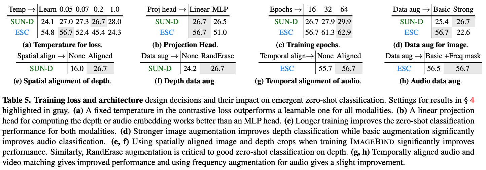

# ImageBind

<https://arxiv.org/abs/2305.05665>

image, text, audio, depth, thermal, IMU data를 single joint embedding space에 embedding 하는 것에 성공했다. (IMU는 Inertial Measurement Unit의 약자로 관성 측정 장치라고 할 수 있다. 데이터가 정확히 어떻게 생겼는지는 잘 모르겠음. 그렇게 와닿지는 않는다.)

전체적으로 컨셉은 [CLIP](https://arxiv.org/abs/2103.00020)과 비슷하다. 다만 modalities가 6개로 늘어났다.

## What To Deal With

최근 많은 연구들이 image features를 text나 audio 등과 같은 다른 modalities와 함께 align하기 위해 노력했다. 이런 방법들은 single pair of modalities를 사용했거나 기껏해야 몇가지 되지 않는 visual modalities를 사용했다. 하지만 최종적으로 생성된 embedding들은 training에 사용된 pair들 끼리만으로 한정되었다. 따라서 video-audio embedding은 image-text embedding과 호환되지 않았고, 반대도 마찬가지다. 이런 현상의 주된 원인은 모든 modalities들이 한번에 나타나있는 large quantities of multimodal data의 부재이다. 여러가지 modalities를 single joint embedding space에 mapping하기 위해 하나의 이미지에 대한 모든 modalities의 combination paired data를 찾는 것은 여전히 불가능하다. (강아지 사진, 사진의 묘사, 짖는 소리, 짖는 비디오 등이 한번에 합쳐진 데이터의 부재.)

## How To Deal With

모든 modalities의 combination paired data가 없다면 이미지랑만 pair 된 데이터를 사용하면 된다. (multiple types of image-paired data.) 모든 modalities간의 pair를 이용하여 학습하는 대신, image하나를 중심으로 각 modalities를 pair로 연결하였다. 이를 위한 데이터는 (image, text) - web-scale, (video, audio) - naturally occurring, (image, depth) - naturally occurring etc. (위 fig 참고)

그리고 image를 중심으로 bind하여 pair embedding을 학습한다. 결과적으로 single joint embedding space에 6가지 modalities을 맵핑하는 것이 가능하다.

아래 데이터셋들로 Naturally paired modalities를 훈련하고 평가했다.

- (video, audio): [Audioset dataset](https://static.googleusercontent.com/media/research.google.com/en//pubs/archive/45857.pdf)
- (image, depth): [SUN RGB-D dataset](https://ieeexplore.ieee.org/document/7298655)
- (image, thermal): [LLVIP dataset](https://arxiv.org/abs/2108.10831)
- (video, IMU): [Ego4D dataset](https://arxiv.org/abs/2110.07058)

### 중요하진 않지만 새로 알게된 사실

(image, text)의 embedding alignment가 잘 수행되었다는 가정 하에, text에 여러 언어가 사용되었다면, 이를 이용한 번역 task 수행이 가능하다.

## Details

### Loss

Loss는 아래 수식과 같이 사용한다. ([InfoNCE](https://arxiv.org/abs/1807.03748) loss)

$$
L_{\mathcal{I, M}} = -\log \dfrac{\exp(\mathbf{q}_i^T \mathbf{k}_i / \tau)}
{\exp(\mathbf{q}_i^T \mathbf{k}_i / \tau) + \sum_{j \neq i} \exp(\mathbf{q}_i^T \mathbf{k}_j / \tau)}
\quad \cdots (1)
$$

$\tau$는 softmax distribution의 smoothness를 조절하는 temperature이다. $j$는 $i$와 연관없는 negative sample이다.  
*하나의 배치 안에서 $j$가 $i$와 다를 경우 모두 negative로 취급한다는데, 하나의 배치안에 강아지 사진이 두번 등장하는 등의 경우가 있을 시 문제가 되겠지만 무시한 듯 하다.*

실제 학습시에는 해당 Loss를 symmetric하게 만들기 위해 $L_{\mathcal{I, M}} + L_{\mathcal{M, I}}$ 형태로 사용한다.

### Encoding modalities

모든 modalities에 대해 Transformer architecture를 사용한 modality encoders를 사용했다.  
그리고 linear projection을 사용하여 각 Encoder에서 나온 modalities의 embedding을 fixed size $d$로 맞춘다.  
학습의 용이함을 위해, 각 Encoder들은 pretrained models를 이용한다. (e.g. image and text encoder using [CLIP](https://arxiv.org/abs/2103.00020))

#### Image

Image data는 그대로 사용했다.  
Image Encoder로는 [ViT](https://arxiv.org/abs/2010.11929)를 사용했다. (ViT-H 630M)

#### Video

Video data는 2 frame video clips sampled from 2 seconds를 사용했다.  
Image Encoder와 마찬가지로 Video Encoder 역시 ViT를 사용했다. (Video에도 ViT를 사용한 근거: [OmniMAE](https://arxiv.org/abs/2206.08356))

#### Audio

[AST: Audio Spectrogram Transformer](https://arxiv.org/abs/2104.01778)에 따라 16kHz sample rate의 audio를 128 mel-spectrogram으로 바꿔 사용한다.  
spectrogram 역시 이미지와 같이 2D signal이므로, Audio Encoder는 16 patchsize, 10 stride를 가지는 ViT를 사용한다. (ViT-B)

#### Thermal & Depth image

둘 모두 one-channel images 취급한다.  
Encoder는 똑같이 ViT 사용한다. (ViT-S)

#### IMU

X, Y, Z 축을 가지는 자이로스코프 측정값을 kernel size 8의 1D convolution을 이용하여 project 하고, 해당 sequence를 Transformer를 이용하여 encode 한다.

#### Text

[CLIP](https://arxiv.org/abs/2103.00020)의 text encoder 디자인을 그대로 차용했다. (OpenCLIP 302M)

## Experiments

### Emergent zero-shot vs. zero-shot

CLIP, [AudioCLIP](https://arxiv.org/abs/2106.13043)과 같이 ImageBind는 audio와 text를 이용한 zero-shot classification task 수행이 가능하다. (물론 audio text외에 다른 modalities에 대해 가능하다.) 이에 대한 훈련을 직접 수행한 것이 아님에도 가능하다는 점에서 Emergent zero-shot이라고 명명한다.

예시를 들자면, 강아지 image와 함께 "이것은 강아지야?"라고 물어보면 "그렇다", "아니다" 대답하는 것. audio등 다른 modalities도 마찬가지. 이에 대해 high classification performance를 얻었다.

다른 모델들과의 zero-shot, few-shot classification performance를 비교하는 내용이 굉장히 긴데, 이는 생략한다.

### Multimodal embedding space arithmetic

여러 modalities를 섞어 표현할 수 있다는 내용이다. 과일 사진(image)와 새소리(audio)의 embedding을 더해 이미지 검색에 사용하면 과일과 새가 함께 있는 사진이 나온다. *여기서 의문이었던 점은 두 embedding을 그냥 더하는 듯 말하는데, 그냥 더하면 embedding length scale이 달라질 것이다. 더한 embedding을 normalize해주는 과정이 있는지는 코드를 봐야 알 수 있을 것 같다.*

### Upgrading text-based detectors to audio-based

text-based로 되어있던 object dectection을 audio-based로 바꿀 수 있다는 내용이다.  
방법은 object detection model인 pretrained [Detic](https://arxiv.org/abs/2201.02605)의 CLIP text embedding을 ImageBind audio embbedding으로 바꿔치기 한다. 별도의 훈련은 필요 없다. 이렇게 하는 것 만으로도 audio-based object detection이 가능하다.

### Upgrading text-based diffusion models to audio-based

text-based diffusion models(image generation)을 audio-based로 바꿀 수 있다는 내용이다.  
방법은 object detection을 바꿔치기 했던 것과 똑같다. [DALLE-2](https://arxiv.org/abs/2204.06125)(private reimplementation을 사용)의 text prompt embeddings를 audio embedings로 바꿔치기한다. 꽤 그럴듯한 이미지 생성에 성공했다.

## Ablation Study

### Scaling the Image Encoder

ImageBind의 주 아이디어는 image를 중심으로 여러 modalities의 representation를 정렬하는 것이다. 따라서 image encoder의 scale에 따른 변화를 살펴본다.

결론은 image encoder는 크면 좋다.

### Training Loss and Architecture

#### 

Training에 사용되는 여러가지 요소들에 대한 study이다.

#### Contrastive loss temperature

[table5](#table5)의 (a)

[Loss](#loss)의 temperature $\tau$의 변화에 따른 study이다. [CLIP](https://arxiv.org/abs/2103.00020)에 따라 $\tau$를 0.07로 init한 learnable param으로 설정 vs fixed value에 대해 비교한다. CLIP과는 다르게 fixed가 더 좋았다.

#### Projection head

[table5](#table5)의 (b)

각 modalities의 embedding을 하나의 fixed length를 가지게 하기 위해 사용되는 projection을 어떻게 할 것이냐에 대한 study이다. Linear가 MLP보다 좋다.

[table5](#table5)의 나머지 내용은 표만 보고 이해가 되거나, 크게 중요하지 않은 디테일이라고 생각되어 생략한다.

#### Effect of batch size

배치 사이즈에 따른 study이다. modality에 따라 optimal batch size가 다르다.  
데이터 셋 자체의 크기가 작을수록 batch size는 작은 것이 좋다. 이유는 제한적인 diversity 때문에 positive negative pairs 확보에 어려움을 겪는 것으로 생각된다고 저자는 말한다. [Loss](#loss)자체도 하나의 batch의 같은 label(여러개의 positive)가 들어있는 경우를 생각하지 않으므로 설득력 있다. (NYU-D는 (image, depth) dataset)

## Limitations

- image가 아닌 다른 modalities간의 pair dataset이 있다면 좋을 것. (e.g. audio with IMU)
- 특정한 downstream task에 대해 훈련이 되지 않았고, 이에 따라 specialist models에 비해 성능이 좋지는 않다. 하면 좋을 것.
