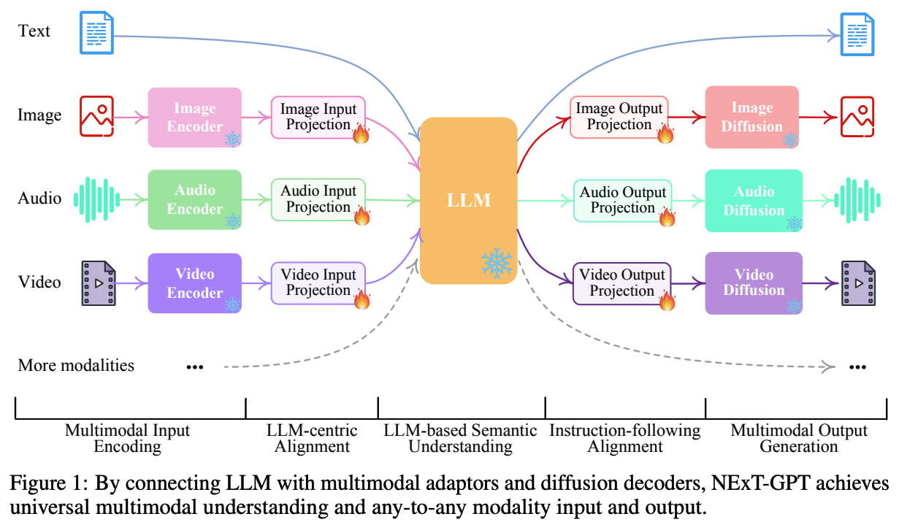
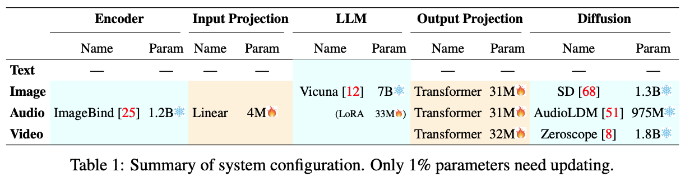
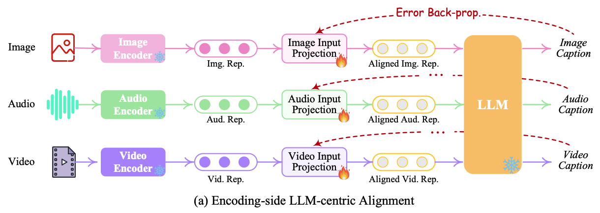
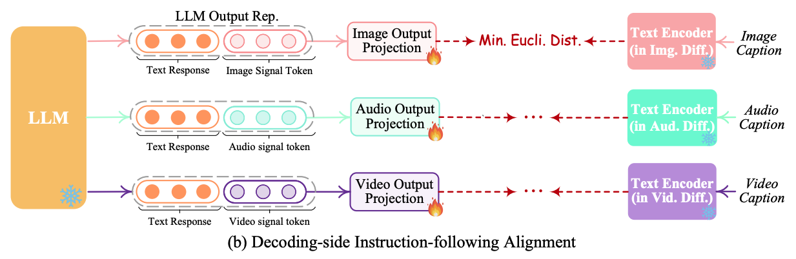
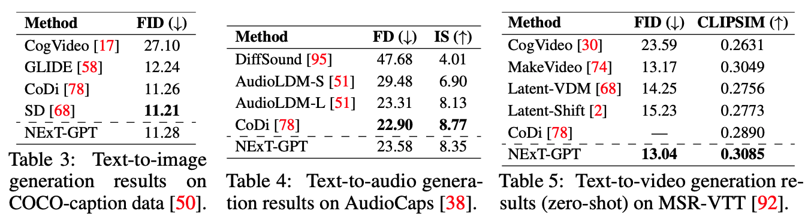
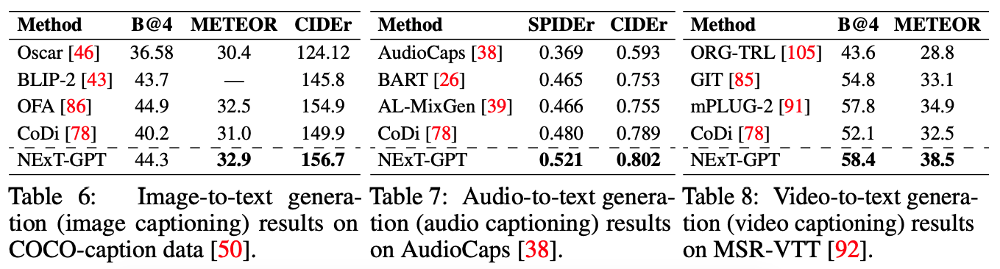
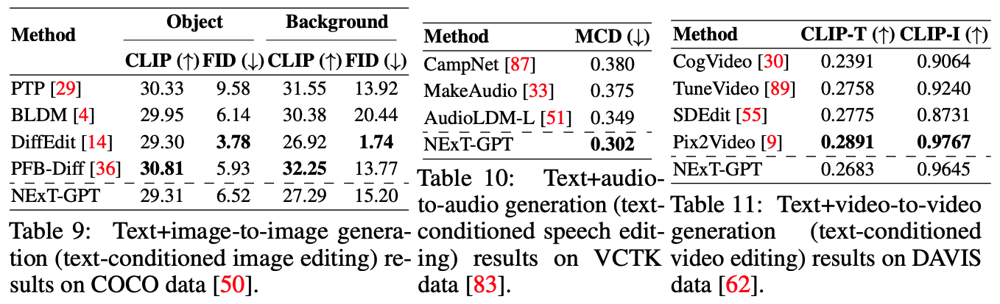

# NExT-GPT: Any-to-Any Multimodal LLM

<https://arxiv.org/abs/2309.05519>

## What To Deal With

이전부터 MM-LLM(MultiModal LLM)에 대한 탐구는 많았다. 대부분의 연구는 understanding multimodal input에 관심이 있었고, multimodal generation에서는 약한 모습을 보였다. (e.g. BLIP-2, Flamingo, MiniGPT-4, Video-LLaMA, LLaVA, PandaGPT, SpeechGPT ...)  
한편 LLM과 external tools의 결합을 통해 'any-to-any' multimodal을 실현하려는 시도도 있었다. e.g. Visual-ChatGPT HuggingGPT. 이들은 multimodal understanding과 generation을 모두 가능하게 했다. 하지만 이들은 여전히 서로 다른 modal간 정보의 전달을 오직 LLM이 만들어내는 text에 의존하였다. 이런 cascade 방식은 무조건 noise와 error를 수반한다. 그리고 pre-trained tools를 training 과정 없이 inference에만 활용하기 때문에 사용자의 복잡하고 implicit한 지시사항을 수행하지 못한다.

## How To Deal With

구조는 Encoder-LLM-Diffusion(Decoder)으로 충분히 생각할 수 있는 구조이다. 중요한 점은 크게 세가지를 뽑을 수 있다.

### 세가지 단계 간의 Alignment

세가지 단계가 loosely-coupled 된 system을 설계 했으므로, 각 단계 간의 feature alignment를 맞추는 것이 중요하다. Encoder <-> LLM alignment를 **encoding-side LLM-centric alignment**, Diffusion <-> LLM alignment를 **decoding-side instruction following alignment** 라고 부른다. 이 alignment를 맞추는 layer를 projection layer라고 부른다.

### LLM fine tuning을 위한 LoRA

Projection만으로는 LLM이 multimodal에 맞춰 훈련되지 않기 때문에, LoRA를 이용하여 LLM도 fine tuning해준다.

### E2E Instruction fine tuning을 위한 Mosit dataset

또한 E2E로 fine tuning하기 위한 instruction data가 부재하기 때문에 **Mosit** 이라는 새로운 high quality cross modal data를 만들었다. (5000개의 샘플 수를 가진다.)

## Details

### Trainable Parameters

훈련에 사용되는 총 parameter는 131M으로 전체 parameter 12.275B의 약 1% 정도이다.

### Multimodal Encoding Stage

Image, Audio, Video 모두 [ImageBind](https://arxiv.org/abs/2305.05665) 하나로 Encoding한다. ImageBind는 6개의 modalities에 대해 작동하는 high-performance encoder이다. 그리고 ImageBind를 통한 각기 다른 input representations는 linear projection layer를 통해 LLM이 이해할 수 있는 language-like representations로 맵핑된다.

### LLM Understanding and Reasoning Stage

LLM으로는 [Vicuna(7B)](https://huggingface.co/lmsys/vicuna-7b-delta-v0)를 사용했다. (이미 MM-LLMs에 사용된 적이 있다. [PandaGPT](https://arxiv.org/abs/2305.16355), [Video-LLaMA](https://arxiv.org/abs/2306.02858)) 여기에 LoRA(33M)을 이용하여 finetuning한다.

LLM은 모든 input을 받아 어떤 contents를 generate할지 결정한다.(text 혹은 다른 modality) LLM이 text를 제외한 다른 content를 생성하기로 결정한다면 speacial type의 token이 출력된다. (참고논문 [Generating Images with Multimodal Language Models](https://arxiv.org/abs/2305.17216))

### Multimodal Generation Stage

Image synthesis를 위해 [Stable Diffusion](https://huggingface.co/runwayml/stable-diffusion-v1-5)([paper](https://arxiv.org/abs/2112.10752)), Video synthesis를 위해 [Zeroscope](https://huggingface.co/cerspense/zeroscope_v2_576w)([paper](https://huggingface.co/cerspense)), Audio synthesis를 위해 [AudioLDM](https://audioldm.github.io/)([paper](https://arxiv.org/abs/2301.12503))을 사용했다.

### Encoding-side LLM-centric Multimodal Alignment

core LLM이 multimodal input을 이해할 수 있도록 각기 다른 multimodal features와 text feature space와 alignment를 맞추는 과정이다. alignment를 맞추기 위해서 이미 존재하는 corpus와 benchmarks에서 **X-caption pair** ('X'는 이미지, 오디오, 비디오를 뜻 함)를 찾아야 했다. 그리고 LLM이 각 input X에 대한 gold caption을 만들도록 훈련했다.

### Decoding-side Instruction-following Alignment

각 diffusion model과 LLM간의 full-scale alignment를 훈련하면 computational burden이 너무 크다. Diffusion에 오직 text로만 condition을 주게 되면 LLM의 text output과 diffusion의 text encoder간의 해석의 차이가 발생하게 된다. 따라서 text를 건너뛸 수 있도록 LLM의 output에 projection을 붙여 해당 projection의 output 값과 각 diffusion encoder들의 text encoder output값의 distance를 줄이도록 훈련한다.

### Instruction Tuning

alignment를 맞춘다 하더라도 encoder-LLM-diffusion 전체 모델이 사용자의 instructions를 완벽히 이해하고 원하는 output을 만들어내기는 힘들다. 이를 가능하게 하기 위해서는 instruction tuning은 필수적이다. NExt-GPT를 위한 IT dataset으로 다음을 고려한다.

#### Text+X - Text

input으로 text와 multimodal contents가 결합된 inputs와 textual responses from LLM을 outputs로 가지는 데이터이다. 이에 해당하는 데이터로는 [LLaVA](https://arxiv.org/abs/2304.08485), [miniGPT-4](https://arxiv.org/abs/2304.10592), [VideoChat](https://arxiv.org/abs/2305.06355)이 있다. 이들을 tuning 목적으로 사용했다.

#### Text - Text+X

보통 MM-LLMs는 multimodal input - text output 을 하기 때문에 Text - Text+X 데이터(namely T2M)는 직접 만들었다. 기존 코퍼스와 벤치마크의 풍부한 양의 X-caption pairs를 기반으로 captions와 result를 wrap하는 textual instructions를 GPT-4를 이용하여 만들었다.

#### MosIT

위의 두가지 만으로는 다양한 modalities에 대한 학습이 부족했다. 또한 real-world 시나리오를 따라가기에는 dialogues가 상대적으로 짧았다. 따라서 Modality-switching Instruction Tuning (MosIT) 데이터를 추가로 선보인다.

'인간' 역할과 '기계' 역할 사이의 몇 가지 template dialogue를 설계하고, 이를 기반으로 GPT-4가 100개 이상의 주제나 키워드가 있는 다양한 시나리오에서 더 많은 대화를 생성하도록 유도한다. 각 conversation은 input과 output모두 multiple modalities를 가지는 3-7 turns(i.e. QA pairs)를 포함한다. multimodal contents가 포함된 conversation에 대해서는 Youtube같은 외부 리소스를 이용했고, AIGC(AI Generated Contents) tools([Stable-XL](https://arxiv.org/abs/2307.01952), [Midjourney](https://www.midjourney.com/))를 이용하기도 했다. 최종적으로는 human inspections와 filtering을 이용하였고, 5K개의 좋은 품질의 dialogues를 확보했다.

## Experiments

### Text - X

각 분야 SOTA들과 비교해도 크게 밀리지 않는다.

### X - Text

Image-to-text에서는 유독 성능이 좋다. LLM과 Diffusion을 text를 거치지 않고 direct로 연결해서 그런것으로 생각된다고 저자는 말한다.

### Text+X - X (text-conditioned modal editing task)

위 두가지에 비해 성능이 떨어진다. 하지만 썩 나쁘지는 않다.

### Human Evaluation on Complex Any-to-any QA

좀 더 복잡한 input과 output간의 cross-modal interactions 평가이다. 이 부분에 대해서는 standard benchmark가 존재하지 않기 때문에 1점부터 10점으로 점수를 측정하도록 human evaluation을 진행했다.  
NExT-GPT는 audio와 video를 만들어내는 것에 비해 images를 만들어내는 것에 강점을 보였다. 또한 combinations of multimodal content에 대해서는 single-modal보다 약했다. complexity 때문이라고 저자는 생각한다.

## Conclusion

이미 있는 Encoder, LLM, Diffusion을 연결함으로써 1%정도의 trainable parameters로 꽤나 좋은 결과를 얻었다. 또한 MosIT 데이터가 앞으로의 MM-LLMs (+ human-like AI) 발전에 도움이 될 것이라고 믿는다.

### Limitaions and Future work

- **Modalities & Tasks Expansion**  
  web page, 3D vision, heat map, tables&figures 같은 더 많은 modalities와 object detection, segmentation, grounding, tracking같은 task에 대한 확장이 필요하다.
- **LLM Variants**  
  7B Vicuna 외에도 requirements에 맞는 다양한 LLM을 결합을 시도해보자.
- **Multimodal Generation Strategies**  
  diffusion model의 성능에 의해 multimodal contents 생성에 한계가 있다. retrieval-based 접근을 통한 생성 프로세스를 보완이 좋아보인다.
- **MosIT Dataset Expansion**  
  데이터 양을 늘림으로써 MM-LLMs이 user prompts를 더 잘 이해하는 능력을 기를 수 있을 것이다.
