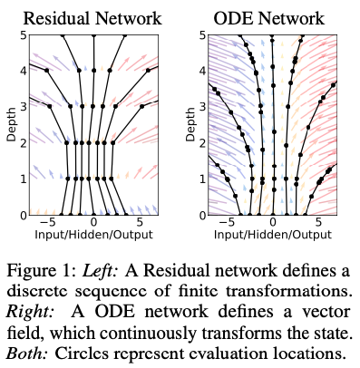

# Neural Ordinary Differential Equations

## Abstract

새로운 neural net model을 제시한다. hidden layers를 discrete하게 구성하지 않고 hidden state의 derivative를 parameterize한다. network의 output은 black-box differential equation(미분방정식) solver를 통해 계산된다. 이런 continuous-depth models는 메모리 비용이 일정하고 inference에 있어 precision과 speed 사이를 조절할 수 있다.  
또한 continuous normalizing flows를 통해 data dimensions를 나누거나 정렬하지 않고 maximum likelihood를 통해 훈련할 수 있다.  
훈련에 있어서 internal operations에 직접 접근하지 않고 ODE solver를 통해 역전파하는 방법을 보여준다. 이는 더 큰 모델에 대해 end-to-end 훈련을 가능하게 한다.

## 1. Introduction

residual networks, recurrent neurla network decoders, normalizing flows 같은 모델들은 복잡한 transformations를 hidden state의 transformations의 연속으로 구성한다.

$$
\mathbf{h}_{t+1} = \mathbf{h}_t + f(\mathbf{h}_t, \theta_t) \quad \cdots (1)
$$

where $t \in {0, ..., T}$ and $h_t \in \mathbb{R}^D$.

이런 반복적인 업데이트는 continuous transformation의 Euler discretization라고 볼 수 있다. (연속 변환의 오일러방식 적분으로 볼 수 있다.)

더 많은 레이어에 대해 더 작은 단계로 극한까지 수행하면 다음과 같이 나타낼 수 있다.

$$
\dfrac{d\mathbf{h}(t)}{dt} = f(\mathbf{h}(t), t, \theta) \quad \cdots (2)
$$

input layer $\mathbf{h}(0)$에서 시작해서 output layer $\mathbf{h}(T)$를 특정 시간 $T$에서 ODE의 initial value problem으로 생각할 수 있다. 그리고 이 값은 ODE solver로 풀 수 있다. fig1은 두가지 방법을 비교한다.

ODE solver를 이용한 모델은 다음과 같은 이점이 있다.

- Memory efficiency  
  Section 2에서 모든 ODE solver를 통한 역전파 방법을 보여준다.
- Adaptive computation  
  Euler’s method는 ODE를 푸는 가장 간단한 방법이고, 이후 효율적인 ODE solver들이 개발됐다(Runge, Kutta, Hairer). 최신 ODE solver들은 approximation 수준을 모니터링하고 보장한다. evaluation strategy를 수정하여 원하는 수준의 정확도를 달성한다. 이를 통해 훈련 후에는 speed를 위해 accuracy를 낮추는 방법도 가능하다.
- Scalable and invertible normalizing flows  
  예상치 못한 부수적 이점으로 change of variables formula의 계산 단순화가 있다. Section 4에서 이에 대해 설명한다.
- Continuous time-series models  
  연속적인 시간변수에 대한 모델을 만들 수 있다. Section 5에서 이에 대해 설명한다.

## 2. Reverse-mode automatic differentiation of ODE solutions

continuous-depth networks 훈련시 가장 큰 기술적 어려움은 ODE solver를 통한 역전파이다. forward pass 그대로 미분해서 역전파 하는 것은 단순하지만 메모리 비용이 많이 들고 추가적인 에러가 발생한다.

따라서 ODE solver를 블랙박스 취급하고 adjoint sensitivity method를 사용하여 gradients를 계산한다. 이 접근 방식은 second, aug- mented ODE backwards를 time에 대해 거꾸로 풀어서 기울기를 계산하며, 모든 ODE solvers에 대해 적용 가능하다. 이 접근 방식은 problem size에 대해 linearly 확장되고, 낮은 memory cost를 가지며, 명시적으로 에러를 컨트롤한다.

input이 ODE solver의 결과인 scalar-valued loss function $L()$을 최적화 하는 것을 생각해보자.

$$
L(\mathbf{z}(t_1)) = L\Big( \mathbf{z}(t_0) + \int_{t_0}^{t_1} f(\mathbf{z}(t), t, \theta)dt \Big) = L(ODESolve(\mathbf{z}(t_0), f, t_0, t_1, \theta)) \quad \cdots (3)
$$

$L$을 optimize하기 위해서는 $\theta$에 대한 gradients가 필요하다. 이를 위해 첫째로 각 $t$에 대한 $\mathbf{z}(t)$의 gradients를 계산하는 것이다. 이것을 $adjoint\ \mathbf{a}(t) = \frac{\partial L}{\partial \mathbf{z}(t)}$라고 부른다. 이의 dynamics ~~(이게 정확히 뭔지 모르겠다. 미분?)~~ 는 또다른 ODE에 의해 제공되며, 이는 instantaneous analog of the chain rule로 생각될 수 있다.

$$
\dfrac{d\mathbf{a}(t)}{dt} = -\mathbf{a}(t)^T \dfrac{\partial f(\mathbf{z}(t), t, \theta)}{\partial \mathbf{z}} \quad \cdots (4)
$$
