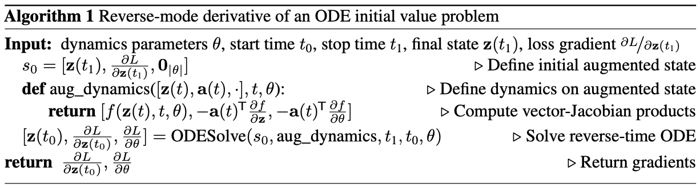
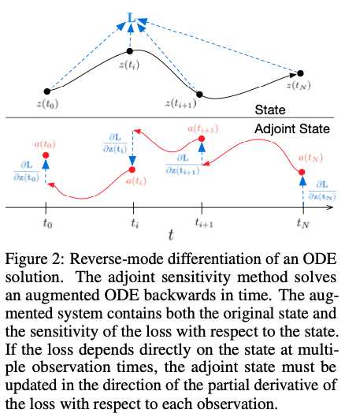
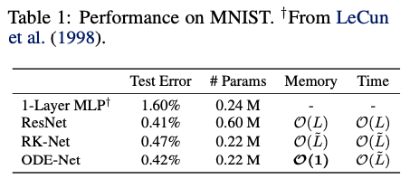
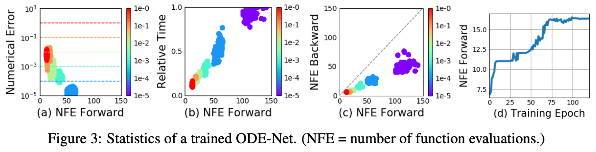
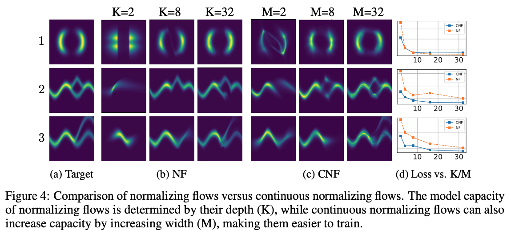
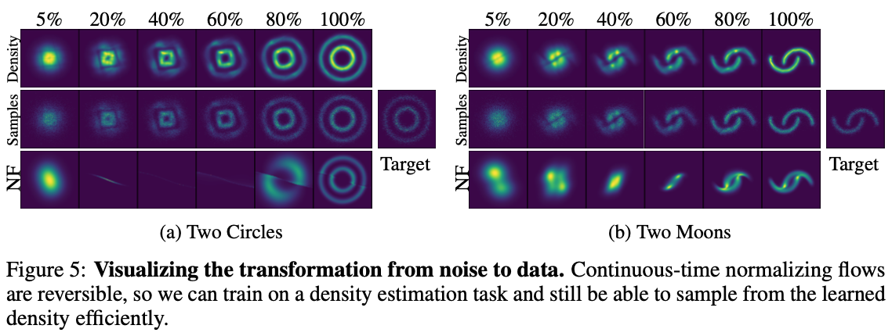

# Neural Ordinary Differential Equations

## Abstract

새로운 neural net model을 제시한다. hidden layers를 discrete하게 구성하지 않고 hidden state의 derivative를 parameterize한다. network의 output은 black-box differential equation(미분방정식) solver를 통해 계산된다. 이런 continuous-depth models는 메모리 비용이 일정하고 inference에 있어 precision과 speed 사이를 조절할 수 있다.  
또한 continuous normalizing flows를 통해 data dimensions를 나누거나 정렬하지 않고 maximum likelihood를 통해 훈련할 수 있다.  
훈련에 있어서 internal operations에 직접 접근하지 않고 ODE solver를 통해 역전파하는 방법을 보여준다. 이는 더 큰 모델에 대해 end-to-end 훈련을 가능하게 한다.

## 1. Introduction

residual networks, recurrent neurla network decoders, normalizing flows 같은 모델들은 복잡한 transformations를 hidden state의 transformations의 연속으로 구성한다.

$$
\mathbf{h}_{t+1} = \mathbf{h}_t + f(\mathbf{h}_t, \theta_t) \quad \cdots (1)
$$

where $t \in {0, ..., T}$ and $h_t \in \mathbb{R}^D$.

이런 반복적인 업데이트는 continuous transformation의 Euler discretization라고 볼 수 있다. (연속 변환의 오일러방식 적분으로 볼 수 있다.)

더 많은 레이어에 대해 더 작은 단계로 극한까지 수행하면 다음과 같이 나타낼 수 있다.

$$
\dfrac{d\mathbf{h}(t)}{dt} = f(\mathbf{h}(t), t, \theta) \quad \cdots (2)
$$

input layer $\mathbf{h}(0)$에서 시작해서 output layer $\mathbf{h}(T)$를 특정 시간 $T$에서 ODE의 initial value problem으로 생각할 수 있다. 그리고 이 값은 ODE solver로 풀 수 있다. fig1은 두가지 방법을 비교한다.

ODE solver를 이용한 모델은 다음과 같은 이점이 있다.

- Memory efficiency  
  Section 2에서 모든 ODE solver를 통한 역전파 방법을 보여준다.
- Adaptive computation  
  Euler’s method는 ODE를 푸는 가장 간단한 방법이고, 이후 효율적인 ODE solver들이 개발됐다(Runge, Kutta, Hairer). 최신 ODE solver들은 approximation 수준을 모니터링하고 보장한다. evaluation strategy를 수정하여 원하는 수준의 정확도를 달성한다. 이를 통해 훈련 후에는 speed를 위해 accuracy를 낮추는 방법도 가능하다.
- Scalable and invertible normalizing flows  
  예상치 못한 부수적 이점으로 change of variables formula의 계산 단순화가 있다. Section 4에서 이에 대해 설명한다.
- Continuous time-series models  
  연속적인 시간변수에 대한 모델을 만들 수 있다. Section 5에서 이에 대해 설명한다.

## 2. Reverse-mode automatic differentiation of ODE solutions

continuous-depth networks 훈련시 가장 큰 기술적 어려움은 ODE solver를 통한 역전파이다. forward pass 그대로 미분해서 역전파 하는 것은 단순하지만 메모리 비용이 많이 들고 추가적인 에러가 발생한다.

따라서 ODE solver를 블랙박스 취급하고 adjoint sensitivity method를 사용하여 gradients를 계산한다. 이 접근 방식은 second, aug- mented ODE backwards를 time에 대해 거꾸로 풀어서 기울기를 계산하며, 모든 ODE solvers에 대해 적용 가능하다. 이 접근 방식은 problem size에 대해 linearly 확장되고, 낮은 memory cost를 가지며, 명시적으로 에러를 컨트롤한다.

input이 ODE solver의 결과인 scalar-valued loss function $L()$을 최적화 하는 것을 생각해보자.

$$
L(\mathbf{z}(t_1)) = L\Big( \mathbf{z}(t_0) + \int_{t_0}^{t_1} f(\mathbf{z}(t), t, \theta)dt \Big) = L(ODESolve(\mathbf{z}(t_0), f, t_0, t_1, \theta)) \quad \cdots (3)
$$

$L$을 optimize하기 위해서는 $\theta$에 대한 gradients가 필요하다. 이를 위해 첫째로 각 $t$에 대한 $\mathbf{z}(t)$의 gradients를 계산하는 것이다. 이것을 $adjoint\ \mathbf{a}(t) = \frac{\partial L}{\partial \mathbf{z}(t)}$라고 부른다. 이의 dynamics ~~(이게 정확히 뭔지 모르겠다. 변수 값?)~~ 는 또다른 ODE에 의해 제공되며, 이는 instantaneous analog of the chain rule로 생각될 수 있다.

$$
\dfrac{d\mathbf{a}(t)}{dt} = -\mathbf{a}(t)^T \dfrac{\partial f(\mathbf{z}(t), t, \theta)}{\partial \mathbf{z}} \quad \cdots (4)
$$

(위 식에 대한 자세한 내용은 Appendix B를 참고할 것.) 그리고 $\frac{\partial L}{\partial \mathbf{z}(t_0)}$를 또다른 ODE solver를 통해 구할 수 있다. 이 ODE solver는 $t_1$를 initial value로 하여 거꾸로 계산되어야한다. 한 가지 복잡한 점은 이 ODE를 풀려면 모든 trajectory를 따라 $\mathbf{z}(t)$를 알아야 한다는 것이다. 하지만 $\mathbf{z}(t)$는 최종 값 $\mathbf{z}(t_1)$에서 시작하여 거꾸로 쉽게 계산할 수 있다.

$\theta$에 대한 gradients를 계산하기 위해서는 다음을 계산한다.

$$
\dfrac{dL}{d\theta} = - \int_{t_1}^{t_0} \mathbf{a}(t)^T \dfrac{\partial f(\mathbf{z}(t), t, \theta)}{\partial \theta} dt \quad \cdots (5)
$$

vector-Jacobian $\mathbf{a}(t)^T \frac{\partial f}{\partial \mathbf{z}}$ 와 $\mathbf{a}(t)^T \frac{\partial f}{\partial \theta}$는 $f$를 evaluating하는 것과 비슷한 time cost로 자동 미분을 통해 효율적으로 evaluated 될 수 있다. $\mathbf{z}, \mathbf{a}, \frac{\partial L}{\partial \theta}$를 풀기 위한 모든 적분은 (original state, adjoint, 그리고 다른 partial derivatives를 single vector로 concat하는) ODE solver의 한번의 호출로 계산될 수 있다. Algorithm 1은 필요한 dynamics를 구성하고 ODE solver를 호출하여 모든 gradients를 한번에 계산하는 방법을 보여준다.

대부분 ODE solver에는 state $\mathbf{z}(t)$를 여러번 출력하는 옵션이 있다. loss가 이런 intermediates states에 영향을 받는다면 reverse-mode derivative는 각 연속적인 pair of output times 사이의 별도의 풀이 sequence로 분리되어야 한다. (fig2 참고) 각 관측치에서 adjoint는 $\frac{\partial L}{\partial \mathbf{z}(t_i)}$ 방향으로 조정되어야한다.

## 3. Replacing residual networks with ODEs for supervised learning

supervised learning에 ODE를 사용한 실험 결과들이다.

Memory를 크게 줄이면서도 ResNet과 비슷한 Test Error를 보였다.

### Error Control in ODE-Nets

ODE solvers는 출력이 실제 해의 주어진 허용오차 내에 있는지 대략적으로 확인할 수 있다. 이 허용오차를 변경함에 따라 Accuracy-Speed trade off가 가능하다. 이에 따라 높은 정확도로 훈련하고 테스트시 낮은 정확도로 전환이 가능하다.

fig 3c는 Backward시의 NFE가 Forward시의 절반인 흥미로운 결과를 보여준다. 이는 memory 측면의 효율 뿐만 아니라 계산측면의 효율성 또한 보여준다.

### Network Depth

ODE solution의 depth를 정하는 방법은 명확하지 않다. 해당 값의 결정은 ODE solver가 자체적으로 수행하고 initial state 혹은 input에 따라 달라진다. fig 3d는 NFE가 훈련이 진행됨에 따라 증가함을 보여주며, 아마 모델이 복잡해짐에 따른 결과일 것이다.

## 4. Continuous Normalizing Flows

Eq1은 normalizing flows와 NICE framework에서도 찾아볼 수 있다. 이런 방법들은 probability의 계산을 위해 change of variables theorem을 이용한다.

$$
\mathbf{z}_1 = f(\mathbf{z}_0)\ \Longrightarrow\ \log p(\mathbf{z}_1) = \log p(\mathbf{z}_0) - \log \bigg\lvert \det \dfrac{\partial f}{\partial \mathbf{z}_0} \bigg\rvert \quad \cdots (6)
$$

planar normalizing flow는 다음과 같다.

$$
\mathbf{z}(t + 1) = \mathbf{z}(t) + uh(w^T \mathbf{z}(t) + b), \quad
\log p(\mathbf{z}(t + 1)) = \log p(\mathbf{z}(t)) - \log \bigg\lvert 1 + u^T \dfrac{\partial h}{\partial \mathbf{z}} \bigg\rvert \quad \cdots (7)
$$

일반적으로 change of variables formula를 사용하는 것에 가장 큰 걸림돌은 determinant of Jacobian $\frac{\partial f}{\partial \mathbf{z}}$를 계산하는 것이다. 이는 $\mathbf{z}$의 dimension의 cubic cost를 가진다.

하지만 놀랍게도 이를 continuous하게 바꾸면 computation이 constant해진다.

### Theorem 1 (Instantaneous Change of Variables)

$\mathbf{z}(t)$를 probability $p(\mathbf{z}(t))$를 가지는 time에 의존한 finite, continuous random variable이라 하고, $\frac{d \mathbf{z}}{d t} = f(\mathbf{z}(t), t)$를 $\mathbf{z}(t)$의 continuous-in-time transformation을 나타내는 미분방정식이라 하자. 이 때 $f$가 Lipschitz continuous하면 다음을 만족한다.

$$
\dfrac{\partial \log p(\mathbf{z}(t))}{\partial t} = - tr \bigg( \dfrac{d f}{d \mathbf{z}(t)} \bigg) \quad \cdots (8)
$$

증명은 Appendix A에 있다. log determinant 대신 trace만을 계산해도 되면서 계산이 훨씬 간단해졌을 뿐더러 일반적인 normalizing flow와 다르게 $f$가 bijective하지 않아도 된다.

planar flow를 continuous하게 하면 다음과 같다.

$$
\dfrac{d \mathbf{z}(t)}{d t} = uh(w^T \mathbf{z}(t) + b), \quad \dfrac{\partial \log p(\mathbf{z}(t))}{\partial t} = -u^T \dfrac{\partial h}{\partial \mathbf{z}(t)} \quad \cdots (9)
$$

initial distribution $p(\mathbf{z}(0))$이 주어졌을 때, ODE를 풀어서 $p(\mathbf{z}(t))$에서 샘플링을 수행하고 평가할 수 있다.

### Using multiple hidden units with linear cost

trace는 linear function이기 때문에 $tr(\sum_n J_n) = \sum_n tr(J_n)$이 성립한다. 따라서 dynamics가 sum of functions라면 log density의 미분방정식 역시 sum이다.

$$
\dfrac{d \mathbf{z}(t)}{d t} = \sum_{n=1}^M f_n(\mathbf{z}(t)), \quad \dfrac{d \log p(\mathbf{z}(t))}{d t} = \sum_{n=1}^M tr \bigg( \dfrac{\partial f_n}{\partial \mathbf{z}} \bigg) \quad \cdots (10)
$$

이는 많은 hidden units를 가지는 flow 모델을 M(number of hidden units)에 대해 linear cost인 적은 비용으로 평가할 수 있다는 뜻이다. 일반적인 NF는 single hidden unit을 쓴다. (안그러면 너무 오래걸림)

### Time-dependent dynamics

flow의 parameter를 function of $t$로 정의할 수 있다. ($f(\mathbf{z}(t), t)$) 이런 parameterization 기법을 [hypernetwork](https://arxiv.org/abs/1609.09106)라고 부른다. 또한 각 hidden unit에 대한 gating 매커니즘을 소개한다. $\frac{d \mathbf{z}}{d t} = \sum_n \sigma_n(t) f_n (\mathbf{z})$ where $\sigma_n(t) \in (0, 1)$이 뉴럴넷이 배우는 dynamics이다. 이를 continuous normalizing flows (CNF)라고 부르도록 한다.

## 4.1. Experiments with Continuous Normalizing Flows

planar를 사용할 때 CNF와 일반 NF의 비교를 수행한다. CNF가 $M$개의 hidden units를 가질 때 $K=M$개의 layers를 가지는 NF 만큼이나 괜찮음을 보인다. (때로는 더 낫다.)

### Density matching

$KL(q(\mathbf{x}) \Vert p(\mathbf{x}))$를 최소화한다. ($q$는 flow, $p$는 target density) fig4에 의하면 CNF가 보통 더 낫다.

### Maximum Likelihood Training

CNF의 장점은 reverse transformation을 forward pass정도의 비용으로 수행할 수 있다는 것이다. 이는 NF는 불가능하다. 이를 통해 density estimation task를 $\mathbb{E}_{p(\mathbf{z})}[\log q(\mathbf{x})]$를 최대화하는 maximum likelihood estimation을 수행함으로써 달성할 수 있다.

CNF로 density를 직접 뽑은 것이 NF보다 좋다.

## 나머지는 관심사와는 차이가 있어서 후략. 나중에 관심이 생기면 다시 읽어보기로.
