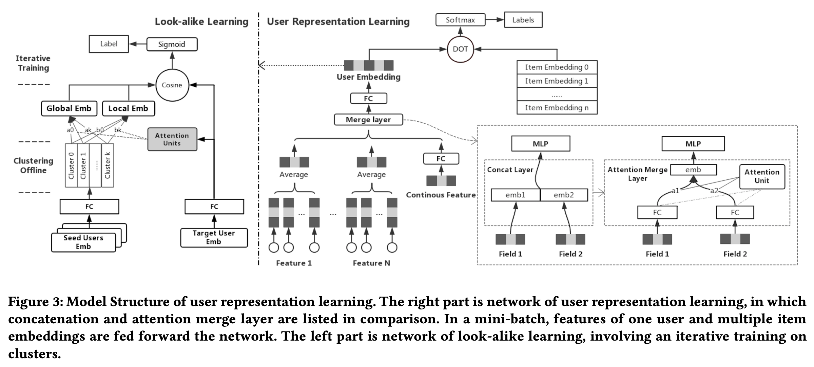
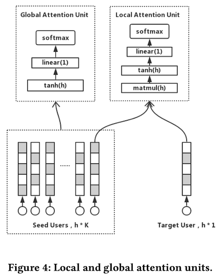
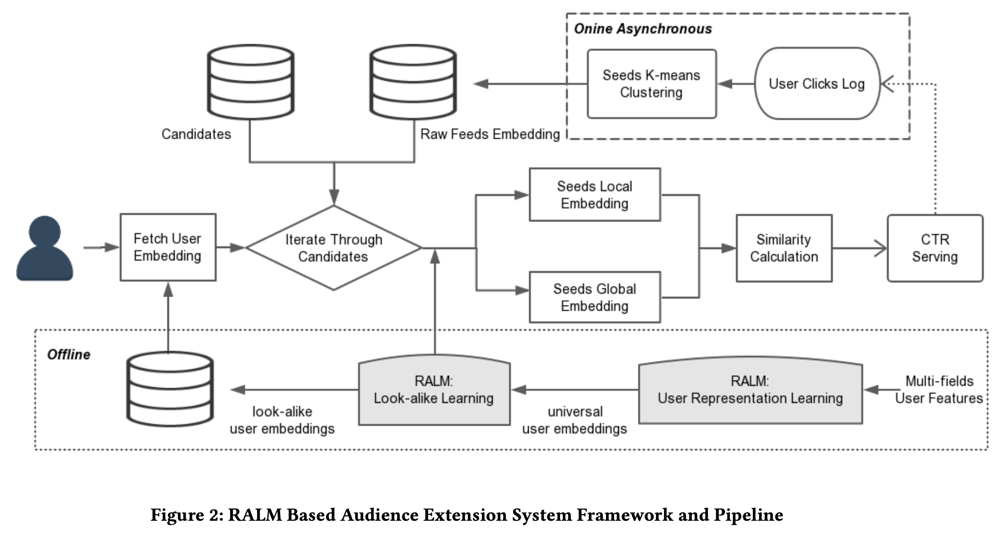
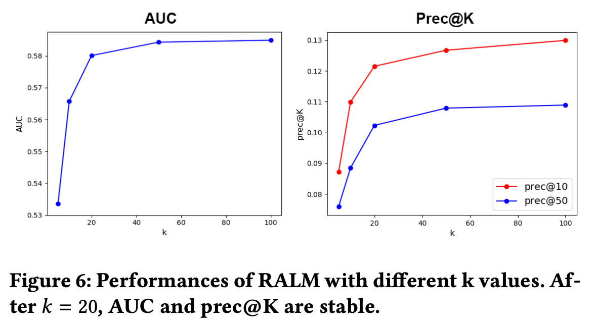

# Real-time Attention Based Look-alike Model for Recommender System

<https://arxiv.org/abs/1906.05022>

## What to Deal with

- **Matthew effect**  
  long-tail contents는 추천에서 멀어지는 현상
- **Real-time**  
  새로운 컨텐츠에 대한 실시간 추천
- **Effectiveness**  
  추천결과의 다양성과 정확성
- **Performance**  
  모델의 복잡성과 동작 속도

## How to Deal with

- Audience extension
  - User representation
  - Look-alike algorithm
- Improve the effectiveness of user representation learning
- Improve the robustness and adaptivity of seeds representation learning  
  (특정 아이템에 대해 해당 아이템을 클릭한 유저의 집합을 해당 아이템의 seeds 혹은 seed users 라고 표현)
- Realize a real-time and high-performance look-alike model

### Specifically (Contributions)

- **Attention Merge Layer**를 통한 User Representation의 Effectiveness 증가.
- Seed Users와 Target User 사이의 **Global Attention**과 **Local Attention**을 통해 Item Representation의 Robustness와 Adaptivity 증가.
- **Seed Users Clustering**을 통한 Real-time과 High-performance Look-alike 모델 실현

## Model Structure

모델은 크게 두가지 파트로 나뉜다.

- Right Part: **User Representation Learning**
- Left Part: **Look-alike Learning**

### User Representation Learning

#### Feature Embedding

- Univalent Feature (ex. gender, location)
  각 Feature에 대한 Embedding 진행
- Multivalent Feature (ex. interested keywords)
  각 Feature에 대한 Embedding 진행 후 해당 Column의 모든 Feature의 Average를 계산
- Continuous Feature (ex. age)
  모든 Continuous Feature를 모아 하나의 벡터로 만든 뒤 FC Layer를 통해 Categorical Feature의
  Embedding Dimension 과 같은 차원의 벡터로 변환 (모든 Continuous Feature는 0~1사이로 Normalize)

#### Attention Merge Layer

$$
u = tanh(W_1 H) \quad \cdots (6)
\quad\quad\quad
a_i = \dfrac{e^{W_2 u_i^T}}{\sum_j^n e^{W_2 u_j^T}} \quad \cdots (7)
$$

where  
$H \in \mathbb{R}^{n \times m}$ is row stacks of fields (= feature embedding vector $h \in \mathbb{R}^{m}$)  
$W_1 \in \mathbb{R}^{k \times n}$ and $W_2 \in \mathbb{R}^k$ are matrix  
$k$ denotes size of attention unit  
$u \in \mathbb{R}^n$ represents the activation unit for fields  
$a \in \mathbb{R}^n$ represents weights of fields.  
(For a value or a set of value representing one kind of categorical features, we call it a feature field.)

*개인적으로 수식이 잘못되지 않았나.. 조심스레 생각해본다. 이유는 다음과 같다.*

(6)의 수식을 그대로 이용하면 n개의 field 차원을 k로 뭉개게 되며, n개의 field 중 어디에 집중할 지 계산하는 attention의 컨셉을 해치게 된다.  
또한 (6)을 그대로 수행하면 (7)에서 matrix간의 shape이 맞지 않아, matrix multiply가 불가능하다.

*따라서 수식을 아래와 같이 바꾸는게 맞지 않을까.. 생각해본다.*

$$
U = tanh(HW_1) \quad \cdots (6)
\quad\quad\quad
a_i = \dfrac{e^{W_2 u_i^T}}{\sum_j^n e^{W_2 u_j^T}} \quad \cdots (7)
$$

where  
$H \in \mathbb{R}^{n \times m}$ is row stack of fields (= feature embedding vector $h \in \mathbb{R}^{m}$)  
$W_1 \in \mathbb{R}^{m \times k}$ and $W_2 \in \mathbb{R}^k$ are matrix  
$k$ denotes size of attention unit  
$u_i$ is row of matrix $U$  
$u_i \in \mathbb{R}^k$ represents the activation unit for fields  
$a \in \mathbb{R}^n$ represents weights of fields.

다음과 같이 수정된 (6)과 (7)을 이용하면 attention의 컨셉을 해치지 않으면서  논문의 의도대로 계산이 가능하다.

최종적으로 $a$는 $n$개의 fields 중 어디에 집중해야할 것인지를 나타내는 가중치를 표현하게 된다.

이후 다음과 같은 계산을 통해 Universal User Embedding을 얻게 된다.

$M = aH$　　··· (8)

$Universal User Embedding = MLP(M)$

논문에서는 이와 같은 Attention Merge Layer가 Concatenate Layer보다 훨씬 좋은 성능을 보이며,
strongly-relevant fields와 weakly-relevant fields 모두의 가중치를 잘 학습할 수 있다고 소개한다.

(*근데 솔직히 그냥 평범한 self attention하면 되는 것 아닌지? 하는 의문이 든다. 실험을 해본 결과였을 것 같지는 않은데.*)

#### Item Embedding

Item Embedding은 단순히 randomly initialize되며 Training 과정에서 update된다. (Embedding Lookup table 사용)

#### Negative Sampling

본 논문은 기본적으로 User Representation Learning을 수백만개의 아이템 중 하나를 선택하는 multi-class classification으로 바라본다.  
이를 softmax로 예측하게 되면 batch마다 모든 Item의 Embedding Look-up Table 가중치가 업데이트 되므로 훈련시 연산량이 너무 많아진다.

따라서 논문에서는 Negative Sampling을 진행하여 훈련의 효율성을 증가시키고자 한다.

하지만 Negative Sample을 무작위로 뽑게 되면 Sample의 데이터가 실제 데이터와 멀어질 수 있으므로 다음과 같은 수식을 통해 각 Item이 Negative Sample로 뽑히게 될 확률을 계산한다.

$p(x_i) = \dfrac{log(k+2)-log(k+1)}{log(D+1)}$　　··· (3)

where  
$x_i$ denotes the $i$-th item  
$k$ denotes the rank of the $i$-th item, $k \in [0, D-1]$  
$D$ denotes the max rank of all the items  
$p(x_i)$ represents possibility of picking the $i$-th item as a negative example

특정 유저가 모든 아이템을 다 클릭하고 다닌다면 해당 유저의 행동이 training loss를 좌지우지하게 되므로 max number of positive example을 50으로 제한한다.  
또한 positive/negative 비율을 1/10으로 맞춘다.

결과적으로 하나의 Input 데이터는 (positive-1개, negative-10개)로 이루어진 11개의 Item Embedding 벡터와 1개의 User Embedding 벡터가 쌍을 이루게 된다.

이렇게 user representation learning을 거친 user embedding을 **Universial User Embedding**이라고 부른다.

### Look-alike Learning

#### Transforming Layer

Look-alike Learning Model은 User Representation Learning을 통해 얻은 Universal User Embedding을 사용한다.

하지만 이를 그대로 사용하게 되면 Overfitting을 유발할 수 있으니 FC레이어를 한번 거쳐 $m$차원인 User Embedding 벡터를 $h$차원으로 변환하고 relu를 거친다. (본 논문에서는 $m$과 $h$ 둘다 128로 동일하게 사용했다.)

이때 User Representation Learning에서 얻은 Target User의 Universial User Embedding이 Transforming Layer를 통과한 결과물을, **Transformed Target User Embedding**라고 부르고 $E_u$로 denote한다.

#### K-means Clustering

Transforming Layer를 지난 Transformed User Embedding을 이용하여 각 아이템의 Seed Users에 대해 K-means Clustering을 진행한다.

Clustering이 끝난 후 K개 클러스터의 Centroid를 해당 아이템의 대표 Matrix로 사용하며 $E_s \in \mathbb{R}^{k \times h}$로 지칭한다.

앞으로의 모든 연산에서 해당 아이템의 모든 Seed Users의 Embedding을 사용하는 대신 K개의 Centroid만을 사용하기 때문에 연산량이 줄어드는 효과를 볼 수 있다.

클러스터링 같은 것 전부 사용하지 않고, 단순히 Seed Users 모두의 Embedding들을 한번에 평균내어 Item의 대표 Embedding 벡터값을 얻을 수도 있다. 하지만 그럴경우 Outlier에 취약하다고 논문은 말한다.

따라서 Item을 대표하기 위한 Embedding을 만들기 위해 Local Seed Embedding (Local Attention)과 Global Seed Embedding (Global Attention) 두가지를 활용한다.

#### Local Seed Embedding (Local Attention)

$$
E_{local_s} = E_s softmax(tanh(E_S^T W_l E_u)) \quad \cdots (9)
$$

where  
$W_l \in \mathbb{R}^{h \times h}$ denotes the attention matrix  
$E_s$ denotes seed users  
$E_u$ denotes target user  
$E_{local_s}$ is an embedding of local information of seeds

본 논문의 수식과 같이 계산하면 Elocals는 $h \times 1$ shape을 가지는 매트릭스(벡터)가 나오게 된다.  
바로 이전 슬라이드의 Fig.4처럼 현재는 열벡터로 표현하고자 하는 듯 싶다. 하지만 User Represent Learning 까지는 계속해서 행벡터로 표현해왔기 때문에 행벡터 형태로 수식을 바꾸면 아래와 같다. (왜 굳이 갑자기 열벡터로 바꿨는지를 모르겠다.)

$$
E_{local_s} = softmax(tanh(E_u W_l E_s^T))E_s \quad \cdots (9)
$$

where  
$W_l \in \mathbb{R}^{h \times h}$ denotes the attention matrix  
$E_s \in \mathbb{R}^{k \times h}$ ($k$ denotes number of cluster) denotes seed users  
$E_u \in \mathbb{R}^{1 \times h}$ denotes target user  
$E_{local_s}$ is an embedding of local information of seeds

**결과적으로 $E_{local_s}$는 $E_s$를 매트릭스가 아닌 하나의 벡터로 만들기 위해 Target User Embedding인 $E_u$와의 Attention을 이용하여 만든 벡터이다.**

#### Global Seed Embedding (Global Attention)

$$
E_{global_s} = E_s softmax(E_s^T tanh(W_g E_s)) \quad \cdots (10)
$$

where  
$W_g \in \mathbb{R}^{s \times n}$ denotes the attention matrix  
$s$ denotes the attention size  
$E_{global_s}$ outputs a weighted summed vector representing the global information of seed users $E_s$.

*이 수식도 잘못되지 않았나.. 조심스레 생각해본다.*

이 수식대로 행렬곱을 진행하면 shape이 맞지 않아 계산이 되지 않는다.
또한 Figure4에서 표현된 `linear(1)` 역시 수식에 없기 때문에 $E_{global_s}$가 벡터가 아닌 매트릭스 형태로 나오게 된다.

따라서 다음과 같이 수식을 수정해보면 어떨까.

$$
E_{global_s} = W_c softmax(tanh(E_s W_g)E_s^T)E_s \quad \cdots (10)
$$

where  
$W_g \in \mathbb{R}^{h \times h}$ denotes the attention matrix  
$W_c \in \mathbb{R}^{1 \times k}$ ($k$ denotes number of cluster) denotes `linear(1)` layer  
$E_{global_s}$ outputs a weighted summed vector representing the global information of seed users $E_s$

**결과적으로 $E_{global_s}$는 $E_s$를 매트릭스가 아닌 하나의 벡터로 만들기 위해 Self-Attention을 이용하여 만든 벡터이다.**

(*이들 역시도 어째서 그냥 평범한 self attention을 사용하지 않았는지.. 추천시스템에서 효율적이고 널리 쓰이는 self attention이 있는 것인가.*)

#### $E_u$, $E_{local_s}$, $E_{global_s}$ 를 이용한 Score 계산

$E_u$, $E_{local_s}$, $E_{global_s}$를 이용하여
Target User와 Seed Users의 유사도를 다음과 같이 계산한다.

$$
score_{u, s} = \alpha \cdot cosine(E_u, E_{global_s}) + \beta \cdot cosine(E_u, E_{local_s}) \quad \cdots(2)
$$

where  
$E_{global_s}$ is the global embedding of seeds  
$E_{local_s}$ is the local embedding of seeds  
$\alpha$ is the weight factors for the global similarity  
$\beta$ are the weight factors for the local similarity

논문에서는 $\alpha =0.3,\ \beta = 0.7$ 을 제안한다.

이 값을 sigmoid에 넣어서 뽑은 값을 pCTR로 활용한다.

#### Iterative Training

back propagation 후, Transforming Layer의 값이 변하기 때문에 K-means Clustering을 위한 Seed Users Embedding의 값이 바뀌게 된다.
따라서 각 Epoch이 끝난 후 K-means Clustering을 다시 수행한다.

훈련은 Look-alike Learning Model의 훈련과 K-means Clustering의 훈련은 번갈아가며 Iterative하게 진행한다.

## System

실제 Item 추천은 다음과 같은 Process로 수행된다.

1. User가 추천을 요청하면 유저의 Feature들을 이용하여 User Representation Model과 Look-alike Model의 Transforming Layer를 이용하여 Target User Embedding을 얻는다.
1. 각 Item들의 Seed Users Embedding과 Target User Embedding 사이의 유사도를 계산하여 Item을 추천한다. ($score_{u, s}$)
1. User가 클릭을 함에 따라 Item의 Seed Users가 확장된다. 이에 따라 Seed Users는 최근 3백만 Click Users로 정의하고 각 Item들에 대해 5분마다 Seed Users K-means 클러스터링을 수행하여 Centroid를 업데이트한다.

## Experiments

### Metric

논문에서는 **precision at K**, marked as $prec@K$를 새로운 Metric으로 제시한다.

$$
prec@K = \dfrac{1}{N} \sum_i^N \dfrac{size(R_{iK} \cap S_i)}{min(K, size(S_i))} \quad \cdots (12)
$$

제시된 추천 목록 K개 중에 얼마나 많이 클릭했나를 측정하는 Metric이다.

#### Setting

real traffic logs from Wechat 2,984,724 users, 43,500 articles and 8,891,670 samples.
Features include user gender, age, interested categories and tags and historically read articleID.

- Adam optimizer
- learning rate = 0.001
- mini-batch size = 256
- dimension of user representation and look-alike embeddings = 128
- number of clusters k = 20

위와 같은 설정의 RALM과 LR, Yahoo Look-alike Model, Youtube DNN, RALM with average 중에 RALM이 가장 좋은 성능을 보였다.  
(RALM with average는 Local & Global Seed Embedding 대신 Seed User들의 Embedding 모두을 평균 낸 값을 사용한 RALM)

#### Experiments on K-means

논문에서는 클러스터 개수 $k$가 변함에 따라 $prec@K$와 AUC가 어떻게 달라지는지에 대한 실험을 추가로 진행한다.

$k = 5, 10, 20, 50, 100$에 대해 실험을 진행한다.

그 결과 k가 커짐에 따라 지속적으로 성능이 좋아진다.
하지만 계산량이 많아지는데 비해 성능이 좋아지는 정도가 크게 차이나지 않기 때문에,
Elbow-point인 20을 K-means Clustering의 클러스터 개수 $k$의 디폴트 값으로 한다.

## Summary

- RALM은 **양질의 추천 결과**를 보여주면서도, **실시간 추천**이 가능하고, **복잡하지 않은** 모델이다.
- RALM은 **User Representation Learning**, **Look-alike Learning** 두가지 파트로 나뉜다.
- User Representation Learning에서 **Attention Merge Layer**를 통해 Concatenate Layer보다 좋은 성능을 얻을 수 있었다.
- User Representation Learning에서 **Negative Sampling**을 통해 계산의 복잡성을 줄일 수 있었다.
- Look-alike Learning에서 **K-means Clustering**을 통해 계산의 복잡성을 줄이고 Real-time을 달성했다.
- Look-alike Learning에서 **Local & Global Seed Embedding**을 통해 Item Representation의 Robustness와 Adaptivity를 증가시켰고, Seed users의 평균으로 Item을 represent하는 것 보다 좋은 성능을 얻었다.
