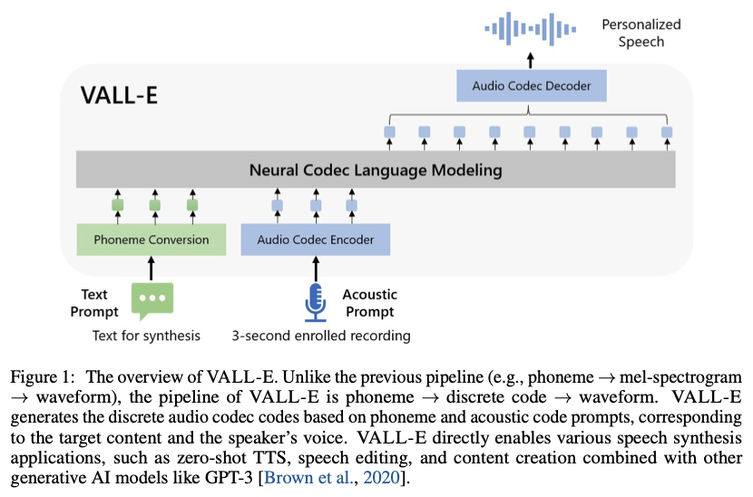
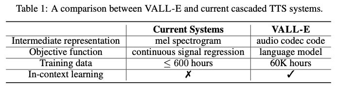
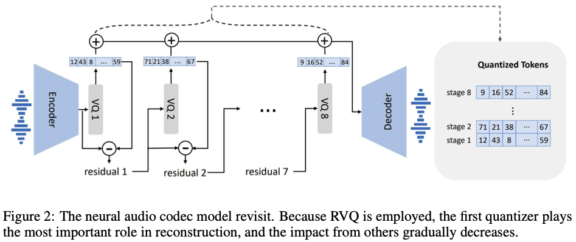
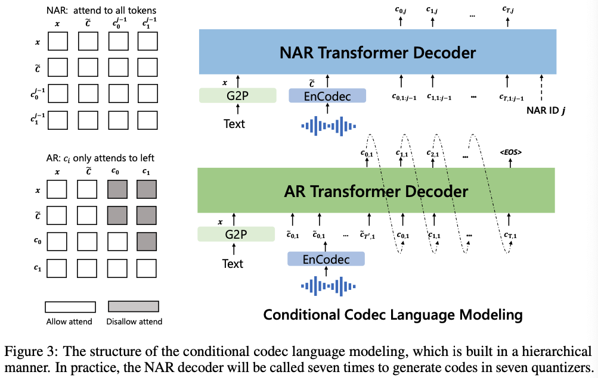

# Neural Codec Language Models are Zero-Shot Text to Speech Synthesizers

https://arxiv.org/abs/2301.02111

## Abstract

neural codec language model (called VALL-E) using discrete codes derived from an off-the-shelf neural audio codec model에서 파생된 discrete codes를 사용한 neural codec language model(called VALL-E)를 만들었다. 그리고 TTS를 conditional language modeling task로 간주한다. (previous work에서는 continuous signal regression으로 간주하던것과 대비된다.)  
3초만으로 custom tts가 가능하며 기존 zeroshot들에 비해 naturalness와 similarity가 압도적이다. 또한 감정또한 보존이 가능하다.

## 1. Introduction

일반적으로 계단식 TTS는 intermediate representations로 mel spectrogram을 활용한다. 고급 TTS는 여전히 고음질 스튜디오 녹음이 필요하다. 따라서 인터넷 대규모 크롤링 데이터 사용은 요구사항을 충족하지 못하고 성능저하로 이어진다. 그리고 training data가 작으므로 current TTS systems still suffer from poor generalization. zero-shot TTS 문제 해결을 위해 복잡한 엔지니어링이 필요하다.

복잡한 네트워크 설계 대신, ultimate solution은 가능한 크고 다양한 데이터를 사용하여 훈련하는 것이다. text synthesis의 성공을 생각해보자. text synthesis는 계속해서 큰 데이터를 활용하면서 눈에 띄는 성능 향상을 이어왔다. Transferring this success to the field of speech synthesis, we introduce VALL-E, the first language model based TTS framework.

discrete acoustic tokens derived from an audio codec model은 TTS를 conditional codec language modeling으로 접근할 수 있게 한다. 또한 acoustic tokens은 inference시에 다른 sampling strategies를 사용하여 다양한 합성 결과를 생성 할 수 있게 한다.

7천명 이상의 화자, 6만시간 이상의 영어 음성으로 훈련했다. 원본 데이터는 음성뿐이고 스크립트가 없기 때문에 STT를 이용해서 스크립트를 만들었다. 사용한 데이터는 더 시끄러운 음성과 부정확한 전사가 포함되어 있지만 다양한 화자와 운율을 제공한다.

VALL-E는 기존 zeroshot tts system에 비해 모든 면에서 뛰어나다. 또한 프롬프트의 acoustic environment(e.g. reverbration)와 emotion을 유지할 수 있다.

## 2. Related Work

### Zero-Shot TTS

계단식 TTS와 E2E TTS를 위해 스피커 임베딩 등 다양한 시도가 있었지만 혁신적인 효과를 보지는 못했다.

### Spoken generative pre-trained models

supervised learning은 speech understanding과 speech-to-speech generation 분야에서 널리 조사되었다. speech-to-speech generation 분야에서는 textless setting이 hot topic이었다. AudioLM은 비슷한 방식을 따라 audio codecs를 활용하여 음성을 합성한다. AudioLM은 HifiGAN같은 vocoder없이도 audio codecs를 기반으로 음성을 합성할 수 있다. AudioLM은 speech-to-speech model이었던 것에 반해 VALL-E는 TTS 모델이다. 따라서 content를 explicitly 제어할 수 있다.

Another direction is to apply pre-training to the neural TTS. unified-modal encoder-decoder framework SpeechT5(레이블이 지정되지 않은 음성 및 텍트 활용)가 제안되기도 했다. 또한 VQVAE를 이용해 unlabeled speech를 discrete tokens로 quantize하여 speech-to-speech translation을 token-to-speech로 훈련하는 시도도 있었다. 이들은 pre-trained model이 fine-tuning을 위해 아주 작은 데이터만을 필요로 함을 증명하였다.

mel spectrogram에 mask와 reconstruction을 적용하여 speech editing와 synthesis에 더 좋은 퍼포먼스를 보인 시도도 있었다.

이전 TTS 시스템이 1000시간 미만의 데이터를 활용한 반면 VALL-E는 6만시간의 데이터로 pre-trained 되었다. 또한 audio codec을 intermediate representations로 사용한 최초이다.

## 3. Background: Speech Quantization

16비트 정수 시퀀스의 1만 이상의 샘플레이트 음성은 다루기 힘들다. 잘 다루려면 음성 양자화가 필요하다. $\mu$-law transformation 은 각 timestep을 256 values로 quantize하고 이를 high-quality raw audio로 reconstruct할 수 있다. WaveNet 같은 음성 생성 모델에서 널리 사용되었지만 느리다.  
벡터 양자화는 feature extraction을 위해 self-supervised speech models에 적용되고 있고, vq-wav2vec, HuBERT같은 것들이 그 예 이다. 이들을 inference 속도가 WaveNet보다 빠르지만 speaker identity가 없고 reconstruct 품질이 낮다. AudioLM은 speech-to-speech language model을 k-means를 이용하여 훈련하고 high-quality speech-to-speech generation을 가능하게 했다.

본 논문에서는 AudioLM에 따라 speech를 discrete tokens로 나타내기 위해 neural codec models을 사용한다. network transmission을 위해 audio를 compress하고 다시 high-quality waveform으로 reconstruct한다. (훈련중에 보지 못한 speaker라도 상관 없다.) 이는 전통적인 audio codec 접근 방식과 비교하여 낮은 bitrates에서 훨씬 나은 모습을 보이며, quantized tokens는 speaker와 recording condition에 대해 충분한 정보를 담고 있다고 생각한다.

audio codec은 다른 quantization 방법들에 비해 다음과 같은 장점들이 있다.

1. speaker information and acoustic information이 풍부하여 reconstruction에 있어 HuBERT에 비해 speaker identity를 더 잘 유지할 수 있다.
2. VQ 기반 방법과 같은 보코더 훈련에 대한 추가 노력 없이 discrete tokens를 waveform으로 변환할 수 있다.
3. $\mu$-law transformation의 문제인 time steps의 length를 줄이기 위한 노력을 덜 할 수 있다.

tokenizer로 pre-trained neural audio codec model [EnCodec](https://arxiv.org/abs/2210.13438)을 사용했다. EnCodec은 variable bitrates에서 input과 output이 모두 24kHz인 convolutional encoder-decoder model이다. 인코더는 24kHz의 입력 파형에 대해 75Hz에서 임베딩을 생성하며, 이는 샘플링 속도가 320배 감소한 것이다. Encoder는 24kHz에 비해 320배 감소된 75Hz의 embedding을 생성한다. 각 embedding은 RVQ(Residual Vector Quantization) 1024개의 entries를 가진 8개의 hierarchy quantizers에 의해 model된다. 이 configuration은 6K bitrates, 24kHz의 EnCodec이다. 이 세팅에서는 10초의 waveform이 주어졌을 때, discrete representation은 750 x 8의 matrix가 된다. (750 = (24000 x 10) / 320) 여기서 750은 downsample된 time step이고 8은 number of qunantizers이다. 비트전송률은 달라져도 괜찮다. 다만 bitrateds가 커질수록 더 많은 quantizers가 필요하고 reconstruction quality가 좋아진다. 예를들어 12K bitrates의 EnCodec을 사용한다면 16개의 quantizers가 필요하게 되고, 10-second waveform은 750 x 16의 행렬이 된다. 모든 quantizers의 discrete codes를 사용하여 EnCodec의 decoder는 실수 embedding을 생성하고 24kHz waveform을 reconstruct한다.

## 4. VALL-E

### 4.1 Problem Formulation: Regarding TTS as Conditional Codec Language Modeling

데이터셋 $\mathcal{D} = \{\mathbf{x}_i, \mathbf{y}_i\}$ ($\mathbf{y}$ 는 audio sample, $\mathbf{x} = \{x_0, x_1, ..., x_L\}$ 은 phoneme transcription) 가 주어졌을 때, 각 audio sample을 discrete acustic codes로 encode하기 위해 pre-trained neural codec model을 사용했다. denoted as Encodec($\mathbf{y}$) = $\mathbf{C}^{T \times 8}$ ($\mathbf{C}$는 two-dimensional acoustic code matrix, $T$는 downsampled utterance length.) acoustic code matrix의 row vector $c_{t,:}$는 frame $t$의 8개의 codes를 나타내고, acoustic code matrix의 column vector $c_{:,j}$는 $j$-th codebook의 code sequence이다. ($j \in \{1, ..., 8\}$) quantization 후에 neural codec decoder는 waveform을 reconstruct할 수 있다. ($Decodec(C) \approx \hat{y}$)

본 논문에서 zero-shot TTS를 conditional codec language modeling task로 생각했다. phoneme sequence $x$와 acoustic prompt matrix $\tilde{C}^{T' \times 8}$, 그리고 optimization objective $\max p(C|\mathbf{x}, \tilde{C})$ 조건 하에 acoustic code matrix $C$를 generate하기 위해 neural language model을 훈련한다. $\tilde{C}$는 같은 neural codec with an enrolled recording as the input에 의해 obtain 된다. neural language model이 content와 speaker information을 각각 phoneme sequence와 acoustic prompt에서 뽑아내길 기대한다. inference시에 주어진 phoneme sequence와 3초의 unseen speaker recording으로 acoustic code matrix를 예측하고, neural codec decoder가 speech를 합성한다.

### 4.2 Training: Conditional Codec Language Modeling

residual quantization in the neural codec model로 인해 tokens는 hierarchical structure를 가진다. 이전 quantizers의 tokens는 speaker identity같은 acoustic properties를 복원한다. 반면 consecutive(연속) quantizers는 미세한(fine) acoustic details를 학습한다. 각 quantizer는 이전 quantizers의 residual을 model하도록 학습된다. 이에 영감을 받아 두개의 conditional language mdoels를 계층적으로 설계하였다.

첫번째 quantizer의 discrete tokens($\mathbf{c}_{:,1}$)에 대해, autoregressive(AR) decoder-only language model을 훈련한다. 이는 phoneme sequence $\mathbf{x}$와 acoustic prompt $\tilde{\mathbf{C}}_{:,1}$에 의해 conditioned 된다. 공식은 다음과 같다.

$$
p(\mathbf{c}_{:,1}|\mathbf{x}, \tilde{\mathbf{C}}_{:,1};\theta_{AR}) = \prod_{t=0}^T p(\mathbf{c}_{t,1}|\mathbf{c}_{<t,1}, \tilde{\mathbf{c}}_{:,1}, \mathbf{x} ; \theta_{AR}) \qquad\qquad \cdots (1)
$$

VALL-E는 decoder-only LM이기 때문에 the concatenation of $\tilde{\mathbf{c}}_{:,1}$ and $\mathbf{c}_{:,1}$ is a whole sequence, 이 둘을 구분하지 않고 specific token을 훈련중에 삽입하지도 않는다. $\tilde{\mathbf{c}}_{:,1}$가 주어졌을때는 오직 $\mathbf{c}_{:,1}$만이 예측된다.

두번째에서 마지막 quantizers의 discrete tokens($\mathbf{c}_{:,j \in [2,8]}$)에 대해, non-autoregressive(NAR) language model을 훈련한다. NAR 방식에서 토큰들은 각자 다른 토큰들에 접근할 수 없으므로, speaker identity를 제한하기 위해 acoustic prompt matrix $\tilde{\mathbf{C}}$를 acoustic prompt로 사용한다. 따라서 모델은 phoneme sequence $\mathbf{x}$, the acoustic prompt $\tilde{\mathbf{C}}$, 그리고 $\mathbf{C}_{:,<j}$ 에 의해 condition된다. 공식으로 나타내면 다음과 같다.

$$
p(\mathbf{c}_{:,2:8}|\mathbf{x}, \tilde{\mathbf{C}} ; \theta_{NAR}) = \prod_{j=2}^8 p(\mathbf{c}_{:,j}|\mathbf{C}_{:,<j}, \mathbf{x}, \tilde{\mathbf{C}} ; \theta_{NAR}) \qquad\qquad \cdots (2)
$$

AR model과 NAR model의 조합은 speech quality와 inference speed 사이의 적절한 trade-off를 보여준다. 한편으로, 생성된 음성의 rate는 enrolled recording과 일치해야하며, 화자마다 말하는 속도가 다양하기 때문에 다른 환자에 대한 length predictor는 훈련하기가 어렵다. 이 경우 acoustic sequence length 예측을 위해 유연성이 있는 AR model이 자연스러운 선택이다. 반면 consecutive(연속) stage의 경우 output slots의 개수가 first stage의 sequence length를 따르기 때문에 time complexity를 O(T)에서 O(1)으로 줄일 수 있다. 전체 공식은 다음과 같다.

$$
p(\mathbf{C}|\mathbf{x}, \tilde{\mathbf{C}} ; \theta) = p(\mathbf{c}_{:,1} | \tilde{\mathbf{C}}_{:,1} , \mathbf{X} ; \theta_{AR}) \prod_{j=2}^8 p(\mathbf{c}_{:,\mathbf{j}} | \mathbf{c}_{:,<j}, \mathbf{x}, \tilde{\mathbf{C}} ; \theta_{NAR}) \qquad\qquad \cdots (3)
$$

#### 4.2.1 Autoregressive Codec Language Modeling

autoregressive language model은 첫 번째 양자화기에서 토큰을 생성한다. phoneme embedding $W_x$, an acoustic embedding $W_a$, a transformer decoder, and a prediction layer로 구성된다. speech with specific content를 생성하기 위해 phoneme sequence를 language model의 phoneme prompt로 사용한다. 따라서 model input은 concatenation of $\mathbf{x}$와 $\mathbf{c}_{:,1}$이다. 그리고 두개의 special \<EOS\> tokens가 각각에 append된다. prompt와 input tokens 각각에 대해 sinuous position embedding을 계산한다. fig3의 왼쪽에서 볼 수 있듯 causal transformer model에 대해 각 토큰 $c_{t,1}$은 $(\mathbf{x}, \mathbf{c}_{\leq t,1})$에 attend to 할 수 있다. 모델은 첫번째 codebook의 next token의 probability를 maximize하도록 optimized 된다. output projection layer와 acoustic embedding $W_a$의 parameters를 공유한다.

AR model에서는 학습에서 audio clip을 prompt로 명시적으로 추출하지 않는다. training process는 pure causal language model training이다. 이 방법으로 모든 prefix sequence $\mathbf{c}_{<t,1}$은 sequence 후반부 $\mathbf{c}_{\geq t,1}$에 대한 prompt로 처리된다. inference시에 enrolled recording이 주어지면, enrolled recording의 phoneme sequence와 synthesis를 위한 phoneme sequence를 concat해야한다. 한편, enrolled recording의 acoustic token sequence는 eq1과 같이 AR decoding의 prefix로 활용된다.

#### 4.2.2 Non-Autoregressive Codec Language Modeling

AR model로 첫번째 quantizer codes를 얻을 때, NAR model을 사용하여 나머지 7개의 quantizers의 codes를 생성한다. NAR model은 8개의 separate acoustic embedding layers를 가진다는 점을 제외하면 AR모델과 유사한 아키텍쳐를 가진다. 각 training step에서 training stage $i \in [2,8]$을 random sample한다. model은 i번째 quantizer codebook을 maximize하도록 훈련된다. stage 1부터 stage i-1까지의 acoustic tokens는 model input으로써 embedded and summed up 된다.

$$
\begin{align*}
& e_{c_{t,j}} = W_a^j \odot c_{t,j} \qquad\qquad \cdots (4) \\
& \\
& \mathbf{e_{c_{t}}} = \sum_{j=1}^{i-1} e_{c_{t,j}} \qquad\qquad \cdots (5)
& \\
& \mathsf{where\ \odot\ indicates\ index\ selection.}
\end{align*}
$$

phoneme sequence는 language model의 prompt로 간주된다. 또한 given speaker의 unique voice를 clone하기 위해 enrolled speech의 acoustic tokens를 acoustic prompt로 활용한다. 구체적으로 먼저 neural codec model을 사용하여 enrolled speech를 $\tilde{\mathbf{C}}^{T \times 8}$로 tokenize한다. The embeddded representations from all of the eigth codebooks는 acoustic prompt $\mathbf{e_{\tilde{C}_t}} = \sum_{j=1}^8 e_{\tilde{c}_{t,j}}$로 summed up 된다. i번째 codebook의 acoustic tokens를 예측하기 위해 transformer input은 concatenation of $(\mathbf{e_x}, \mathbf{e_{\tilde{c}}}, \mathbf{e_{c:,<i}})$이다. positional embeddings 역시 prompt와 acoustic sequence에 대해 각각 계산된다. 현재 stage $i$는 Adaptive Layer Normalization으로 network에 injected 된다. (operator, i.e., $AdaLN(h, i) = a_i LayerNorm(h) + b_i$, where $h$ is the intermediate activations, $a_i$ and $b_i$ are obtained from d a linear projection of the stage embedding.)  
AR과 달리 NAR model에서는 각 token이 self-attention layer의 모든 input tokens를 attend to 할 수 있다. 또한 acoustic embedding layer와 output prediction layer의 parameter를 공유한다. 즉, j번째 prediction layer의 weights는 (j-1)번째 acoustic embedding layer와 동일하다.

### 4.3 Inference: In-Context Learning via Prompting

In-context learning은 text-based language model의 놀라운 능력이다. additional parameter updates 없이 unseen speaker의 label을 예측 할 수 있다. TTS에서는 모델이 fine-tuning 없이 unseen speaker에 대한 high-quality speech를 synthesize할 수 있다면 in-context learning capability가 있다고 말한다. 하지만 현존하는 TTS systems의 in-context learning 능력은 강하지 않다. 왜냐하면 fine-tuning이 필요하거나 크게 성능저하가 있기 때문이다.

language model의 경우 zeroshot 시나리오에 대해 in-context learning 활성화를 위해서는 prompt가 필요하다. prompt와 inference는 다음과 같이디자인 되었다.  
첫째로 text를 phoneme sequence로 바꾸고, enrolled recording을 acoustic matrix로 인코딩 하여 phoneme prompt와 acoustic prompt를 활성화한다. 두 prompt 모두 AR과 NAR model에 사용된다. AR모델의 경우 prompt에 따라 conditioned 되는 sampling based decoding을 사용한다. (beam search가 LM을 infinity loop로 이끌 수 있음이 확인되었기 때문.) 또한 sampling based 방법은 output의 다양성을 크게 향상시킬 수 있다. NAR 모델의 경우 가장 높은 확률의 token을 선택하도록 greedy decoding을 사용하였다. 최종적으로 eight code sequence에 대해 conditioned된 waveform을 생성할 수 있도록 neural codec decoder를 사용했다.  
acoustic prompt는 의미론적으로(semantically) 합성할 음성과 관련될 수도 있고 아닐 수도 있다.

**VALL-E**: unseen speaker에 대한 given content를 generate하는 것이 주 목적이었다. 모델에는 a text sentence, a segment of enrolled speech, 그리고 its corresponding transcription이 주어진다. enrolled speech의 transcription phoneme을 phoneme prompt에서 주어진 phoneme sequence(생성해야하는 문장)에 prepend하고 first layer acoustic token of enrolled speech $\tilde{c}_{:,1}$을 acoustic prefix로 사용한다. phoneme prompt와 acoustic prefix를 사용하여 VALL-E는 speaker의 목소리를 cloning하여 주어진 text에 대한 acoustic tokens를 생성한다.

**VALL-E-continual**: 

이 설정에서는 phoneme과 acoustic prompt로 whole transcription과 utterance의 첫 3초를 사용하고 모델에 continuations 생성을 요청한다. enrolled speech와 generated speech가 semantically continuous하다는 점을 제외하면 inference process는 VALL-E와 동일하다.
