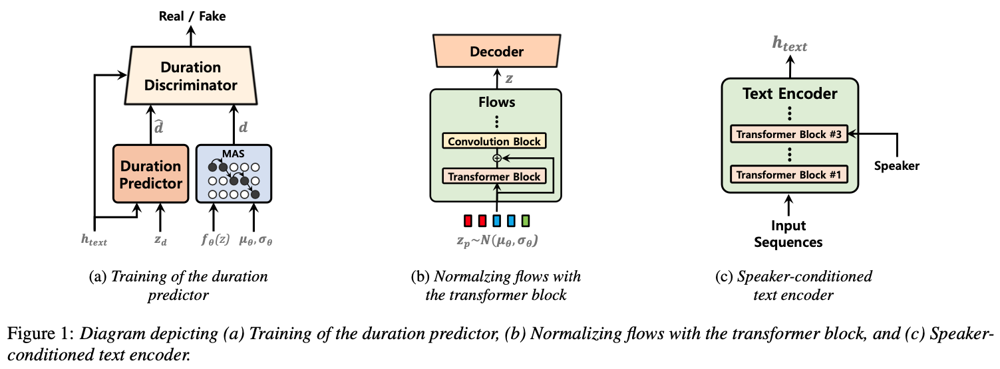
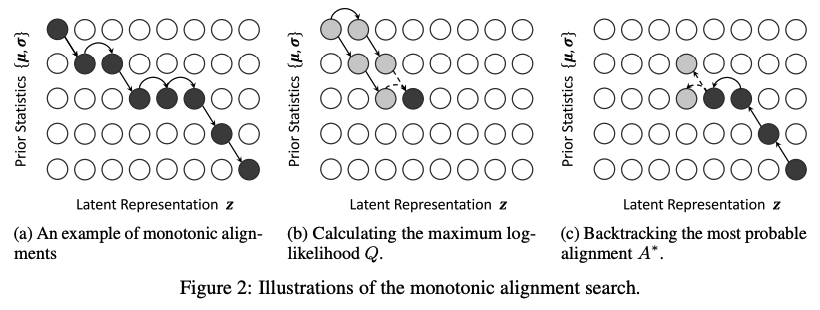
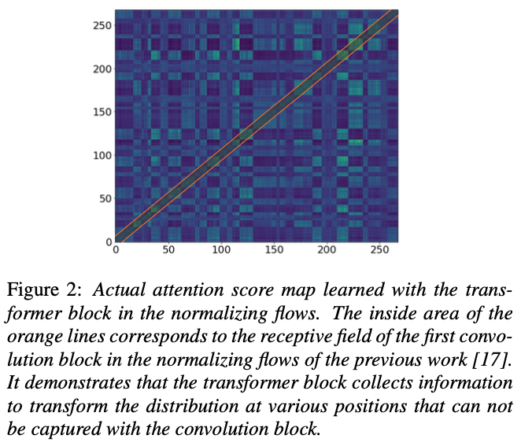
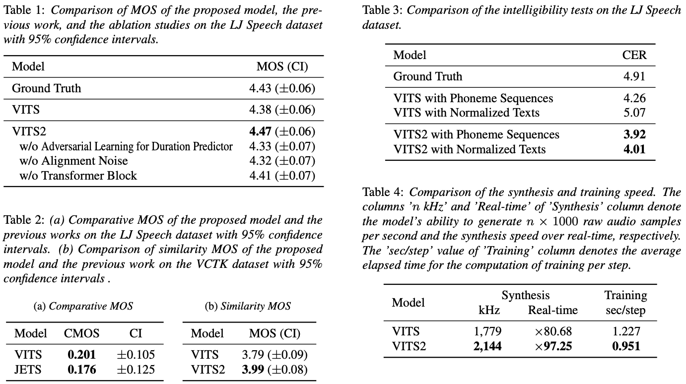

# VITS2: Improving Quality and Efficiency of Single-Stage Text-to-Speech with Adversarial Learning and Architecture Design

VITS의 개선판이다. 저자들이 지적한 VITS의 한계와 극복하기 위해 어떤 조치를 취했는지를 눈여겨 보면 좋을 듯 하다.

## Abstract

VITS는 2 staged TTS model에 비해 성능이 좋았지만 여전히 개선의 여지가 있었다. 이를 개선한 VITS2를 소개한다. 그리고 phoneme conversion에 대한 의존성을 크게 줄였다.

## 1. Introduction

기존 TTS는 text to mel, mel to wav의 두 단계에 거쳐 수행되었다. 모델을 단순화 하고 훈련에 용이하지만 이는 mel이 잘못 만들어지면 그 오류가 그대로 전파된다. 따라서 end-to-end가 활발히 연구 되었고 성과도 있었다.

VITS는 큰 성공을 거두었지만 다음과 같은 문제들이 있었다: **간헐적인 unnaturalness, duration predictor의 low efficiency, complex input(use of blank token), multi-speaker model의 낮은 화자 유사성, phoneme conversion에 대한 높은 의존성**

이를 해결하기 위해 **duration predictor에 adversarial learning사용, transformer block을 사용한 normalizing flows, speaker-conditioned text encoder**를 제안한다.

## 2. Method

4가지 키워드는 **duration prediction, augmented variational autoencoder with normalizing flows, alignment search, and speaker-conditioned text encoder**

### 2.1. Stochastic Duration Predictor with Time Step-wise Conditional Discriminator

VITS는 stochastic duration predictor를 제안하고 기존의 deterministic approach보다 자연스러움을 향상시켰다. 하지만 이는 더 많은 computations와 정교한 테크닉이 요구된다. 이전 연구보다 훈련과 합성에서 모두 더 높은 효율성으로 더 자연스러운 음성을 합성하기 위해 **stochastic duration predictor with adversarial learning**을 제안한다. fig1에 개요가 나와있다. 수식으로 표현하면 다음과 같다.

$$
\begin{align*}
L_{adv}(D) &= \mathbb{E}_{(d, z_d, h_{text})}\big[ (D(d, h_{text}) - 1) ^2 + (D(G(z_d, h_{text}), h_{text}))^2 \big] \quad \cdots (1) \\
L_{adv}(G) &= \mathbb{E}_{(z_d, h_{text})}\big[ (D(G(z_d, h_{text})) - 1)^2 \big] \quad \cdots (2) \\
L_{mse} &= MSE(G(z_d, h_{text}), d) \quad \cdots (3)
\end{align*}
$$

흔히 볼 수 있는 adv loss이다. 그리고 기존의 mse loss도 그대로 사용한다.

제안된 메커니즘은 duration이 짧은 스텝만에 학습이 가능하게 하고, duration predictor가 마지막으로 별도로 훈련되므로 overall computation time for training이 줄어든다.

### 2.2. Monotonic Alignment Search with Gaussian Noise

Glow-TTS와 VITS의 MAS(Monotonic Alignment Search)는 가장 높은 확률을 가지는 text와 audio의 alignment를 계산한다. 그리고 모델은 이 확률을 최대화 하도록 훈련된다. 이 방법은 효율적이지만 한번 alignment를 찾고나면 더 가능성 있는 다른 alignment를 찾지 않는다. 이를 완화하기 위해 계산된 확률에 작은 가우시안 노이즈를 더한다. MAS를 사용한며 모델이 alignment를 빠르게 학습할 수 있으므로 훈련 시작 시에만 이 노이즈를 추가한다.

아래 그림은 Glow-TTS의 fig2로 MAS의 과정을 설명한다. 아래 그림의 Q에 노이즈를 더하게 된다.

$$
\begin{align*}
P_{i, j} &= \log \mathcal{N}(z_j ; \mu_i, \sigma_i) \quad \cdots (4) \\
Q_{i, j} &= \max_A \sum_{k=1}^j \log \mathcal{N}(z_k ; \mu_{A(k)}, \sigma_{A(k)}) \\
&= \max(Q_{i-1, j-1}, Q_{i, j-1}) + P_{i, j} + \epsilon \quad \cdots (5)
\end{align*}
$$

$i, j$는 각각 input sequence와 posterior의 특정 포지션이고, $z$는 normalizing flows를 통해 바뀐 latent variables이다. $\epsilon$은 $P$의 표준편차를 가지는?(~~해석이 애매함~~) 정규분포에서 샘플인 된 것이고, 노이즈 스케일은 $0.01$에서 시작해 매 스텝마다 $2 \times 10^{-6}$ 줄어든다. ($\epsilon$ is obtained as the product of noise sampled from the standard normal distribution, the standard deviation of $P$, and the noise scale starting at $0.01$ and decreasing by $2 \times 10^{-6}$ for every step.)

### 2.3. Normalizing Flows using Transformer Block

VITS의 flow파트는 conv로만 구성이 되어있었다. conv는 인접한 패턴을 효과적으로 찾지만 장기적인 종속성을 찾기는 힘들다. 이에 따라 작은 transformer block을 추가한다.

### 2.4. Speaker-Conditioned Text Encoder

VITS는 text encoder가 speaker condition을 활용하지 않는다. 하지만 화자의 특정 발음이나 억양과 같은 특징이 화자의 음성 특성에 영향을 준다는 점을 고려하여 text encoder에 speaker condition을 활용한다. 3번째 transformer block에서 이를 활용한다.

## 3. Experiments

LJspeech, VCTK 데이터셋을 사용하여 실험했다. phoneme sequences와 normalized texts 모두 사용했다. VITS와 달리 blank token을 사용하지 않았다. generator는 800k, duration predictor는 30k까지 훈련되었다.

## 4. Results

VITS보다 좋았다. MOS, Comparative MOS, Similarity MOS, CER, training and synthesis speed 다 좋았다. phoneme conversion에 대한 의존성도 줄였다.

## 개인적인 의견

### 의문점

우선 기존 VITS의 문제점으로 지적했던 사항들에 공감이 가지 않는 부분들이 있었다.

#### 공감됐던 부분

우선 공감됐던 부분은 **간헐적인 unnaturalness**. 이건 확실히 그렇다. 근데 그렇게 자주 나타나지는 않는다. 그리고 개선 된 VITS2에서도 이를 이전 VITS와 제대로 비교하기는 힘들었을 것이다. 물론 MOS나 CMOS같은 지표가 제시되긴 했지만 아무래도 지표 자체가 주관적 지표이기 때문에 사실 그렇게 와닿지는 않는다.. 그렇다고 MOS의 대안으로 딱히 떠오르는 것이 없는 것도 사실이지만 Voicebox가 VALL-E와의 비교로 보여줬던 표에 비해서는 아쉬웠다.

#### 공감하기 힘들었던 부분

공감하기 힘들었던 부분은 **complex input(use of blank token)**, **multi-speaker model의 낮은 화자 유사성**이다. 직접 VITS를 훈련하고, YourTTS 기반으로 아키텍쳐를 개선하고, 여러 데이터들을 사용하여 훈련해보았을 때 크게 느껴지는 부분들은 아니었다.

우선 *blank token을 사용하는게 굳이 complex input이라고 말할만큼 어려운가?* 잘 모르겠다. 그냥 각 token들 사이에 blank token을 넣어주기만 하면 된다.

*multi-speaker model의 화자 유사성이 낮은가?* 도 잘 모르겠는게 유명 연예인이나 유튜버의 목소리로 훈련하고 목소리를 생성했을 때 이질감을 거의 느끼지 못했다. 다만 text encoder에 speaker condition을 사용하는 것은 나 역시도 같은 생각을 하고 있었고 효과가 있을 것이라 생각된다. 그런데 어째서 3번째 block에만 사용했는지..? 이건 확실히 의문이다. 왜 그랬는지에 대해 논문에서 말해줬다면 더 좋았을텐데 아쉽다.

#### 애매했던 부분

애매했던 부분. 정확히는 판단하기가 힘들었던 부분으로는 **phoneme conversion에 대한 높은 의존성**, **duration predictor의 low efficiency**가 있다.

*phoneme conversion에 대한 의존성이 높은가?* 이건 우선 영어에 대해서는 어느정도 그렇다고 느꼈다. YourTTS는 G2P를 사용하지 않고 훈련을 했다고 밝혔고, 이에 따라 G2P를 사용하지 않은 경우, 사용한 경우에 대해 비교해봤을 때, 그 차이가 분명히 있었다. 논문에서도 CER로 직접적인 비교를 보여주기도 한다. 하지만 한글은 그렇게 크게 느껴지지는 않았다. 오히려 장단점이 있는 느낌이었다. 각자 잘 말하는 문장이 있고 아닌 문장이 있다. 그리고 G2P를 쓰게되면 G2P자체의 성능에 크게 의존하게 된다. 물론 한글의 경우에는 text를 애초에 발음기호 그대로 넣어주면 되기 때문에 가능한 부분이긴 하다. 따라서 이건 **언어의 특성에 따라 다르다**고도 할 수 있을 것 같다.

*duration predictor의 efficiency가 낮은가?* 에 대해서는 이전 VITS를 훈련시키면서 사실 크게 고민해본적이 없다. 읽으면서 생각해본정도로는 크게 공감가지는 않았다. 다만 MAS자체에 노이즈를 더하는 방법은 다양성을 확보하고 하나의 잘못된 점에 빠지지 않게 하는데에는 분명히 도움이 될 것이라고 생각한다. 그리고 훈련시간 단축 역시 좋은 효과를 보일 것이라고 생각하지만 그에대한 방법을 정확히 제시하지 않은 점이 아쉽다.. 또한 E2E를 하지 않게 되어버린 것이 아닌가 하는 생각 역시도.. 이부분은 실제로 VITS2의 훈련을 하게 된다면 진행하면서 더 고민을 해봐야할 것 같다.

### 아쉬운점

우선 duration discriminator의 정확한 구조를 설명해주지 않는다. layer구조를 어떻게 할 것인지, 그냥 disc의 최종 output값을 통해 0, 1 분류만 할 것인지, 각 layer들의 결과값을 전부 활용할 것인지. 이런 설명들이 없다.

그리고 공식 implementation이 없다. 사실 의무는 아니겠지만 최근 논문들은 거의 공식 implementation을 함께 공개하는 경우가 많다. 이를 보면서 paper만 보고는 이해가 힘들었던 부분들에 대해 구름이 걷히는 듯한 느낌을 받는 경우가 많은데 이 점이 아쉽다.
