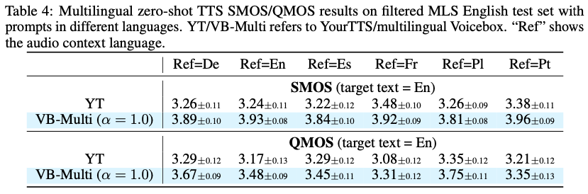

# Voicebox: Text-Guided Multilingual Universal Speech Generation at Scale

~~논문이 너무 어려워서 이해를 제대로 하고 쓰지 못한 관계로 사실상 번역에 가까운 리뷰... 특히 3. Method는 사실상 이해를 하지 못했습니다. 그래도 이를 제외하면 논문의 전체적인 컨셉 자체는 이해하기 어렵지 않습니다.~~

## Abstract

Voicebox (the most versatile text-guided generative model for speech) 소개한다. 성능 최고다.

## 1. Introduction

large-scale generative models의 발전으로 explicitly trained된 task에 대한 작업 뿐만 아니라 다른 것들도 수행하는 general-purpose models를 만드는 새로운 패러다임 전환이 있었다. 이런 모델들은 주어진 context에 대해 missing data를 예측하도록 학습한다. 학습 후 labeled data를 이용한 fine-tuning 대신 contextual question-answer examples를 직접 input한다. 예를들면 “The capital of Germany is Berlin. The capital of Japan is” 같이. 모델이 모든 task에 잘 작동하게 하려면 p(missing data|context)가 모든 context에 대해 정확해야함을 의미한다. 

다른 영역들에서 대규모 모델의 성공에 반해 음성 모델은 여전히 적은 데이터로 학습한다. VCTK같이 정확히 큐레이팅된 스튜디오 품질 데이터만 사용한 모델은 소음, 감정, 음향조건 같은 것들을 일반화하는 능력이 테스트되지 않았다. CommonVoice, Librispeech, LibriTTS와 같은 실제 데이터를 이용하려는 시도가 있었지만 VCTK같은 데이터를 사용한 것에 비해 underfit 되었다.

가장 다재다능한 text-conditioned speech generative model, 큰 규모의 Voicebox를 소개한다. Voicebox는 text-guided speech infilling task에 대해 훈련된다. audio를 masking하고 text transcript를 주고 infilling한다. 이전 모델들은 화자, 감정, 소음 등의 lables를 이용하여 출력 음성과 원본사이의 mapping을 더 정확하게 만들었지만 Voicebox는 이런 style labels가 필요하지 않다.

모델링 측면에서 Voicebox는 non-autoregressive (NAR) continuous normalizing flow (CNF) model이다. Diffusion과 유사하게 CNF는 네트워크에 의해 parameterized된 복잡한 분포 p(missing data|context)를 모델링한다. 우리는 최근 제안된 CNF의 효율적 훈련이 가능하게 만드는 방법인 flow-matching으로 Voicebox를 훈련한다. auto-regressive models와 달리 Voicebox는 past뿐 아니라 future에 대해서도 context를 사용할 수 있다. 또한 quality와 runtime efficiency의 trade-off로 inference time을 컨트롤할 수 있다.

Voicebox는 60K 시간의 영어와 50K 시간의 다국어 오디오북으로 훈련되었다. 다양한 부분에서 SOTA달성했다. 그리고 subjective metrics의 한계 대신 공개모델을 사용한 일련의 메트릭을 제시한다.

Contribution은 다음과 같다.

1. text-guided speech infilling task를 해결하도록 훈련함으로써 explicitly trained되지 않은 작업을 context learning을 통해 해결할 수 있다.
2. english zeroshot VALL-E보다 좋다. SOTA다.
3. 6개 언어에 대해 TTS를 수행할 수 있는 최초의 모델이다. YourTTS와 비교해도 SOTA다.
4. 잡음제거에서도 SOTA다. 어떤 길이의 음성도 채울 수 있다.
5. Voicebox의 결과물만으로 ASR훈련이 가능하다. 그리고 더 좋다.

## 2. Related Work

### Generative speech models

style conversion은 다른속성을 동일하게 유지하면서 특정 속성만 변환하는 것을 목표로 한다. (ex 감정) 이는 label을 만들기가 어렵고 작은 데이터 셋에서 훈련되며 일반화되기 어렵다.

TTS는 Text와 audio style(voice, speaking style, recording environment등)이 주어졌을 때 음성을 합성하는 것을 목표로 한다. 일부 스타일은 임베딩을 통해 지정할 수 있지만 prosody같은 일부 label은 annotate나 embed하기 힘들다. 다양한 시도가 있었지만 이들은 지나치게 단순한 분포를 부과한다. low dimensional vector가 주어지면 realistic한 noisy speech를 생성할 수 없고 성능이 떨어진다.

Infilling은 다른 타입의 task로 볼 수 있다. 이들은 context가 주어졌을 때 (optionally text guidance도) speech를 predict하는 것을 목표로한다. style을 컨트롤하기 위해 explicit embedding을 학습하는 것 대신 context에 일관된 음성을 예측하도록 한다. LLM과 비슷하게 in-context learning을 수행한다. explicit supervision을 거의 사용하지 않는 large scale generalist models를 building하는 과정이지만 most prior work는 text와 context로 부터 target의 deterministic mapping을 가정한다. (which is only realistic for very short segments) 따라서 이러한 가정을 가진 모델은 일반적으로 1초까지만 infilling한다.

Voicebox는 infilling 모델이지만 어떤 distribution이나 parameterize할 수 있도록 CNF모델을 활용한다. 따라서 Voicebox는 모든 길이의 음성을 infilling할 수 있고, 다양한 품질의 데이터를 사용할 수 있고, text-guided fashion task들을 포함하는 general solution을 제공한다.

### Large scale in-context learning models

neural codec for speech의 발전과 함께 speech generation을 위한 token-based language modeling에 대해 많은 연구가 있었다. GSLM-family는 HuBERT units에 구축된 텍스트를 사용하지 않는 speech continuation을 위한 textless language models이다. HuBERT units는 대부분의 content를 인코딩하며 생성된 음성은 프롬프트의 voice를 보존하지 않는다. 이를 해결하기 위해 AudioLM은 HuBERT-like tokens를 먼저 생성하고, 그 다음 스타일을 보존하는 reconstruction based codec인 SoundStream을 예측하도록 하는 cascaded approach를 고려했다. 이런 모델은 text condition을 사용할 수 없으며 spoken language modeling tasks로써 evaluated된다.

VALL-E는 Voicebox와 가장 관련이 있다. VALL-E는 Encodec tokens(similar to SoundStream)로 훈련된 text conditioned LM이다. Encodec은 각 프레임을 8codebooks으로 75Hz frame rate로 인코딩하는 residual quantization layer를 통해 speech를 tokenize한다. 코드북은 첫 번째 코드에 가장 많은 정보가 포함되도록 정렬된다. 첫번째는 텍스트와 오디오 프롬프트가 주어진 각 프레임의 첫번째 코드를 예측하는 auto-regressive(AR) model이다. 두번째는 나머지 7개의 코드북을 순차적으로 예측하는 NAR model이다. (각 코드북을 예측할 때 모든 프레임이 동시에 예측됨)

VALL-E는 in-context learning을 통해 zeroshot TTS의 SOTA를 달성했다. 원하는 스타일의 음성을 프롬프트로 넣어주게 된다. 모델은 동일한 오디오 스타일로 텍스트를 포함하는 나머지 부분을 생성하고 프롬프트를 전체 발화의 일부로 간주하게 된다.

Voicebox는 VALL-E대비 설계상의 이점 몇가지가 있다.

1. Voicebox는 과거와 미래의 context를 모두 활용할 수 있다.
2. VALL-E는 1개의 AR과 7개의 NAR 단계가 필요한 반면, flow-matching은 10개 미만의 NAR 단계로 inference속도가 빠르다.
3. Voicebox는 duration과 audio modeling을 분리했기 때문에 더 세밀한 alignment control을 가능하게 한다.
4. Voicebox는 Encodec embeddings를 포함한 모든 continuous features와 compatible하다.

## 3. Method

### 3.1 Background: Flow Matching with an optimal transport path

$\mathbb{R}^d$를 data space, $x \in \mathbb{R}^d$를 unknown distribution $q(x)$에서 샘플링 된 데이터라고 하자. [Continuous Normalizing Flows (CNFs)](https://papers.nips.cc/paper_files/paper/2018/file/69386f6bb1dfed68692a24c8686939b9-Paper.pdf)는 generative models의 일종으로, prior distribution $p_0$ (e.g., normal distribution)에서 data distribution $p_1 \approx q$ 으로의 transformation을 학습한다. CNFs는 time-dependent vector field $v_t: [0, 1] \times \mathbb{R}^d \rightarrow \mathbb{R}^d$를 parameterize한다. 이는 point를 prior에서 target distribution으로 push하는 flow: $\phi_t: [0, 1] \times \mathbb{R}^d \rightarrow \mathbb{R}^d$를 construct한다. vector field와 flow사이의 관계는 ordinary differntial equation (ODE, 상미분방정식)을 통해 define된다.

$$
\dfrac{d}{dt}\phi_t(x) = v_t(\phi_t(x)); \quad \phi_0(x) = x \quad \cdots (1)
$$

flow $\phi_t$에 대해 the probability path (time-dependent probability density function) $p: [0, 1] \times \mathbb{R}^d \rightarrow \mathbb{R}_{>0}$은 변수 변경으로 공식을 나타낼 수 있다.

$$
p_t(x) = p_0(\phi_t^{-1}(x)) \det \bigg[ \dfrac{\partial \phi_t^{-1}}{\partial x}(x) \bigg] \quad \cdots (2)
$$

$p_t(x)$에서 샘플링하기 위해, 첫째로 $x_0$를 $p_0$에서 뽑고, initial value problem ($\dfrac{dy}{dt},\ y_0 = x_0$가 주어졌을 때의 $y_t$)을 ODE solver를 통해 풀어야한다.  
$p_t$가 probability path, $u_t$가 $p_t$를 generate하는 corresponding vector field라 할 때, neural network $\theta$에 의해 parameterized되는 vector field $v_t(x;\theta)$는 Flow Matching objective에 의해 train될 수 있다.

$$
\mathcal{L}_{FM}(\theta) = \mathbb{E}_{t \sim \mathcal{U}[0, 1], x \sim p_t(x)} \lVert u_t(x) - v_t(x;\theta) \rVert^2 \quad \cdots (3)
$$

objective가 간단해보여도 실제로는 prior knowledge $p_t$ 혹은 $v_t$를 모르고 loss나 gradient estimator에 대한 직접적 계산은 불가능하다.

$x_1$을 data distribution $q$에서 sampling된 random variable이라 하자. 이때 probability path $p_t$는 (vector field $u_t(x | x_1)$을 쉽게 계산할 수 있는) 간단한 conditional paths $p_t(x | x_1)$을 통해 constructed될 수 있다. $p_t(x)$를 construct하기 위해, conditional path는 다음과 같이 define된다. 1) $p_0(x | x_1) = p_0(x)$, 2) $p_1(x | x_1) = \mathcal{N}(x | x_1, \sigma^2I)$ ($x_1$이 평균, 아주작은 $\sigma$ (typically 1e-5)). marginal path는 $\int p_t (x | x_1) q(x_1)$으로 계산된다. 이는 $t=1$일 때 $q(x_1)$과 근사한다. 이런 근거들로 Conditional Flow Matching (CFM)의 objective는 아래와 같다.

$$
\mathcal{L}_{CFM}(\theta) = \mathbb{E}_{t, q(x_1), p_t(x|x_1)} \lVert u_t(x|x_1) - v_t(x;\theta) \rVert^2 \quad \cdots (4)
$$

이와 함께 [Flow Matching for Generative Modeling](https://arxiv.org/pdf/2210.02747.pdf)에서 FM과 CFM이 $\theta$에 대해 같은 gradient를 가진다는 것이 증명되었다. 더 중요한 것은 $p_t(x | x_1)$에서 쉽게 샘플을 추출하고 $u_t(x | x_1)$를 계산하여 unbiased gradient estimator를 도출할 수 있다는 것이다.

Voicebox를 훈련하기 위해, [Flow Matching for Generative Modeling](https://arxiv.org/pdf/2210.02747.pdf)에서 제안된 optimal transport (OT) conditional path 를 도입했다. 이는 평균이 $\mu_t(x) = tx_1$이고 표준편차가 $\sigma_t(x) = 1 - (1 - \sigma_{min})t$ (changing linearly in time)인 간단하고 직관적인 Gaussian path $p_t(x | x_1) = \mathcal{N}(x | \mu_t(x_1), \sigma_t(x_1)^2I)$ 이다. 연관된 conditional vector field는 $u_t(x | x_1) = (x_1 - (1 - \sigma_{min})t)$이고, conditional flow는 $\phi_t(x | x_1) = (1 - (1 - \sigma_{min})t)x + tx_1$이다. Flow Matching for Generative Modeling의 저자는 diffusion models가 Gaussian paths의 special cases이고, 경험적으로 diffusion paths에 비해 OT path가 faster training, faster generation, and better performance임을 주목한다.

### 3.2 Problem formulation

dataset (x, y) (x는 audio sample, y는 transcript)가 주어질 떄, 목표는 in-context learning을 통해 text-guided speech generation을 수행하는 single model을 만드는 것이다. 이에 text-guided speech infilling task를 위한 generative model을 제안한다. $m$을 $x$와 같은 길이를 가진 binary temporal mask라 할 때 다음과 같이 나타낼 수 있다. $x_{mis} = m \odot x,\ x_{ctx} = (1 - m) \odot x$. 다른말로 하면 $y$와 $x_{ctx}$가 context, $x_{mis}$가 missing data이다.

### 3.3 Model and Training

Voicebox는 audio model과 duration모델을 분리했다. $x = (x^1, x^2, ..., x^N)$을 audio sample, $y = (y^1, y^2, ..., y^M)$을 text sequence, $l = (l^1, l^2, ..., l^M)$을 duration ($\sum_{j=1}^M l^j = N$), $z = \mathsf{rep}(y, l) = (z^1, z^2, ..., z^N)$을 frame-level phone transcript라고 하자.  
pair of (x, y), l, z는 speech recognition model을 이용한 forced alignment를 통해 estimated될 수 있다. $q(x_{mis} | y, x_{ctx})$의 estimation은 audio model $q(x_{mis} | z, x_{ctx})$와 duration model $q(l_{mis} | y, l_{ctx})$로 분리된다.

#### Audio Model

context 길이 $N$의 $z$와 $x_{ctx}$가 주어졌을 때, $x_{mis}$의 분포는 알기 어렵다. 그래서 이를 CNF를 통해 parameterize하고, optimal transport path를 이용한 flow matching objective를 통해 훈련한다. Audio $x$는 100Hz frame rate에서 추출된 80-dimentional log Mel spectrogram ($x^i \in \mathbb{R}^{80}$)을 표현한다. $m^i = 1$일 때 audio context $x_{ctx}^i = 0$이고, $m^i = 0$일 때 audio context $x_{ctx}^i = x^i$이다.

간단한 conditioning을 위해, 모든 frame $x$에 대해 conditional distribution $q(x | z, x_{ctx})$를 model한다. (instead of only masked frames $x_{mis}$) neural network는 conditional vector field $v_t(w, x_{ctx}, z ; \theta)$를 parameterize하는데 사용된다. $w$는 flow step $t$에서의 샘플이고, $x$는 step $t=1$일 때의 $w$에 대응된다.

input으로 $x_{ctx} \in \mathbb{R}^{N \times F},\ w \in \mathbb{R}^{N \times F}$ 그리고 phone sequence $z \in [K]^N$ ($K$는 number of phone classes, time step $t \in [0, 1]$) 가 주어졌을 때, vector field $v_t$를 parameterize하기 위해 Transformer model을 사용한다. $L \in \mathbb{L \in \mathbb{R}^{K \times H}}$로 표현되는 lookup table은 phone sequence $z$를 표한하는데 사용된다. 결과적으로 embedded sequence $z_{emb} \in \mathbb{R}^{N \times H}$ 형태이고 $z_{emb}^i = L(z^i)\ for\ i \in 1, ..., N$이다. 이어서 3개의 sequences ($w, x_{ctx}, z_{emb}$)는 frame-by-frame으로 concat되고, 행렬 $W_p \in \mathbb{R}^{(2F + H) \times D}$를 사용하여 sequence projected되어 $X_c \in \mathbb{R}^{N \times D}$를 얻는다. (D는 Transformer model의 embedding dimension)

(flow step을 embed하기 위해) $t \in [0, 1]$를 $x_t \in \mathbb{R}^D$로 map하기 위해 sinusoidal positional encoding이 적용되었다. Transformer 모델의 입력이 되는 수열 $X_t \in \mathbb{R}^{(N+1) \times D}$는 time dimension을 따라 $X_c$와 $x_t$가 concat됨으로써 유도된다. $X_c$와 대응되는 sub-sequence인 Transformer output $v_t(w, x_{mis}, z ; \theta) \in \mathbb{R}^{N \times F}$가 주어졌을 때 loss는 다음과 같이 계산된다.

$$
\mathcal{L}_{audio-CFM}(\theta) = \mathbb{E}_{t, m, q(x,z), p_0(x_0)} \lVert (x - (1 - \sigma_{min})x_0) - v_t(w, x_{ctx}, z ; \theta) \rVert ^2 \quad \cdots (5)
$$

with $w = (1 - (1 - \sigma_{min})t)x_0 + tx$  
위 함수는 masked되지 않은 것까지 포함한 (inference시에는 필요 없는) 모든 frames의 loss를 계산한다. 모델의 focus를 masked frames로 옮기기 위해 $\mathcal{L}_{audio-CFM}$의 masked version을 다음과 같이 만들었다.

$$
\mathcal{L}_{audio-CFM-m}(\theta) = \mathbb{E}_{t, m, q(x,z), p_0(x_0)} \lVert m \odot ((x - (1 - \sigma_{min})x_0) - v_t(w, x_{ctx}, z ; \theta)) \rVert ^2 \quad \cdots (6)
$$

위 loss는 masked frames에 대해서만 계산된다. 자세한 내용은 Appendix B.1 참고.

#### Duration model

두가지 solution을 고려한다. 첫째는 audio model을 밀접하게 따른다. 이는 $(x, x_{ctx}, z)$와 $(l, l_{ctx}, y)$를 swap하는 conditional vector field를 통해 $q(l | y, l_{ctx})$를 모델링한다. 그리고 flow에 따르면 $l, l_{ctx} \in \mathbb{R}^{M \times 1}$ and $y \in [K]^M$이다. CFM loss의 masked version은 training에 사용된다. 다른 한편으로, previous studies는 regression duration models는 resonalble speech를 생성할 수 있음을 보였다. 따라서 context duration $l_{ctx}$와 phonetic transcript $y$가 주어졌을 때 masked duration $l_{mis}$을 예측하는 second solution을 고려한다. time embedding이 사용되지 않고 두가지 input sequence만 사용되는 나머지는 같은 Transformer model이 사용된다. 모델은 masked phones에 대해 L1 regression loss를 사용하여 학습된다.

$$
\mathcal{L}_{dur-regr-m}(\theta) = \mathbb{E}_{m, q(l,y)} \lVert m^{\prime} \odot (l_{mis} - g(l_{ctx}, y ; \theta)) \rVert _1 \quad \cdots (7)
$$

$g$는 regression-based duration model을 의미한다. 이는 [FastSpeech2](https://arxiv.org/pdf/2006.04558.pdf)에서 사용된 duration model과 비슷하다. 하지만 추가적인 duration context $l_{ctx}$가 input으로 사용된다.

### 3.4 Inference

learned audio distribution $p_1(x | z, x_{ctx})$에서 sample을 뽑기 위해, noise $x_0$는 $p_0$에서 sampled되고, ODE solver는 $\dfrac{d\phi(x_0)}{dt} = v_t(\phi_t(x_0), x_{ctx}, z ; \theta)$와 initial condition $\phi_0(x_0)$가 주어졌을 때 $\phi_1(x_0)$을 평가하는데 사용된다.

직관적으로, ODE solver는 initial condition $\phi_0(x_0) = x_0$이 주어졌을 때, $t=0$부터 $t=1$까지의 integration을 근사하기 위해 $v_t$를 multiple $t$시점에서 evaluating함으로써 $\phi_1(x_0)$를 계산한다. 더 많은 수의 함수 evaluations (NFEs)는 종종 longer run time을 대가로 $\phi_1(x_0)$의 more accurate solution을 얻는다. evaluations의 횟수를 조정할 수 있는 solver도 있다. 이는 speed와 accuracy사이의 trade-off를 결정할 수 있도록 user에게 flexibility를 제공한다. 또한 경험적으로 Voicebox는 이미 10개 미만의 NFESs로 매우 높은 품질의 음성을 생성할 수 있으므로 auto-regressive models에 비해 훨씬 빠르다.

### 3.5 Classifier-Free Guidance

Classifier guidance (CG)는 GAN 및 discrete flow models에 대한 truncated 또는 low-temperature sampling 효과와 유사하게, diffusion models post training 대한 mode coverage와 sample fidelity trade-off하는 데 사용되는 기술입니다. 이는 auxiliary(보조) classifier의 gradient of the log likelihood를 포함하도록 diffusion model의 score 추정치를 수정한다. [Ho and Salimans](https://arxiv.org/abs/2207.12598)는 CG가 $p(x | c)p(c | x)^{\alpha}$ ($c$는 conditioner)의 sampling을 근사하고, 이는 conditional model과 unconditional model의 score estimate를 mixing하는 방법으로 classifier 없이 simulated될 수 있다고 말한다. unconditional model은 일정 확률로 conditioner c를 dropping함으로 써 jointly trained 될 수 있고, 동일한 모델은 $p(x)$와 $p(x | c)$ 모두에 대한 score estimates를 제공한다.

classifier free guidance (CFG) 아이디어를 flow-matching models로 확장한다. conditioner c는 audio models의 경우 $(z, x_{ctx})$와 일치하고, duration models의 경우 $(y, l_{ctx})$와 일치하며, 학습중에 $p_{uncond}$와 함께 dropped된다. inference 중에 audio model에 대해 수정된 vector field $\tilde{v}_t$는 다음과 같이 된다.

$$
\tilde{v}_t(w, x_{mis}, z ; \theta) = (1 + \alpha) \cdot v_t(w, x_{ctx}, z ; \theta) - \alpha \cdot v_t(w ; \theta) \quad \cdots (8)
$$

$\alpha$는 strength of the guidance, $v_t(w ; \theta)$는 $x_{ctx}$와 $z$를 dropping함으로 써 얻을 수 있다. (경험적 결과에 기반하여) 선택된 audio model과 duration model의 CFG strengths로 $\alpha$와 $\alpha_{dur}$를 사용한다.

### 3.6 Applications

Voicebox가 명시적으로 훈련되지 않은 작업을 수행하기 위해 context를 생성하는 방법에 대한 몇가지 예를 제시함으로써 LLM과 유사한 context learning abilities를 소개한다. Fig1 참조.

#### Zero-shot TTS & alignment-preserved style transfer

target text $\hat{y}$와 전사된 ref audio $(x, y)$가 주어졌을 때, zero-shot TTS는 ref의 보이지 않을 수 있는 오디오 스타일과 유사한 음성을 합성하는 것을 목표로 한다. Voicebox는 ref 오디오와 target speech를 target speech가 마스킹된 하나의 utterance로 취급하여 작업을 수행합니다. $l$을 duration, $z$를 $(x, y)$의 frame-level transcript라고 하자. duration context $l$과 concatenated phone sequence $\mathsf{cat}(y, \hat{y})$이 주어질 때, target duration $\hat{l}$이 샘플링된다. 그런 다음 context $x$와 concatenated frame-level phones $\mathsf{cat}(z, \mathsf{rep}(\hat{y}, \hat{l}))$이 주어지면 target speech $\hat{x}$가 샘플링된다.

Voicebox는 alignment $\bar{z}$를 유지하면서 speech $\bar{x}$의 audio style을 convert할 수도 있다. 이는 비디오와 같은 다른 modalities와 synchronized된 오디오 편집에 유용합니다. zero-shot TTS와 유사하게 context $x$와 concatenated된 frame-level phone $\mathsf{cat}(z, \bar{z})$가 주어졌을 때, target speech $\hat{x}$를 샘플링함으로써 task를 수행할 수 있습니다.

#### Transient noise removal & content editing

Voicebox는 원본 frame-level transcript와 surrounding clean audio가 주어졌을 때, 손상된 segment를 재생성 하여 노이즈 제거를 할 수 있다. 구체적으로, frame-level transcript $z$가 주어지면, 사용자는 noisy segment에 mask $m$을 씌운다. segment $\hat{x}_{mis}$는 given된 $z$와 $x_{ctx} = (1-m) \odot x$로 샘플링된다. audio model은 학습 중에 clean audio context가 대부분 clean target audio와 함께 co-occurs하기 때문에 $x_{mis}$에 대해 clean speech를 생성할 가능성이 높다. new audio $\hat{x} = \hat{x}_{mis} + x_{ctx}$.

content editing을 위해 $\hat{y}$를 원본 스크립트에서 바뀐 새로운 desired transcript라고 하고, $l$을 original duration이라고 하자. 사용자는 첫째로, $l$에서 replaced되지 않은 length of phones를 복사하여 (same length as $\hat{y}$인) $l_{ctx}$ 를 구성하고 new phones의 lengths를 0으로 설정한다. 새로운 phones의 duration $\hat{l}_{mis}$는 주어진 $l_{ctx}$와 $\hat{y}$이 given되어 샘플링된다. 그리고 새로운 duration은 $\hat{l} = \hat{l}_{mis} + l_{ctx}$가 된다. new frame-level transcript는 $\hat{z} = \mathsf{rep}(\hat{y}, \hat{l})$로 구성된다. 마찬가지로, audio context $x_{ctx}$는 $\hat{z}$와 길이가 같고, unreplaced phones에 매핑된 frames를 $x$의 대응되는 frames로 채우고, new phones에 대한 frames는 0으로 남겨 둠으로써 생성된다. new phones $\hat{x}_{mis}$에 대한 프레임은 $\hat{z}$와 $x_{ctx}$가 주어졌을 때 샘플링 된다. edited speech는 $\hat{x} = \hat{x}_{mis} + x_{ctx}$로 계산된다.

#### Diverse speech sampling & alignment-preserved style shuffling

Voicebox는 whole utterance를 채워 다양한 음성 샘플을 생성할 수 있다. 먼저 duration 모델을 사용하여 given된 $\hat{y}$에 대한 $\hat{l}$를 샘플링한다. 그런 다음 audio model을 사용하여 주어진 $\hat{z} = \mathsf{rep}(\hat{y}, \hat{l})$에서 $\hat{x}$를 샘플링한다.

style transfer와 유사하게 Voicebox는 target speech clip $\bar{x}$의 frame-level transcript $\bar{z}$ conditioning으로 $\hat{x}$를 샘플링하여 alignment를 유지하면서 audio style을 shuffle할 수도 있다.

## 4. Metrics

이전 연구들에서는 주로 Mean Opinion Scores (MOS)를 주로 사용했다. 이는 다른 시스템의 같은 시도에 의해 만들어진 샘플의 quality에 의해 편향될 수 있기 때문에, 연구들간에 비교를 하기에는 적절하지 않은 수치이다. 어떤 연구는 voice synthesis와 voice conversion에 대해 Mean Cepstral Distance (MCD)나 signal-to-noisedistortion ratio(SNR/SDR)같은 정량 지표를 고려하기도 했다. 하지만 이런 metric들은 현실적으로 유효한 샘플에 대해 부당하게 불이익을 주는 경우가 있다. 다음과 같은 재현 가능한 model-based perceptual metrics를 소개한다.

### Correctness and intelligibility

Public automatic speech recognition (ASR) models를 이용한 input text에 대한 합성된 음성의 word error rate (WER)를 측정한다. 영어의 경우 HuBERT-L을 사용한다. 다국어 설정의 경우 Whisper large-v2를 사용한다.

낮은 WER은 모델이 더 이해하기 쉽고 정확한 컨텐츠를 포함하고 있음을 보여주지만, 반드시 품질이 좋다는 것을 의미하지는 않는다. 마찬가지로 다양한 샘플을 생성하거나 audio style을 더 expressive, noisy하게 만든다면 나쁜 샘플이 아님에도 높은 WER로 이어진다.

### Coherence

생성된 음성의 embedding과 audio context의 embedding의 similarity로 측정한다. 다양한 embedding models는 다양한 속성(attributes)의 일관성(Coherence)를 반영한다. VALL-E는 WavLM-TDCNN 스피커 임베딩 모델을 사용하여 유사도를 측정할 것을 제안했다. VALL-E와의 비교를 위해 똑같이 사용한다.

### Diversity and quality

Fréchet Inception Score(FID)는 이미지 생성 분야에서 실제 이미지와 생성된 이미지의 유사성을 측정하는데 사용된다. 거리가 짧을수록 분포가 유사하고 일반적으로 더 높은 샘플 품질과 다양성을 보인다. wav2vec2.0을 사용하여 Fréchet Speech Distance (FSD)를 만들었다.

supplementary metrics으로 quality MOS(QMOS)와 similarity MOS(SMOS)을 사용한다.

duration models 평가를 위해서는 앞선 메트릭들을 사용하여 end-to-end 성능 측정을 할 수 있다. duraion model 자체에 초점을 맞춘 몇가지 독립 지표도 있는데 Appendix C 참조.

## 5. Experiment

### 5.1 Setup

#### Data

영어모델은 60K 시간의 ASR-transcribed 오디오북을 사용했고, multilingual model은 50K 시간의 6개 언어가 담긴 multilingual 오디오북을 사용했다. 너무 적은 데이터를 가진 언어에 대해 upsampling을 적용한다. 다음 분포를 사용하여 샘플링한다. $p_s \sim \Big( \dfrac{n_s}{N} \Big)_{s=1,...,S}^{\beta} \quad$ $S$는 언어 개수, $n_s$는 각 언어별 데이터 양(hours), $N$은 총 데이터 양(hours). $\beta = 0.25$로 설정한다. 두 모델은 각각 VB-En, VB-Multi로 칭한다. Montreal Forced Aligner (MFA)는 international phonetic alphabet (IPA)의 변형된 버전인 MFA phone set을 기반으로 transcript를 phonemize하고 강제 정렬하는데 사용된다. Word position 접미사(postfixes)가 추가된다. 오디오는 80차원 log Mel spectrogram을 사용하고, 보코더로 HiFi-GAN을 사용한다.

#### Model

Transformer는 audio model과 duration model 모두에 사용된다. flow step $x_t$의 ALiBi bias는 0으로 설정된다. audio model은 24개의 layers, 16개의 attention heads, 1024/4096의 embedding/feed-forward network (FFN) dimension, 330개의 parameters를 가진다. UNet 아키텍처 스타일로 symetric layers를 연결하는 skip connections를 사용한다. (첫번째와 마지막, 두번재와 마지막에서 두번째..) States는 채널별로 연결되고 linear layer를 통해 combined된다. duration model은 8개의 heads, 512/2048의 embedding/FFN dimensions, 8/10 layers for English/multilingual setup (28M/34M parameters in total)을 가진다. 모든 모델은 FP16으로 훈련한다.

#### Training

VB-En/VB-Multi 오디오 모델은 240K 프레임의 적절한 배치로 500K/750K 스텝만큼 훈련한다. 훈련 효율성을 위해 audio length는 1,600 frames로 제한한고, 이보다 길면 무작위로 청크한다. duration model은 60K 프레임의 적절한 배치 크기로 600K 스텝만큼 훈련한다. Adam 옵티마이저는 최대 lr 1e-4로 5K step만큼 선형적으로 워밍업 되고, 나머지동안 선형적 감소한다. audio model은 훈련 안정성을 위해 gradient norm을 0.2로 clip한다. audio/duration sequence는 $p_{drop} = 0.3/0.2$로 마스킹 되고, 그렇지 않으면 sequence length의 segment of $r\%$가 마스킹된다. $r \sim \mathcal{U}[70,100]/\mathcal{U}[10,100]$. audio/duration models에 대해 $p_{uncond}$는 0.2로 설정된다.

#### Inference

fixed와 adaptive step ODE solvers 모두 구현되어있는 torchdiffeq가 사용되었다. 디폴트로 midpoint solver는 step size 0.0625로 사용된다. resulting NFE는 64/32 with/without classifier-free guidence. regression duration model은 디폴트로 사용된다. 양쪽 끝 무음은 최대 0.1초로 trim했다.

#### Baselines

3가지 베이스라인을 고려한다. 1. VALL-E (zero-shot TTS SOTA) 2. YourTTS (multilingual zeroshot TTS SOTA) 3) A3T (NAR speech editing and infilling SOTA), Demucs (denoising SOTA)

### 5.2 Monolingual zero-shot TTS

같은 스피커의 다른 샘플을 audio context로 활용했다. YourTTS와 Voicebox에 대해 MOS평가를 진행하였다. A3T는 bad performance로 인해 빠졌고, VALL-E는 모델 사용이 불가능해서 빠졌다. Voicebox가 가장 좋았고, 특히 style을 transfer하는데 뛰어났다.

### 5.3 Cross-lingual zero-shot TTS

Note that VB-Multi는 같은 스피커의 multiple language를 학습한게 아니라 언어별로 스피커가 다른 것.

모든 실험에 대해 YourTTS보다 좋았다.

### 5.4 Transient noise removal

Voicebox는 noise removal에 대해 명시적으로 학습된 것이 아님에도 노이즈 제거를 효과적으로 수행할 수 있다. A3T, Demucs와 비교한 결과이다.

### 5.5 Diverse speech sampling and application to ASR data generation

table6는 얼마나 다양한 샘플을 생성하느냐를 보여준다. VB-En(regression과 flow-matching duration models 둘 모두)을 측정 대상으로 한다.

A3T는 언제나 같은 음성을 생성한다. VITS-LJ는 낮은 WER을 가지지만 single speaker이기 때문에 다양성이 적다(낮은 FSD(Fréchet Speech Distance)). VITS-VCTK는 음성의 다양성을 높여 FSD를 낮췄고, YourTTS는 더 많은 스피커에 대해 훈련되었다. Voicebox는 가장 낮은 FSD를 보인다. 특히 regr보다 FM duration model이 더욱 그랬다.

ASR모델을 생성된 음성으로 훈련시키고, 실제 음성으로 평가해보았다. (이는 생성된 음성의 낮은 퀄리티 때문에 이전에는 잘 된 기록이 없다.)

두개의 Voicebox variants 모두 baseline을 큰 차이로 이겼다. 특히 Voicebox는 FM duration 모델을 사용할 때 더 다양한 음성을 생성하므로, 이를 이용한 ASR 훈련시 더 나은 ASR 시스템으로 이어진다.

### 5.6 Inference efficiency versus performance

다양한 세팅의 guidance strength($\alpha$)와 NFE(specified by the user)에 대해 여러 메트릭(WER, SIM, FSD)과의 trade-off를 측정했다. 결론은 대부분의 세팅에 대해 VALL-E보다 Voicebox가 빠르고 생성된 음성의 품질 또한 좋았다.

### 5.7 How context length affects monolingual and cross-lingual zero-shot TTS

#### Monolingual

prompt 음성의 길이가 짧아져도 WER의 변화는 크게 없다. 다만 Speaker Similarity는 변한다.

#### Cross-lingual

fig4는 prompt 길이에 따른 speaker similarity의 변화, fig5는 prompt 길이에 따른 WER의 변화이다.

Monolingual과 마찬가지로 prompt의 길이가 증가함에 따라 speaker similarity가 증가한다.

하지만 이와 반대로 prompt의 길이가 증가함에 따라 WER이 증가하는 것을 볼 수 있다. 그리고 이는 EN -> Non EN 방향에서 훨씬 더 증가한다. 이는 학습데이터의 불균형 때문이라고 생각한다. 다국어 학습 데이터의 90% 이상이 영어이다. 따라서 영어에서 전환할 때 모델은 prompt 길이가 증가함에 따라 전체 문장이 영어로 되어 있다고 가정하고 영어가 아닌 대상에 대해 잘못된 발음을 생성할 가능성이 더 크다.

## 6. Ethical Statement

임의의 사람의 음성을 생성할 수 있는 모델의 잠재적 위험을 알고있다. 따라서 생성된 음성과 원래 음성을 구분하기 위한 이진분류 모델을 만들었다.

전체가 생성된 음성 vs GT의 구분은 어렵지 않지만 적은 부분만 마스킹해서 다시 만들고 이를 GT와 구분하는 것은 쉽지 않았다.

## 7. Conclusion and Discussion

### Limitation

audiobooks로 훈련되었기 때문에 대화식 speech에는 잘 적용되지 않을 수 있다. 이는 웃음소리와 같은 더 많은 비언어적 사운드를 포함하기 때문이다. 더 다양한 음성을 통합하기 위해 데이터를 확장해야한다.

또한 Voicebox는 phonemizer(g2p)에 의존한다. 또한 기존의 많은 phonemizer는 주변 단어를 고려하지 않고 음성전사를 수행하기 때문에 경우에 따라 발음이 다양해지는 경우 특히나 음성 전사를 정확하게 할 수 없다. 앞으로 YourTTS와 같이 phonemizer를 제거할 수 있는 다양한 end-to-end 방법을 탐색할 것이다.

마지막으로 audio style을 하나로 통합해서 바라보기 때문에 여러가지를 독립적으로 조합할 수 없다. 예를들어 A음성의 감정과 B음성의 목소리를 가진 음성을 생성하는 것은 불가능하다.

### Broader Impact

컨텐츠 편집과 같은 분야에서 활용될 수 있고, 장애를 가진 사람들에게 목소리를 되돌려줄 수도 있다. 다양한 긍정적인 영향을 가져올 수 있지만 피해 가능성도 있다.
