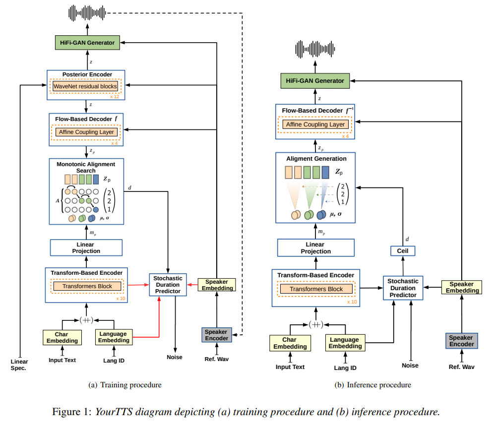
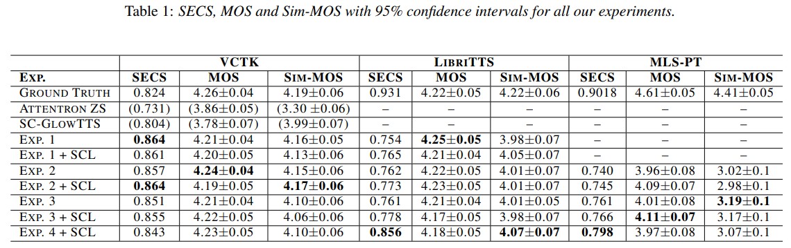
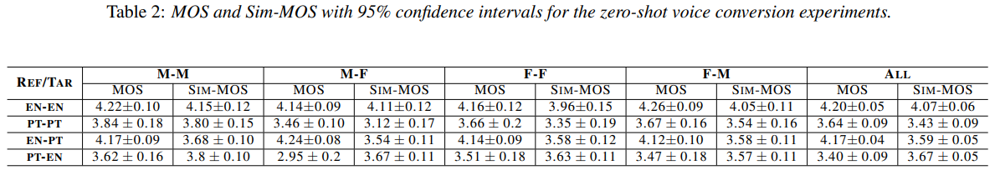
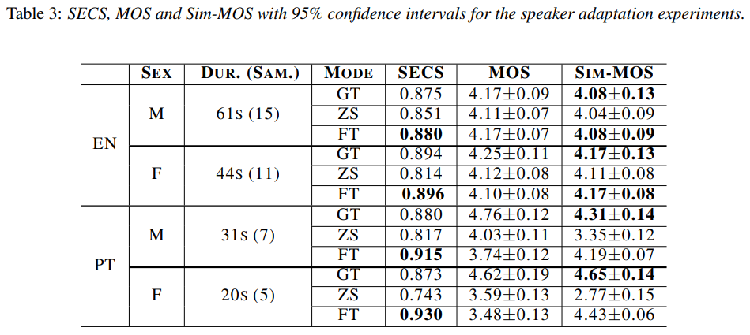

# YourTTS: Towards Zero-Shot Multi-Speaker TTS and Zero-Shot Voice Conversion for everyone

https://arxiv.org/abs/2112.02418

## 해결하고자 하는 문제

Zero-Shot TTS (ZS-TTS)는 많은 발전을 이뤄왔음에도 unseen speaker에 대해 자연스러우면서도 비슷한 음성을 합성하는 것은 쉽지 않다.  
더 자연스럽고 비슷하면서도 Multilingual한 ZS-TTS를 제시한다.

## 방법

[VITS](https://arxiv.org/abs/2106.06103) 기반으로 적절한 Modification을 추가했다.

변경사항은 다음과 같고 나머지는 VITS와 동일하다.

- Phoneme 대신 raw text를 input으로 활용한다. G2P없이도 사용할 수 있고 좀 더 realistic result를 얻을 수 있다.
- 4-dimentional trainable language embeddings를 각 character embeddings와 concat한다.
- Text encoder transformer block을 10개로 늘린다.
- Text encoder transformer hidden dim을 196으로 늘린다.
- Speaker encoder가 추가 되었다.
- Speaker Consistency Loss를 final loss에 추가하였다. (optional. fig1에 dashed line으로 표시되었다.)

**Speaker Consistency Loss (SCL)** 은 pre-trained speaker encoder를 이용하여 generated audio로 추출한 embedding과 ground truth로 추출한 embedding의 cosine similarity를 비교한다.

$$
L_{SCL} = \dfrac{-\alpha}{n} \cdot cos\_sim(\phi(g_i),\phi(h_i))
$$

where

- $\phi$: speaker encoder
- $g$: ground truth audio
- $h$: generated audio

Speaker encoder로는 VoxCeleb2 dataset과 [Prototypical Angular](https://arxiv.org/abs/2003.11982) plus Softmax loss로 훈련된 [H/ASP model](https://arxiv.org/abs/2009.14153)를 사용했다.

## Data

영어, 포르투갈어, 프랑스어 세가지 언어를 데이터로 활용했다. 각 데이터셋 공통 전처리는 다음과 같이 수행했다.

- similar loudness를 가지게 함.
- long periods of silence를 제거함.
- 모두 같은 Sampling rate를 가지도록 resampling을 수행함. (16Khz)
- Webrtcvad toolkit의 Voice Activity Detection (VAD)를 활용하여 trailing silence를 trim함.
- 파이썬 패키지 ffmpeg-normalize를 이용하여 RMS-based normalization을 수행, we normalized all audio to -27dB

## Experimental setup

YourTTS의 Train에 대해 4가지 experiments를 수행했다.

- (EXP1) VCTK만 사용 (monolingual)
- (EXP2) VCTK, TTS-Portuguese 사용 (bilingual)
- (EXP3) VCTK, TTS-Portuguese, M-AILABS french 사용 (trilingual)
- (EXP4) 3번 기준으로 LibriTTS partitions train-clean-100 and train-clean-360의 1151명의 additional English speakers에 대해 continue training 했다.

Train의 각 단계마다 transfer learning을 수행했다. 각 단계의 실험마다 새로운 layer가 추가되는 경우가 있는데 이 경우 random init한다. 그리고 선택적으로 $\alpha=9$ SCL을 함께 사용했다.

그리고 **1) Zero-Shot TTS** 에 있어 어떤 Train experiment가 좋은지 Test를 진행한다. 이때 사용되는 speaker는 당연히 trainset에 없는 speaker로만 이루어져있다.  
추가로 최종 EXP4로 **2) Zero-Shot Voice Conversion** 과 **3) New Speaker Adaptation (Fine-Tuning)** 에 대한 평가를 추가로 진행한다.  
~~사실 ZS VC는 EXP4 기준이라고 써있진 않은데 아마도 그렇지 않을까..?~~

실험에 사용된 데이터에 대한 자세한 내용은 다음과 같다.

|   |   | English | Portuguese | French |
|---|---|---|---|---|
| Train | Dataset | VCTK / LibriTTS | TTS-Portuguese Corpus | M-AILABS (fr_FR) |
|   | # of speakers | 109 / 1151 | 1 (1M) | 5 (3M/2F) |
|   | Data Quality | High / Low | Low | High |
| ZS TTS | Dataset | VCTK / LibriTTS | Multilingual LibriSpeech (MLS) | - |
|   | # of speakers | 11 (4M/7F) / 10 (5M/5F) | 10 (5M/5F) | - |
|   | Data Quality | High / Low | Low | - |
| ZS VC | Dataset | VCTK | Multilingual LibriSpeech (MLS) | - |
|   | # of speakers | 8 (4M/4F) | 8 (4M/4F) | - |
|   | Data Quality | High | Low | - |
| FT | Dataset | Common Voice | Common Voice | - |
|   | # of speakers | 2 (1M/1F) | 2 (1M/1F) | - |
|   | Data Quality | ? | ? | - |

## Metric

Synthesized speech quality 평가를 위해 Mean Opinion Score (MOS)를 사용하고, GT와 Synthesized를 비교하기 위해 Speaker Encoder Cosine Similarity (SECS)와 Sim-MOS를 사용했다.

## Zero-Shot TTS Result

정답 speaker embedding을 뽑기 위한 데이터는 충분한 duration이 보장되어야 했기 때문에 VCTK의 20words를 가지는 문장으로 정했다. 포르투갈어와 프랑스어는 5초 이상의 문장을 골랐다.

MOS, SECS, Sim-MOS 세가지 metric에 대해 평가를 진행했다. 3개의 각 언어 마다 55문장을 random 추출하고 다시 speaker마다 5문장씩을 추출하여 inference를 진행했다. 결과는 아래와 같다.

### VCTK dataset (English)

VCTK에서 특이한점은 모든 실험의 SECS가 GT의 SECS보다 높다는 점이다. VCTK 데이터 자체에 숨소리같은 소리가 들어가있고 speaker encoder가 이런 feature들을 handle하지 못한 것으로 보인다고 한다. VCTK dataset unseen speaker에 대한 zero-shot multi-speaker TTS의 SOTA를 달성했다. ~~정답 speaker embedding에 사용된 발화도 숨소리가 있을텐데 이게 그럴듯한 이유가 맞나 싶다.~~

### LibriTTS dataset (English)

EXP4에서 1151명의 speaker를 추가하여 best similarity를 얻었다. voice와 recording condition의 다양성 확보가 결과의 key라고 설명할 수 있다. ~~recording condition이 같은 데이터로 학습을 한 뒤 speaker만 다른 Zero-Shot을 수행했기 때문에 그런거 아닐까나.. 그렇게까지 의미가 있나 싶다.~~  
반면에 LibriTTS의 test MOS는 VCTK만 사용한 EXP1이 가장 좋고, 이후 점점 낮아지는데 이는 LibriTTS의 quality가 떨어지기 때문이라고 논문은 말한다.

**결과적으로 zero-shot TTS를 위한 reference sample audio보다는 training data의 녹음 환경과 품질이 중요하다.**

### Portuguese MLS dataset

오직 한명의 speaker로 훈련했음에도 zero-shot multi-speaker synthesis에서 좋은 MOS를 얻었다.  
SECS와 Sim-MOS가 다른 경향임을 볼 수 있는데 이는 audiobook으로 이루어진 LibriTTS의 dataset 특성 때문이라고 볼 수 있다.

Portuguese speaker가 male 한명이었기 때문에 gender에 따라 metric을 나눠보면 male에 비해 female 수치가 굉장히 좋지 않다. 하지만 기존의 Attentron은 100명의 speakers로 train되었음에도 그와 비슷한 Sim-MOS를 달성했음은 인상적이다.

EXP3(French 포함)에서 Portuguese test에 대해 quality와 similarity 모두 향상되었다. M-AILABS French dataset이 Portuguese corpus에 비해 더 좋은 quality를 가지고 있기 때문이라고 볼 수 있다.

### Speaker Consistency Loss (SCL)

SCL의 사용은 SECS를 분명히 올려주었다. 하지만 Sim-MOS에 대한 효과는 미미했다. 그래도 LibriTTS, MLS-PT의 결과를 보면 분명히 효과가 있었다.  
하지만 SCL은 quality of generated audio (MOS) 측면에서 악영향을 끼치는 것으로 보인다. 이는 distortion이나 noise같은 recording characteristics를 그대로 generate 하도록 training 되는 것으로 보인다. 하지만 high-quality reference samples가 있다면 high-quality speech를 생성한다. ~~이것 역시 너무 넘겨짚은 것 아닐까. 실험결과는 그래보이지 않는데? VCTK결과도 MOS가 낮아지는데.~~

## Zero-shot Voice Conversion Result

en-en은 기존 SOTA인 AutoVC와 NoiseVC와 비슷한 성능을 달성했다.

pt-pt는 F-F가 M-M보다 훨씬 좋지 않은 모습을 보이는데 training에 female이 없기 때문이다. 여성화자 없이도 이정도 성능을 보인것은 인상적이다.

en-pt는 잘 되었지만 pt-en은 낮은 quality를 보였다. lack of female speaker와 sample의 low quality가 원인인 것으로 보인다.

**결과적으로 ZS VC가 잘 되려면 source 언어 training data의 quality와 speaker encoder에 들어가는 source 샘플 quality가 모두 좋아야한다.**

## Speaker Adaptation Fine-Tuning

Common Voice dataset의 2 Portuguese와 2 English speakers (1M/1F)의 20초에서 61초의 샘플을 골라 EXP4+SCL 기준 fine-tuning을 진행했다. Multilingual systhesis의 기능을 유지하기 위해 EXP4의 모든 데이터를 함께 사용했다. 대신 batch의 1/4은 adapted speakers의 샘플을 가지도록 했다. Section4 와 같이 SECS, MOS, Sim-MOS에 대해 평가를 진행했다.

ZS도 충분히 좋지만 FT는 이보다 더 개선이 가능했다. FT의 SECS가 GT보다 높은 이유는 [여기](#vctk-dataset-english)에 써있는 이유와 같다.  
pt의 MOS가 낮은데 이는 amount of speech가 직접적인 영향을 미치는 것으로 보이고, 44초 이하의 speech로 fine-tuning을 진행하는 것은 ZS보다 안좋은 것으로 보인다.

**결과적으로 Adaptation은 amount of speech를 조금만 늘려도 ZS보다 좋은 결과를 얻을 수 있다.**

## Conclusions, limitations and future work

YourTTS는 zero-shot multi-speaker TTS와 VCTK의 zero-shot voice conversion에서 SOTA를 달성했다. 또한 target language의 single speaker dataset 만으로 promising result를 달성했다.

하지만 가끔 (특히 포르투갈어에서) mispronunciations가 발생했다. 이는 phonetic transcriptions을 사용하지 않았기 때문이다.

더 나아가 ASR model에 Data augmentation 기법으로 이를 활용할 수 있을 것이다.

## 사견

실험이 과정과 결론 도출이 좀 ~~사실은 많이.. 굉장히..~~ 이상하다. 훈련에 사용된 포르투갈어 데이터셋이 1 male speaker만을 가지기 때문에 이상한 결과들이 많이 나왔는데.. 훈련에 사용할 수 있는 데이터가 아예 없었다면 모를까 test에 사용한 데이터 조금만 가져왔어도 많은 의문들이 해결되었을텐데 참 아쉽다.  
실험 결과에 대한 해석도 이상하다. 단편적으로 Speaker Adaptation 부분만 봐도 en과 pt의 비교를 잘 하기 위해서는 비슷한 duration을 가지는 data로 fine-tuning을 진행해야했지 않았을까.. 그런데 pt가 잘 안된 이유를 amount of speech로 단정짓는다. 데이터의 양을 늘려도 포르투갈어의 특성때문에 결과가 바뀌지 않을 수도 있지 않을까. 포르투갈어 전혀 모르지만 G2P를 안써서 그런지 포르투갈어에서 특히 mispronunciations가 많이 발생했다고 말하면서 포르투갈어의 특성을 전혀 고려하지 않는 실험은 이해하기 힘들다.  
EXP1~4의 VCTK test결과 모든 실험에서 SECS가 GT보다 높은 것도 VCTK 데이터 자체의 숨소리 때문이라고 해석하는데 다른 데이터셋에는 숨소리가 없는 것도 아닐뿐더러 정답 embedding을 추출에 사용된 발화에도 숨소리가 있을것인데, 실험 결과의 이유에 근거가 부족하게 느껴진다.  
SCL 사용시 MOS가 낮아지는 현상에 대한 이유 해석도 실험 결과에 따른 근거가 부족하다. speaker embedding이 distortion이나 noise같은 것을 포함하게 되어서 그렇다는 얘기를 하고, 그 근거로 high-quality reference가 있다면 괜찮다고 했지만 VCTK의 실험결과를 보면 그렇지 않아보인다.  
위에 적은 내용들 말고도 의문점이 남는 부분들이 있다.

하지만 본 논문이 VCTK의 Zero-Shot TTS에서 SOTA를 달성했음은 분명하다. 한국어에 잘 적용될지는 미지수이긴 하다. multilingual이나 G2P, 그리고 SCL등 여러가지 자체적인 실험이 필요할 것으로 보인다.
