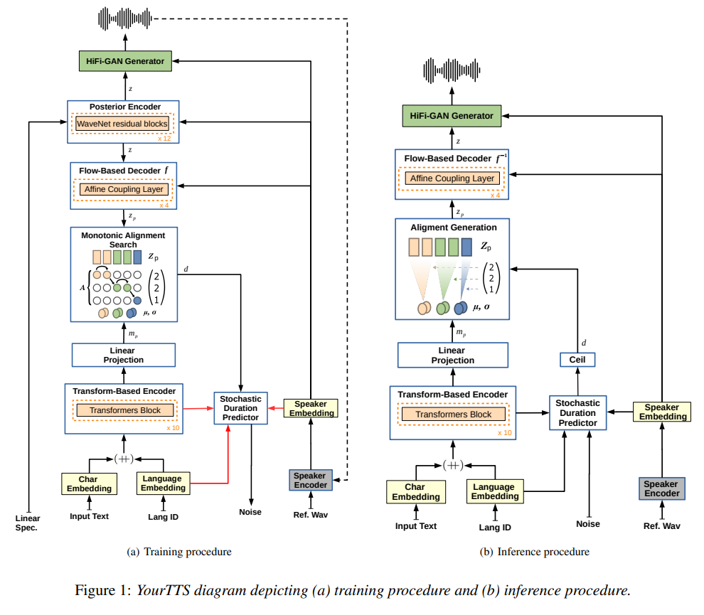
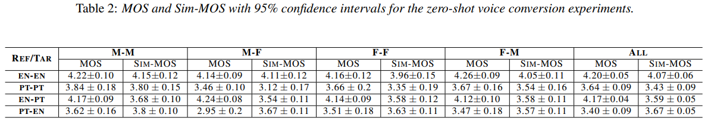

# YourTTS: Towards Zero-Shot Multi-Speaker TTS and Zero-Shot Voice Conversion for everyone

https://arxiv.org/abs/2112.02418

## Abstract

VITS기반의 zero-shot multi-speaker and multilingual training을 위한 modification이다.
zero-shot multi-speaker TTS와 zero-shot voice conversion이 가능하다.
1분 미만의 데이터를 이용한 파인튜닝으로 좋은 품질의 synthesizing도 가능하다.

## 1. Introduction

training에 사용되지 않은 new speakers의 few seconds of speech만을 사용해서 synthesizing voice 하는 것을 zero-shot multi-speaker TTS (ZS-TTS) 라고 한다. ZS-TTS와 더불어 multilingual TTS도 함께 발전했다. 이는 source language와 target language간의 switch를 하게 되는데 이 기술이 ZS-TTS에 useful 하다.

zero-shot multi-speaker and multilingual YourTTS를 소개한다. Contributions는 다음과 같다.

- 영어 VCTK SOTA
- zero-shot과 multilingual을 동시에 하는 최초
- 한명의 target language 화자만으로 promising quality and slimilarity
- Condition이 매우다른 화자의 1분 미만의 데이터로 fine-tune 가능

## 2. YourTTS Model

YourTTS는 VITS 기반이다. VITS대비 변경사항은 다음과 같고, 나머지는 VITS와 동일하다.

- Phoneme 대신 raw text를 input으로 활용한다. G2P없이도 사용할 수 있고 좀 더 realistic result를 얻을 수 있다.
- 4-dimentional trainable language embeddings를 각 character embeddings와 concat한다.
- Text encoder transformer block을 10개로 늘린다.
- Text encoder transformer hidden dim을 196으로 늘린다.
- Speaker encoder가 추가 되었다.
- Speaker Consistency Loss를 final loss에 추가하였다. (optional. fig1에 dashed line으로 표시되었다.)

**Speaker Consistency Loss (SCL)** 은 pre-trained speaker encoder를 이용하여 generated audio로 추출한 embedding과 ground truth로 추출한 embedding의 cosine similarity를 비교한다.

$$
L_{SCL} = \dfrac{-\alpha}{n} \cdot cos\_sim(\phi(g_i),\phi(h_i))
$$

where

- $\phi$: speaker encoder
- $g$: ground truth audio
- $h$: generated speaker audio

## 3. Experiments

### 3.1. Speaker Encoder

Speaker encoder로는 VoxCeleb2 dataset과 [Prototypical Angular](https://arxiv.org/abs/2003.11982) plus Softmax loss로 훈련된 [H/ASP model](https://arxiv.org/abs/2009.14153)를 사용했다. 또한 이를 이용하여 Multilingual LibriSpeech (MLS)의 모든 languages에 대해 평가를 진행했다. 결과는 Equal Error Rate (EER) 1.967로 매우좋았다.

### 3.2. Audio Datasets

영어, 포르투갈어, 프랑스어 세가지 언어를 데이터로 활용했다. 각 데이터셋 공통 전처리는 다음과 같이 수행했다.

- similar loudness를 가지게 함.
- long periods of silence를 제거함.
- 모두 같은 Sampling rate를 가지도록 resampling을 수행함. (16Khz)
- Webrtcvad toolkit의 Voice Activity Detection (VAD)를 활용하여 trailing silence를 trim함.
- 파이썬 패키지 ffmpeg-normalize를 이용하여 RMS-based normalization을 수행, we normalized all audio to -27dB

#### English

VCTK dataset을 활용했다. 44 hours, 109 speakers, sampled at 48KHz.  
train, dev(containing same speakers as the train set) and test(neither in the dev and training set)  
추가로 특정 실험에서는 LibriTTS dataset의 subset *train-clean-100*과 *train-clean-360*을 speaker 수를 늘리기 위해 사용했다.

#### Portuguese

TTS-Portuguese Corpus 사용. 10 hours, 1 male speaker, sampled at 48KHz.  
스튜디오 환경에서 녹음되지 않았기 때문에 noise가 꽤나 섞여있다. 따라서 [FullSubNet model](https://arxiv.org/abs/2010.15508)을 활용하여 denoise를 진행했다.

#### French

LibriVox에 베이스가 있는 M-AILABS dataset의 fr_FR을 활용했다. 2 female (104h) and 3 male speakers (71h), sampled at 16KHz.

#### Testset

영어에 대한 zero-shot multi-speaker capabilities를 평가하기 위해 VCTK 11명의 화자를 test를 위해 남겨두었다. 또한 VCTK domain 바깥의 테스트를 위해 test-clean of LibriTTS dataset의 10 speakers (5M/5F) 를 사용했다.  
포르투갈어는 10 speakers (5M/5F) from the Multilingual LibriSpeech (MLS) dataset을 test로 준비했다.  
프랑스어는 evaluation dataset이 없다.  
마지막으로 speaker adaptation experiments을 위해 Common Voice dataset의 4명의 화자를 test로 활용했다.

### 3.3. Experimental Setup

YourTTS에 대해 4가지 training experiments를 수행했다.

- (EXP1) VCTK만 사용 (monolingual)
- (EXP2) VCTK, TTS-Portuguese 사용 (bilingual)
- (EXP3) VCTK, TTS-Portuguese, M-AILABS french 사용 (trilingual)
- (EXP4) 3번 기준으로 LibriTTS partitions train-clean-100 and train-clean-360의 1151명의 additional English speakers에 대해 continue training 했다.

Training을 가속하기 위해 각 단계마다 transfer learning을 수행했다. 1단계에서는 VCTK 사용 전에 LJSpeech에 대해 1M step을 먼저 훈련하고 VCTK에 대해 200K 훈련했다. 각 단계마다 새로운 layer가 추가되는 경우가 있는데 이는 incompatibility of the shape 문제로 그냥 random init했다.  
2, 3번 실험에 대해서는 전단계에 비해 140k 정도의 futher learning을 수행했다.  
각 단계의 fine-tuning은 $\alpha=9$ SCL을 함께 사용해서 50k steps 훈련되었다. 결과적으로 4번 실험에 대해서는 3번의 모델을 SCL을 추가한 Loss로 fine-tuning을 진행했다.

VCTK는 녹음 환경이 균일하다. 따라서 VCTK에 대해서만 훈련한 이전에 시도된 ZS-TTS는 다양한 녹음환경에 대해 만족스럽게 generalize되지 않았고, 새로운 환경에서 녹음된 input이 들어오면 굉장히 다른 결과를 내었다.

NVIDIA TESLA V100 32GB with a batch size of 64로 훈련되었다. TTS모델과 discriminator는 AdamW optimizer with betas 0.8 and 0.99, weight decay 0.01, initial learning rate 0.0002 decaying exponentially by a gamma of 0.999875 사용했다. 또한 multilingual experiments에 대해 language balanced batch를 위해 weighted random sampling을 사용했다.

## 4. Results and Discussion

Synthesized speech quality 평가를 위해 Mean Opinion Score (MOS)를 사용하고, GT와 Synthesized를 비교하기 위해 Speaker Encoder Cosine Similarity (SECS)와 Sim-MOS를 사용했다. 모든 metric은 speaker unseen during training에 대해서만 계산되었다.  
speaker embedding을 뽑기 위한 데이터는 충분한 duration이 보장되어야 했다. VCTK 데이터중 20words로 긴 문장(5번째 데이터)을 뽑았고, LibriTTS와 MLS Portuguese는 5초 이상의 문장 중 random하게 뽑았다.  
영어의 MOS, SECS, Sim-MOS 평가에는 LibriTTS dataset의 test-clean subset 중 55문장을 random하게 사용했다. 포르투갈어는 이 문장들을 번역한 문장을 사용했다.  
Inference시에 모든 speaker에 대해 55개의 문장 중 5개의 문장을 synthesize했으며, SCES와 Sim-MOS 평가를 위해 각 화자마자 선택된 해당 5문장을 이용하여 speaker embedding을 추출했다. 결과는 table1과 같다.

### 4.1. VCTK dataset

VCTK는 EXP1과 EXP2+SCL에서 가장 좋은 simirality(SECS, Sim-MOS)를 보였다. Sim-MOS측면에서 보자면 SCL의 사용은 별다른 improvements를 보여주지 못했지만 SECS측면에서 보면 효과가 있다.  
특이한점은 모든 실험의 SECS가 GT의 SECS보다 높다는 점이다. VCTK 데이터 자체에 숨소리같은 소리가 들어가있고 speaker encoder가 이런 feature들을 handle하지 못한 것으로 보인다.  
VCTK dataset 기준 unseen speaker에 대한 zero-shot multi-speaker TTS의 SOTA를 달성했다.

### 4.2. LibriTTS dataset

EXP4에서 1151명의 speaker를 추가하여 best similarity를 얻었다. voice와 recording condition의 다양성 확보가 결과의 key라고 설명할 수 있다.  
반면에 MOS는 VCTK만을 사용한 EXP1에서 결과가 가장 좋았다. 이는 LibriTTS dataset의 quality가 떨어지기 때문이라고 설명 할 수 있다.

### 4.3. Portuguese MLS dataset

오직 한명의 speaker로 훈련했음에도 EXP3+SCL에서 굉장히 좋은 MOS를 얻었고 zero-shot multi-speaker synthesis에서 좋은 quality를 얻었다.  
SECS와 Sim-MOS가 다른 경향임을 볼 수 있는데 이는 audiobook으로 이루어진 LibriTTS의 dataset 특성 때문이라고 볼 수 있다.

gender에 따라 metric을 나눠보면 male에 비해 female 수치가 굉장히 좋지 않다. 이는 Portuguese speaker가 male 한명이었기 때문인 것으로 보인다. 기존 Attentron은 100명의 speakers로 train되었음에도 그와 비슷한 Sim-MOS를 달성했다.

French를 포함한 EXP3에서 Portuguese에 대해 quality와 similarity 모두 향상되었다. M-AILABS French dataset이 Portuguese corpus에 비해 더 좋은 quality를 가지고 있고, batch가 balanced by language 구성되었기 때문이라고 설명할 수 있다.

### 4.4. Speaker Consistency Loss (SCL)

SCL의 사용은 SECS를 분명히 올려주었다. 하지만 Sim-MOS에 대한 효과는 미미했다. 그래도 LibriTTS, MLS-PT의 결과를 보면 Similarity 측면에서 아주 효과가 없진 않았다.  
하지만 SCL은 quality of generated audio 측면에서 악영향을 끼치는 것으로 보인다. 이는 distortion이나 noise같은 recording characteristics를 그대로 generate 하도록 training 되는 것으로 보인다. high-quality reference samples에서는 좋은 성능을 보였던 것을 보면 더욱 그러한듯 하다.

## 5. Zero-shot Voice Conversion

Speaker encoder의 사용으로 unseen speaker를 흉내내도록 할 수 있다. 영어는 VCTK 8명(4M/4F)의 unseen speaker, 포르투갈어는 MLS Portuguese 8명(4M/4F)의 unseen speaker를 활용했다.

M-M, F-F, M-F, F-M 그리고 en-en, pt-pt, en-pt, pt-en 총 16가지 경우에 대해 3초 이상의 길이를 가지는 샘플로 voice conversion을 수행했다.

### 5.1. Intra-lingual Results

en-en 기존 VCTK의 zero-shot voice conversion SOTA인 AutoVC와 NoiseVC와 비슷한 성능을 달성했다.  
포르투갈어의 경우 F-F가 M-M보다 훨씬 좋지 않은 모습을 보이는데 training에 female이 없기 때문이다. 여성화자 없이도 이정도 성능을 보인것은 인상적이다.

### 5.2. Cross-lingual Results

en-pt는 잘 되었지만 pt-en은 낮은 quality를 보였다. lack of female speaker와 sample의 low quality가 원인인 것으로 보인다. (speaker encoder에 들어가는 source 샘플이 좋아야한다.)

## 6. Speaker Adaptation

Common Voice dataset의 2 Portuguese와 2 English speakers (1M/1F)의 20초에서 61초의 샘플을 골라 EXP4+SCL 기준 fine-tuning을 진행했다. Multilingual systhesis의 기능을 유지하기 위해 EXP4의 모든 데이터를 함께 사용했다. 대신 batch의 1/4은 adapted speakers의 샘플을 가지도록 했다. Section4 와 같이 SECS, MOS, Sim-MOS에 대해 평가를 진행했다.

ZS도 충분히 좋지만 FT는 이보다 더 개선이 가능했다. FT의 SECS가 GT보다 높은 이유는 4.1에 설명된 이유와 같다. MOS와 Sim-MOS에서도 GT에 못지않은 성능을 보였다.

포르투갈어의 경우 FT가 ZS보다 similarity 측면에서는 나았으나 MOS가 낮아졌다. MOS는 amount of speech가 직접적인 영향을 미치는 것으로 보인다. 44초 이하의 speech로 fine-tuning을 진행하는 것은 ZS보다 안좋은 것으로 보인다.

fine-tuned model의 voice conversion 성능이 굉장히 좋은것으로 나타났다.

## 7. Conclusions, limitations and future work

YourTTS는 zero-shot multi-speaker TTS와 VCTK의 zero-shot voice conversion에서 SOTA를 달성했다. 또한 target language의 single speaker dataset 만으로 promising result를 달성했다.  
Speaker Adaptation(FT)의 경우 20초 정도의 문장만으로 괜찮은 결과를 얻었고 45초 이상의 문장을 사용할 경우 충분히 높은 수준의 결과를 얻을 수 있었다.  
더 나아가 ASR model에 Data augmentation 기법으로 이를 활용할 수 있을 것이라 생각된다.
