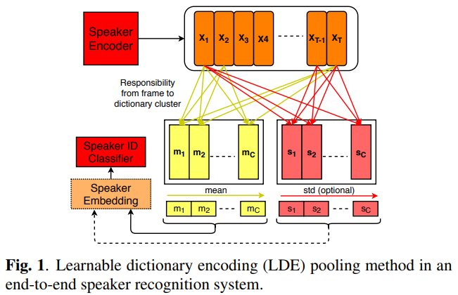
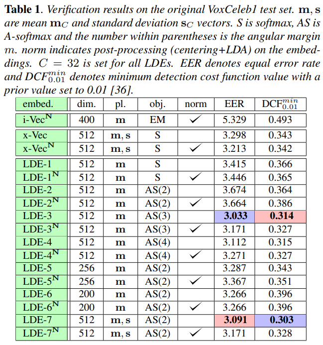
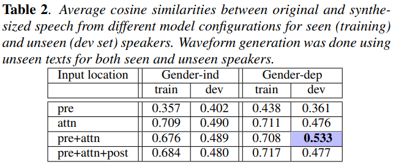
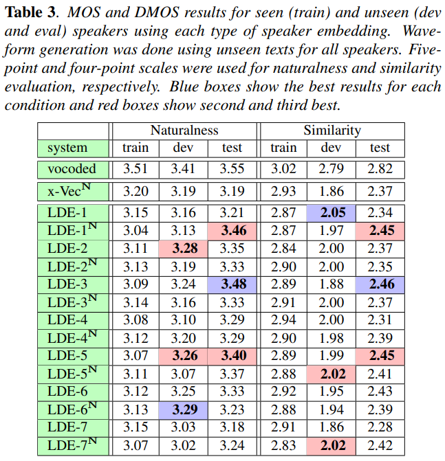

# ZERO-SHOT MULTI-SPEAKER TEXT-TO-SPEECH WITH STATE-OF-THE-ART NEURAL SPEAKER EMBEDDINGS

<https://arxiv.org/abs/1910.10838>  
[demo](https://nii-yamagishilab.github.io/samples-multi-speaker-tacotron/)

## 해결하고자하는 문제

New speaker의 TTS adaptation에는 크게 두가지 방법이 있다. Fine-tuning과 Zero-shot manner.

### Fine-tuning

가장 접근성이 좋다. 하지만 이 방법은 transcribed adaptation data(TTS에서는 script가 있는 speech와 같은말이겠다)가 필요할 뿐더러 computational time과 resource도 잡아먹는다.

### Zero-shot manner

Speaker modeling이라고도 할 수 있다. 예시로 speaker embedding network를 완전히 분리하여 speaker recognition(verification)같은 아예 다른 task로 훈련하여 speaker embedding을 추출, 이를 TTS에 이용한다. 이 방법은 Fine-tuning의 문제점을 모두 커버할 수 있다. 하지만 synthesized 결과물이 그에 미치지 못한다.

**정리하자면** fine-tuning말고 zero-shot manner로 unseen speaker의 목소리로 TTS를 전보다 잘 수행하고싶다.

## 방법

결과적으로 본 논문은 **어떻게 하면 Speaker embedding을 잘 할것이냐**에 초점이 있다. 그리고 그것을 speaker recognition에 Learnable Dictionary Encoding(LDE)을 사용함으로써 실현한다. ~~추가로 angular softmax도 사용하는데 실험결과 크게 효과가 없다고 하므로 생략한다. 또한 x-vectors라는 이전의 speaker embedding기법에 대한 설명이 있는데 결과적으로 LDE가 더 좋으므로 설명은 생략한다.~~

Speaker recognition에서 embedding을 뽑아내는 것의 장점은 앞서 말했듯 transcribed data가 필요하지 않다. (화자가 어떤사람인지 구분하는데 script는 당연히 필요없다.)
화자를 구별하기 위한 softmax에 들어가기 전 값을 embedding으로 보고 이를 추출하는 형태를 가진다. 결과적으로 본 논문은 speaker recognition에 LDE를 사용하여 embedding을 뽑으면 zero-shot manner new speaker adaptation의 성능을 높일 수 있다고 말하는 것이다.

### Learnable Dictionary Encoding (LDE)

Frame level representation $X_T = \{x_1, x_2, ..., x_T\}$ where $T$ is sequence length.  
LDE layer learns a dictionary of $C$ clusters $\{e_1, e_2, ..., e_C\}$.

The learning procedure is decomposed into three steps:

1. 각 프레임 $x_t$와 cluster $e_c$ 사이의 거리 $r_{tc}$를 계산한다.
1. $e_c$에 대한 각 $x_t$의 가중치 $w_{tc}$를 $r_{tc}$에 근거하여 학습한다.
1. utterance-level representation을 만들어내기 위해 $w_{tc}$에 근거하여 $x_t$를 $T$에 대해 aggregate한다.

$$
\begin{align*}
& r_{tc} = ||x_t - e_c||^2 \\
& w_{tc} = \dfrac{\exp(-r_{tc})}{\sum_{i=1}^C \exp(-r_{ti})} \\
& \\
& for\ aggregation\ of\ x_t \\
& mean \qquad m_c = \frac{1}{Z}\sum_{\forall t}w_{tc}(x_t - e_c) \\
& std \qquad s_c = \frac{1}{Z} \sqrt{\sum_{\forall t}w_{tc}(x_t - e_c)^2} \\
& where \quad Z = \sum_{t=1}^{T} w_{tc}
\end{align*}
$$

$w_{tc}$는 각 $t$가 각 $c$에 대해 얼마나 가중치를 가지고 있는지. $c$에 대해 전부 더하면 1이 된다. 가까울수록 값이 커진다.  
$m_c$와 $s_c$는 각 cluster를 대표하는 값이다. 이들은 concat 되어 각각 $\textbf{m}_C$, $\textbf{s}_C$가 된다.

## 실험

3가지를 평가한다. (LDE가 얼마나 좋은지 평가한다고 생각해도 된다.)

- 어떤 Embedding을 사용했을 때 Speaker verification system이 얼마나 잘 작동하는가
- 어떤 TTS모델을 사용했을 때 Original speech에서 뽑은 speaker embedding과 Synthesized speech에서 뽑은 speaker embedding이 얼마나 유사한가
- 어떤 Embedding을 사용했을 때 Synthesized speech가 얼마나 자연스러운가, 그리고 Original speech와 얼마나 유사한가

### Speaker Verification

Training data는 VoxCeleb (7,325 speakers and 1,277,344 utterances)을 활용했다. 추가로 reverberation, noise, music, and babble을 이용한 augmentation을 진행, 총 2,277,344 utterances를 final training data로 활용했다.

- LDEs는 x-vectors만큼 좋았다.
- Speaker embedding size를 줄이면 좋았다.
- angular margin $m$을 늘리면 좋았다.
- $\textbf{m}_C$, $\textbf{s}_C$ 모두 쓰는게 좋았다. (원래 $\textbf{s}_C$는 optional)

### Speaker Similarity

사실 이부분은 LDE가 얼마나 좋은지에 대한 실험이 아니라 어떤 TTS모델이 좋은지에 대한 추가적인 실험이므로 넘겨도 상관 없다.

Training data는 VCTK(109명의 화자, 서로 다른 영어 방언사용, 각 화자당 400문장정도) 사용했다. 4명의 dev와 4명의 test는 훈련에서 제외했고 이들의 50개 문장정도씩을 evaluation에 활용했다. 이들의 embedding은 50개의 문장에서 추출했다.

두가지에 대해 실험한다.

- TTS모델로 tacotron을 활용하는데, 이를 multi-speaker로 확장하는데 embedding을 어디에 넣어야 좋은가  
  ~~이건 tacotron과 다른 TTS모델을 사용하면 의미 없기 때문에 생략한다.~~
- gender에 따라 모델을 분리하는게 좋은가 (gender-independent model or gender-dependent model)

Gender에 따라 모델을 분리했을 때, Original speech에서 뽑은 speaker embedding과 Synthesized speech에서 뽑은 speaker embedding 사이의 cosine similarity가 더 높았다.

### Comparing Different Embeddings for Speaker Similarity

The best training and model settings 하에 어떤 type의 embedding이 가장 좋은지 평가한다. 평가 기준은 Naturalness에는 Mean Opinion Score (MOS) (5점만점), Similarity에는 Differential MOS (DMOS) (4점만점)이다.

LEDs가 x-vectors보다 좋은 score를 얻었다. Angular softmax와 postpreprocessing(N)의 영향은 미미했다.

## 사견

Speaker recognition을 훈련하는데 사용되는 데이터가 너무 많다. augmentation을 제외해도 1,277,344 utterances 인데. 쉽지 않다.

현재 논문에서는 unseen speaker의 embedding을 뽑아낼 때 speaker 당 50개의 문장을 사용하여 각 utterance들의 embedding값을 평균내어 speaker embedding으로 활용했다. 이들을 사용한 training과정이 없어 zero-shot이라고는 하지만, 50문장 너무 많다. 문장이 적어지면 결과가 어떤지에 대한 실험도 있었으면 좋았을 것 같다.
