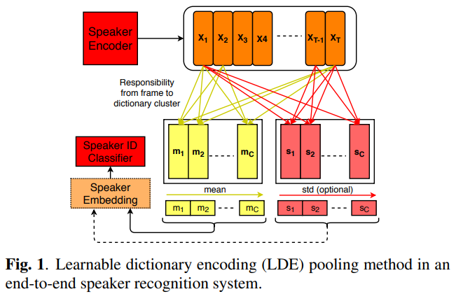
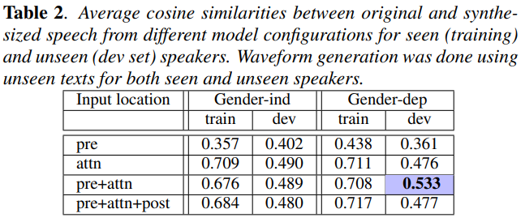
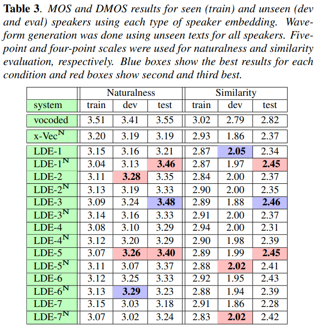

# ZERO-SHOT MULTI-SPEAKER TEXT-TO-SPEECH WITH STATE-OF-THE-ART NEURAL SPEAKER EMBEDDINGS

<https://arxiv.org/abs/1910.10838>  
[demo](https://nii-yamagishilab.github.io/samples-multi-speaker-tacotron/)

## Abstract

multi-speaker modeling for end-to-end text-to-speech synthesis에 embedding을 어디 넣어야하는지 조사하고, 여러가지의 neural speaker embeddings이 speaker similarity for unseen speakers에 대해 어떤 영향을 미치는지 연구했다.  
Learnable dictionary encoding-based speaker embeddings with angular softmax loss가 효과가 있다.

## 1. Introduction

New speaker를 adapt하는데 있어 가장 접근성이 좋은 방법은 Fine-tuning을 이용하는 것이다.
하지만 이 방법은 transcribed adaptation data가 필요할 뿐더러 computational time과 resource도 잡아먹는다. 그리고 train data 바깥의 데이터를 사용하는데 있어 이점이 없다.

Speaker modeling은 이런 issue들에 대응할 수 있다. 이런 접근방식으로 speaker embedding network는 완전히 분리하여 speaker recognition같은 아예 다른 task로 훈련할 수 있다.
이런 모델은 상대적으로 적은 데이터를 이용하여 channel이나 recording conditions에 independant한 robust speaker representation을 만들 수 있다.
End-to-end TTS 모델은 이 speaker embedding만을 활용하여 fine-tuning없이 zero-shot manner로 target speaker's voice를 adapt할 수 있다.
하지만 이 방법을 사용한 앞선 연구들은 대부분 성능이 기대에 미치지 못했다.

이와 동시에 speaker recognition에서도 상당한 발전이 있었다. 이 중 주목할 것은 Learnable Dictionary Encoding(LDE)와 angular softmax이다.

**정리하자면** fine-tuning말고 zero-shot manner로 unseen speaker의 목소리로 TTS를 수행하고 싶은데 이전 방법들은 그닥 좋지 못했다. 그래서 speaker recognition의 상당한 발전을 이룬 LDE와 angular softmax로 embedding을 잘 뽑아보고 어떤게 TTS에 효과가 좋은지 알아보자.

## 2. Neural Speaker Embeddings

Speaker recognition system에는 3가지 components가 있다:  
an encoder network, a statistical pooling layer, and a classifier

### 2.1. Encoder Network

original paper는 [x-vectors](https://www.danielpovey.com/files/2018_icassp_xvectors.pdf)로 Speaker embedding을 만드는 기법중 하나로 time delay neural network(TDNN)을 사용했다. (i-vectors에 비해 발전을 이루었다.) Conv1d + FC 혹은 ResNet34 같은 Conv2d로 이루어져있다.  
뒤에 나올 Learnable Dictionary Encoding(LDE)와 respectively하게 사용했다. (뭐가 더 좋은지 비교했다.)

### 2.2. Pooling methods

Frame-level representations를 fixed-dimensional utterance-level embedding으로 요약하는 중요한 작업이다.

#### Statistical Pooling (SP)

x-vector에서 제시된 방법으로 frame-level representations의 mean과 standard deviation을 계산하여 fixed-dimensional vector로 concat된다.

#### Learnable Dictionary Encoding (LDE) ***(사실상 본 논문의 핵심)***  

SP에서 단순하게 frame-level representations의 mean과 standard deviation을 계산하는 것과 다르게, frame-level representations을 clustering하고 cluster의 mean과 std를 concat한다.

Frame level representation $X_T = \{x_1, x_2, ..., x_T\}$ where $T$ is sequence length.  
LDE layer learns a dictionary of $C$ clusters $\{e_1, e_2, ..., e_C\}$.

The learning procedure is decomposed into three steps:

1. 각 프레임 $x_t$와 cluster $e_c$ 사이의 거리 $r_{tc}$를 계산한다.
1. $e_c$에 대한 각 $x_t$의 가중치 $w_{tc}$를 $r_{tc}$에 근거하여 학습한다.
1. utterance-level representation을 만들어내기 위해 $w_{tc}$에 근거하여 $x_t$를 $T$에 대해 aggregate한다.

$$
\begin{align*}
& r_{tc} = ||x_t - e_c||^2 \\
& w_{tc} = \dfrac{\exp(-r_{tc})}{\sum_{i=1}^C \exp(-r_{ti})} \\
& \\
& for\ aggregation\ of\ x_t \\
& mean \qquad m_c = \frac{1}{Z}\sum_{\forall t}w_{tc}(x_t - e_c) \\
& std \qquad s_c = \frac{1}{Z} \sqrt{\sum_{\forall t}w_{tc}(x_t - e_c)^2} \\
& where \quad Z = \sum_{t=1}^{T} w_{tc}
\end{align*}
$$

$w_{tc}$는 각 $t$가 각 $c$에 대해 얼마나 가중치를 가지고 있는지. $c$에 대해 전부 더하면 1이 된다. 가까울수록 값이 커진다.  
$m_c$와 $s_c$는 각 cluster를 대표하는 값이다. 이들은 concat 되어 각각 $\textbf{m}_C$, $\textbf{s}_C$가 된다.

### 2.3. Classifier

The last step은 speaker ID를 softmax layer를 통해 예측하는 것이다. 보통 criterion으로 cross entropy를 사용한다. 그런데 최근 angular softmax loss라는 More discriminative criteria가 제시되었다. 이게 more separable embedding representation을 만들지 않을까 라는 생각에 그냥 softmax와 angular softmax 둘 다 시험한다.

## 3. Multi-Speaker TTS Model Architecture

Tacotron을 base로 embedding을 끼워넣어 multi-speaker로 만들었다.

New speaker에 대한 speaker adaptation은 zero-shot이다. training phase에는 하나의 target speaker에 대한 untranscribed adaptation utterance들의 speaker embedding을 speaker encoder를 이용하여 뽑아내고 이들을 평균낸다. 이렇게 뽑아낸 speaker embedding을 multi-speaker TTS의 speaker embedding으로 활용한다. 이때 fine-tuning은 없다.

## 4. Experiments

[x-vectors] 는 [TDNN + SP] 를 의미하고, [LDEs] 는 [ResNet34 + LDE] 를 의미한다.

### 4.1. Speaker Verification

#### Data

Training data는 VoxCeleb (7,325 speakers and 1,277,344 utterances)을 활용했다. 추가로 reverberation, noise, music, and babble을 이용한 augmentation을 진행, 총 2,277,344 utterances를 final training data로 활용했다.

#### Acoustic Features and Pre-processing

x-vectors는 30-dimensional MFCCs를, LDEs는 30--dimensional log-Mel filter banks를 이용하여 훈련했다.

#### Embedding Post-processing and Backend

We followed Kaldi’s backend recipe in post-processing the embeddings prior to the PLDA: centering and LDA reduction to 200 dimensions.

#### Verification Results

- LDEs는 x-vectors만큼 좋았다.
- Speaker embedding size를 줄이면 좋았다.
- angular margin $m$을 늘리면 좋았다.
- $\textbf{m}_C$, $\textbf{s}_C$ 모두 쓰는게 좋았다. (원래 $\textbf{s}_C$는 optional)

### 4.2. Preliminary Experiments for Speaker Similarity in TTS

추가적인 실험으로 gender-dependent(성별에 따라 모델이 분리)가 좋은지 gender-independent가 좋은지. unseen speaker에 대한 synthesized speech와 original speech의 similarity를 토대로 연구했다.
~~그리고 embedding을 TTS의 어디에 어떻게 끼워넣어야하는지도 연구했다. (embedding을 어떻게 넣는지는 본 리뷰애서는 생략)~~

#### Data

VCTK(109명의 화자, 서로 다른 영어 방언사용, 각 화자당 400문장정도) 사용했다. 4명의 dev와 4명의 test는 훈련에서 제외했고 이들의 50개 문장정도씩을 evaluation에 활용했다. 이들의 embedding은 50개의 문장에서 추출했다.

#### Training

speaker-dependent 모델을 가져와서 VCTK를 이용하여 multi-speaker로 훈련하도록 warm start했다.

#### Evaluation and Results

4명의 seen speaker와 또다른 4명의 unseen speaker에 대해 평가를 진행한다. metric은 original speech로 뽑아낸 speaker의 embedding(x-vector)과 똑같이 synthesized speech로 뽑은 embedding 사이의 cosine similarities다.  
~~어떤 위치에 embedding을 넣어야하는지에 대한 결과도 표에 있는데 내용은 생략한다.~~  
적절한 위치에 embedding을 넣었다는 전제 하에 gender dependent한게 dev 평가가 좋았다.

### 4.3. Comparing Different Embeddings for Speaker Similarity

The best training and model settings 하에 어떤 type의 embedding이 가장 좋은지 평가한다. 평가 기준은 Naturalness에는 Mean Opinion Score (MOS) (5점만점), Similarity에는 Differential MOS (DMOS) (4점만점)이다.

LEDs가 x-vectors보다 좋은 score를 얻었다. Angular softmax와 postpreprocessing(N)의 영향은 미미했다.

## 5. Conclusions

LDE-based speaker embeddings가 unseen speaker에 대한 synthetic speech의 speaker similarity와 naturalness에 좋은 영향을 미침을 알았고 이를 zero-shot adaptation으로 활용할 수 있음을 보았다.

## 사견

현재 논문에서는 unseen speaker의 embedding을 뽑아낼 때 speaker 당 50개의 문장을 사용하여 각 utterance들의 embedding값을 평균내어 speaker embedding으로 활용했다. 이들을 사용한 training과정이 없어 zero-shot이라고는 하지만, 50문장 너무 많다. 문장이 적어지면 결과가 어떤지에 대한 실험도 있었으면 좋았을 것 같다.

또한 speaker recognition을 훈련하는데 사용되는 데이터가 너무 많다. augmentation을 제외하더라도 1,277,344 utterances 인데. 쉽지 않다.
