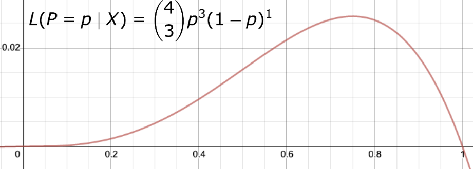

# Likelihood

## Likelihood

> 가능도(可能度, 영어: likelihood) 또는 우도(尤度)는 확률 분포의 모수가, 어떤 확률변수의 표집값과 일관되는 정도를 나타내는 값이다. (출처: 위키백과)

약간의 왜곡이 있는 표현이지만, 관측된 데이터가 주어졌을 때 어떤 수가 모수일 확률이라고 생각하면 편하다.  
(원래 모수는 상수이지만 모수를 하나의 변수라고 생각하고 접근하는 방식이라고 생각하자.)

## MLE(Maximum Likelihood Estimation)

Likelihood를 최대화하는 값을 모수의 추정값으로 바라보는 것.

## Probability VS Likelihood

Probability란 모수가 주어졌을 때, 표본의 등장 확률.  
Likelihood란 표본이 주어졌을 때, 모수의 확률.

간단하게 표현하면  
Probability: $P(X | \theta)$  
Likelihood: $L(\theta | X)$

## Likelihood의 계산

### Qusetion

동전을 4번 던져서 앞면이 나오는 횟수를 X라고 하자. 4번의 시행 중 앞면은 총 3번 나왔다. 이때 $p = \dfrac{1}{2}$ 의 Likelihood는?

### Solution

이항분포의 PMF(Probability Mass Function):

$$
P(X = x) = {n \choose x}p^x(1-p)^{n-x}
$$

현재 $n=4,\; x=3,\; p=?$

$$
L(P = p | X = 3) = {4 \choose 3}p^3(1-p)^1
$$

$p$를 x축에 놓고 위 식의 그래프를 그려보면

위 수식에 $p = \dfrac{1}{2}$ 을 대입하면 답을 구할 수 있다.

해당 풀이를 잘 보면 하나 더 알 수 있는 것.

$$
\begin{align*}
L(\theta | X) = P(X | \theta)
\end{align*}
$$

연속확률 분포에서는 조금 오해의 소지가 있는 표현이지만 이렇게 이해해도 크게 상관 없다.

## MLE의 계산

### Question

위 경우에 MLE를 통해 Likelihood를 최대화하는 모수 p를 계산해보자.

### Solution

$$
L(P = p | X = 3) = {4 \choose 3}p^3(1-p)^1
$$

위 식을 최대화하는 $p$를 찾으면 된다. 어떻게?  
위 수식의 미분값을 0으로 만드는 $p$를 찾으면 된다.

$$
\begin{align*}
& \dfrac{\mathrm{d}}{\mathrm{d}p}\Big({4 \choose 3}p^3(1-p)^1\Big) = 0 \\ 
& \\
& \dfrac{\mathrm{d}}{\mathrm{d}p}\Big(\dfrac{1}{4}(p^3-p^4)\Big) = 0 \\
& \\
& p^2(3-4p) = 0 \\
& \\
& \therefore p = \dfrac{3}{4}
\end{align*}
$$

## Sample이 여러개일 때 Likelihood & MLE

위 예시에서는 관측값이 오직 1개였다. ($X = 3$)  
하지만 현실에서 샘플을 하나만 뽑는 일은 거의 없다.  
샘플을 여러개 뽑았을 때의 Likelihood를 Gaussian(Normal) Distribution에서 계산해보자

### Question

A학교 학생들의 시험점수 $X \sim N(\mu, \sigma^2)$ 이라고 알려져있다. 10명 학생의 점수를 무작위하게 뽑았을 때 그 점수가 다음과 같았다.  
$\{5, 40, 60, 45, 70, 85, 90, 100, 30, 80\}$  
이 때, MLE로 계산한 $\mu$의 추정값은?

### Solution (1)

PDF(Probability Density Function) of Gaussian Distribution:  

$$
\begin{align*}
f(x) = \dfrac{1}{\sigma \sqrt{2\pi}}\exp\Big(-\dfrac{(x - \mu)^2}{2\sigma^2}\Big)
\end{align*}
$$

앞선 이항분포 문제의 풀이처럼 접근한다면 $x$에 주어진 표본 10개 값을 모두 넣고 해당 값들을 모두 곱한 값을 최대로 만드는 $\mu$를 찾으면 된다. (곱하는 이유는 표본의 추출은 독립을 가정하기 때문.)  

$$
\begin{align*}
&& \prod_{x \in X}\bigg(\dfrac{1}{\sigma \sqrt{2\pi}}\exp\Big(-\dfrac{(x - \mu)^2}{2\sigma^2}\Big)\bigg)
\end{align*}
$$

$$
\begin{align*}
where \quad X = \{5, 40, 60, 45, 70, 85, 90, 100, 30, 80\}
\end{align*}
$$

이걸 $\mu$에 대해 편미분한다? 계산이 너무 힘들다.

### Solution (2) - Negative Log Likelihood

위 식에 마이너스와 로그를 취해보자. 그리고 해당 값을 최소로 만드는 값을 찾으면 된다.

$$
\begin{align*}
& -\ln \Bigg( \prod_{x \in X}\bigg(\dfrac{1}{\sigma \sqrt{2\pi}}\exp\Big(-\dfrac{(x - \mu)^2}{2\sigma^2}\Big)\bigg) \\
& \\
& = -\sum_{x \in X}\ln\Big(\dfrac{1}{\sigma \sqrt{2\pi}}\Big) + \sum_{x \in X}\dfrac{(x-\mu)^2}{2\sigma^2}
& \\
& \\
& \\
& \dfrac{\partial}{\partial\mu} \Bigg( -\sum_{x \in X}\ln\Big(\dfrac{1}{\sigma \sqrt{2\pi}}\Big) + \sum_{x \in X}\dfrac{(x-\mu)^2}{2\sigma^2} \Bigg) = 0 \\
& \\
& -\sum_{x \in X}\dfrac{(x-\mu)}{\sigma^2} = 0 \\
& \\
& \sum_{x \in X}(x-\mu) = 0 \\
& \\
& \therefore \mu = \overline X
\end{align*}
$$

결국 모수 $\mu$의 추정값은 표본평균 $\overline X$이다.  
정규분포에서 MLE를 통한 모수 $\mu$의 추정값은 표본 $X$의 평균임을 증명했다.  
(중요한 것은 결과 ($\mu = \overline X$) 가 아니라 과정.)

여기까지 이해했다면 딥러닝에서 흔히 사용하는 `NLLLoss`가 어떤 생각으로 만들어졌는지 알 수 있다.

## 주의

실제 접하게 될 대부분의 data sample은 $x \in \mathbb{R}$이 아니다.  
보통 sample은 $x \in \mathbb{R}^n$이다.  
즉 $x$는 Joint Distribution을 따르는 경우가 대부분이고 달라지는 점이 조금 생길 수 있다.  
또한 given 되는 값이 모수만이 아닐 수도 있다.

하지만 대부분 위 내용을 통해 이해 가능하다.