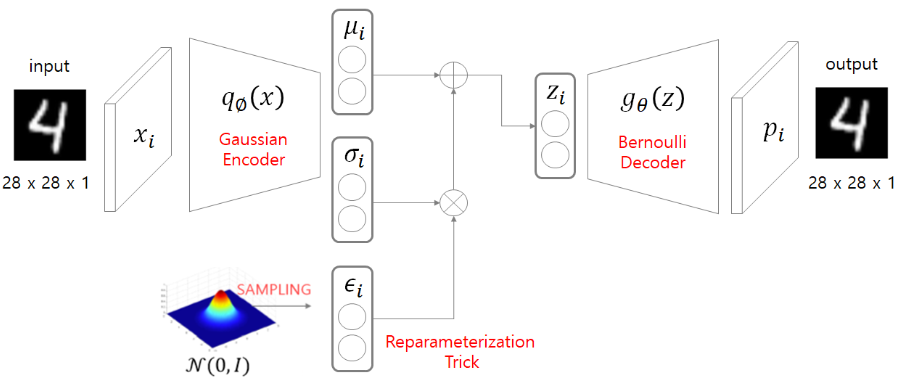

# VAE (Variational Auto Encoder)

$\mu_i, \sigma_i, \epsilon_i$를 제외하고 구조만 보면 지극히 평범한 Auto Encoder와 다르지 않다. 하지만 latent variable을 찾는 것(혹은 dimention reduction)에 초점이 있는 AE와는 다르게 VAE는 gneration에 초점이 있다. 즉, 그 구조가 비슷할지언정 AE와 VAE는 모델이 만들어진 생각 자체가 다르다.

개인적인 생각에 VAE는 코드로 구현된 것을 이해하는 것이 VAE의 개념이나 사상을 이해하는 것 보다 훨씬 쉽다. 하지만 VAE의 진짜 중요한 부분은 '어떻게 구현하는지'가 아니라 '어떤 생각으로 만들어졌는지'라고 생각한다. 따라서 보다 쉽게 접근 하기 위해 어떻게 구현하는지를 먼저 살펴보고, 그 뒤에 완벽하게 이해하기 위해 왜 이렇게 만들어졌는지를 알아보도록 하자.

## 