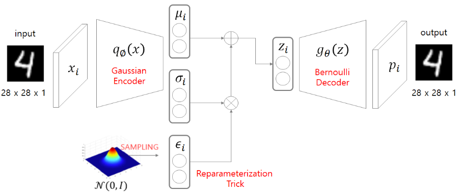
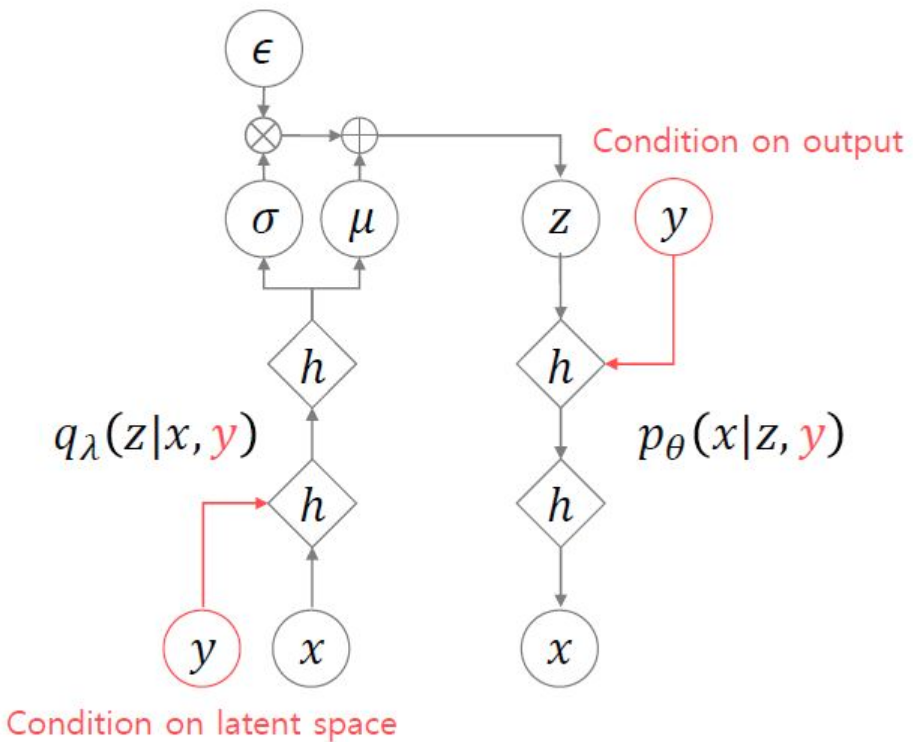
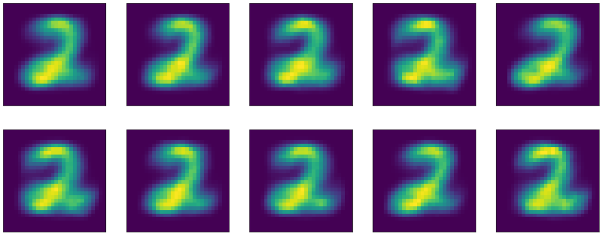
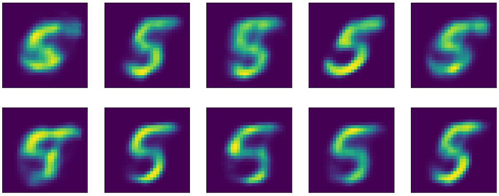

# About AutoEncoder

본 문서에서는 일반적인 AE(AutoEncoder)는 물론 VAE(Variational AutoEncoder)와 AAE(Adversarial AutoEncoder) 등 AutoEncoder 구조를 가진 다양한 모델들을 다룬다. 이해를 돕기 위해 MNIST Dataset을 이용하여 간단한 Implement를 진행하였고 모든 코드는 [fidabspd/about-autoencoder](https://github.com/fidabspd/about-autoencoder)에서 확인 가능하다.

많은 내용을 이활석님의 강의 [오토인코더의 모든 것](https://www.youtube.com/watch?v=o_peo6U7IRM)에서 따왔다. 정말 내용이 깊고 유익한 강의이니 꼭 한번 들어보시길 추천!

## AutoEncoder


흔하게 알고있는 AutoEncoder의 구조이다. 보통 원래의 데이터 $x$의 차원을 축소하였다가 다시 차원을 늘려가며 복원하는 구조로 되어있다.

모델 구조만 보면 *'오토인코더는 원래 데이터를 다시 만들어내는데 사용되는구나'* 라고 생각하기 쉽다. 하지만 오토인코더는 원래의 데이터 $x$를 잘 나타내는 lower dimension features of $x$인 latent variable $z$를 찾고자 하는 생각에 만들어진 모델이다. 그리고 그를 위해 Encoder와 Decoder형태의 모델을 사용했을 뿐, 원래의 목적은 Encoder에 있다.

### Implementation of AE

```python
class AEEncoder(torch.nn.Module):
    
    def __init__(self, in_dim, hidden_dim, latent_dim, dropout_ratio=0.1):
        super().__init__()
        self.linear_in = torch.nn.Linear(in_dim, hidden_dim)
        self.linear_hidden = torch.nn.Linear(hidden_dim, hidden_dim)
        self.linear_out = torch.nn.Linear(hidden_dim, latent_dim)
        self.dropout = torch.nn.Dropout(dropout_ratio)

    def forward(self, x):
        x = x.flatten(1)
        x = self.dropout(torch.nn.functional.elu(self.linear_in(x)))
        x = self.dropout(torch.tanh(self.linear_hidden(x)))
        z = self.linear_out(x)
        return z
    
    
class AEDecoder(torch.nn.Module):
    
    def __init__(self, latent_dim, hidden_dim, out_dim, img_size, dropout_ratio=0.1):
        super().__init__()
        self.latent_dim = latent_dim
        self.img_size = img_size
        self.linear_in = torch.nn.Linear(latent_dim, hidden_dim)
        self.linear_hidden = torch.nn.Linear(hidden_dim, hidden_dim)
        self.linear_out = torch.nn.Linear(hidden_dim, out_dim)
        self.dropout = torch.nn.Dropout(dropout_ratio)
        
    def forward(self, z):
        z = self.dropout(torch.tanh(self.linear_in(z)))
        z = self.dropout(torch.nn.functional.elu(self.linear_hidden(z)))
        x_hat = torch.sigmoid(self.linear_out(z))
        x_hat = x_hat.reshape((-1, 1, self.img_size, self.img_size))
        return x_hat


class AutoEncoder(torch.nn.Module):
    
    def __init__(self, in_dim, latent_dim, hidden_dim, img_size, dropout_ratio=0.1):
        super().__init__()
        self.encoder = AEEncoder(in_dim, hidden_dim, latent_dim, dropout_ratio)
        self.decoder = AEDecoder(latent_dim, hidden_dim, in_dim, img_size, dropout_ratio)
        
    def forward(self, x):
        z = self.encoder(x)
        x_hat = self.decoder(z)
        x_hat = x_hat.clamp(1e-8, 1-1e-8)
        return x_hat
```

원래의 데이터 `x`와 모델을 통해 생성된 데이터인 `x_hat`을 비교하여 학습하면 된다. 이미지는 각 픽셀값이 0~255 값을 가지므로 0~1로 스케일링하고 CrossEntropy를 사용하도록 한다.

latent variable $z$를 뽑고싶다면 $x$를 Encoder에 통과시켜 해당 값을 사용하면 된다.

## Variational AutoEncoder



$\mu_i, \sigma_i, \epsilon_i$를 제외하고 구조만 보면 지극히 평범한 Auto Encoder와 다르지 않다. 하지만 latent variable을 찾는 것(혹은 dimention reduction)에 초점이 있는 AE와는 다르게 VAE는 Generating에 초점이 있다. 다른 말로 하면, AE는 Encoder(Dimension Reduction)에, VAE는 Decoder(Data Generating)에 초점이 있다. 즉, 그 구조가 비슷할지언정 AE와 VAE는 모델이 만들어진 생각 자체가 다르다.

개인적인 생각에 VAE는 코드로 구현된 것을 이해하는 것이 VAE의 개념을 이해하는 것 보다 훨씬 쉽다. 하지만 VAE의 진짜 중요한 부분은 '어떻게 구현하는지'가 아니라 '어떤 생각으로 만들어졌는지'라고 생각한다. 따라서 보다 쉽게 접근 하기 위해 어떻게 구현하는지를 먼저 살펴보고, 그 뒤에 완벽하게 이해하기 위해 왜 이렇게 만들어졌는지를 알아보도록 하자.

### Implementation of VAE

#### Model

```python
class VAEEncoder(torch.nn.Module):

    def __init__(self, in_dim, hidden_dim, latent_dim, dropout_ratio=0.1):
        super().__init__()
        self.latent_dim = latent_dim
        self.linear_in = torch.nn.Linear(in_dim, hidden_dim)
        self.linear_hidden = torch.nn.Linear(hidden_dim, hidden_dim)
        self.linear_out = torch.nn.Linear(hidden_dim, latent_dim*2)
        self.dropout = torch.nn.Dropout(dropout_ratio)

    def forward(self, x):
        x = x.flatten(1)
        x = self.dropout(torch.nn.functional.elu(self.linear_in(x)))
        x = self.dropout(torch.tanh(self.linear_hidden(x)))
        x = self.linear_out(x)
        mu, sigma = x[:, :self.latent_dim], 1e-6+torch.nn.functional.softplus(x[:, self.latent_dim:])
        return mu, sigma


class VAEDecoder(torch.nn.Module):

    def __init__(self, latent_dim, hidden_dim, out_dim, img_size, dropout_ratio=0.1):
        super().__init__()
        self.latent_dim = latent_dim
        self.img_size = img_size
        self.linear_in = torch.nn.Linear(latent_dim, hidden_dim)
        self.linear_hidden = torch.nn.Linear(hidden_dim, hidden_dim)
        self.linear_out = torch.nn.Linear(hidden_dim, out_dim)
        self.dropout = torch.nn.Dropout(dropout_ratio)

    def forward(self, z):
        z = self.dropout(torch.tanh(self.linear_in(z)))
        z = self.dropout(torch.nn.functional.elu(self.linear_hidden(z)))
        x_hat = torch.sigmoid(self.linear_out(z))
        x_hat = x_hat.reshape((-1, 1, self.img_size, self.img_size))
        return x_hat


class VariationalAutoEncoder(torch.nn.Module):

    def __init__(self, in_dim, latent_dim, hidden_dim, img_size, dropout_ratio=0.1):
        super().__init__()
        self.encoder = VAEEncoder(in_dim, hidden_dim, latent_dim, dropout_ratio)
        self.decoder = VAEDecoder(latent_dim, hidden_dim, in_dim, img_size, dropout_ratio)
        
    def reparameterize(self, mu, sigma):
        epsilon = torch.randn_like(mu).to(mu.device)
        z = mu + sigma * epsilon
        return z

    def forward(self, x):
        mu, sigma = self.encoder(x)
        z = self.reparameterize(mu, sigma)
        x_hat = self.decoder(z)
        x_hat = x_hat.clamp(1e-8, 1-1e-8)
        return x_hat, mu, sigma
```

#### Loss

```python
class LogLikelihood(torch.nn.Module):
    
    def __init__(self, scale=1.):
        super().__init__()
        self.scale = scale
        
    def forward(self, x, x_hat):
        log_likelihood = torch.mean(x * torch.log(x_hat) + (1 - x) * torch.log(1-x_hat))
        return log_likelihood * self.scale


class KLDivergence(torch.nn.Module):

    def __init__(self, scale=1.):
        super().__init__()
        self.scale = scale

    def forward(self, mu, sigma):
        kl_divergence = 0.5 * torch.mean(torch.square(mu) + torch.square(sigma) - torch.log(torch.square(sigma)) - 1)
        return kl_divergence * self.scale


class ELBO(torch.nn.Module):
    
    def __init__(self, scale=1.):
        super().__init__()
        self.log_likelihood = LogLikelihood(scale)
        self.kl_divergence = KLDivergence(scale)
        
    def forward(self, x, x_hat, mu, sigma):
        _log_likelihood = self.log_likelihood(x, x_hat)
        _kl_divergence = self.kl_divergence(mu, sigma)
        elbo = _log_likelihood - _kl_divergence
        return elbo, _log_likelihood, _kl_divergence
```

`ELBO`의 음수값을 minimize하도록 모델을 학습하면 된다.

데이터를 생성하고 싶다면 $\mathcal{N}(0, I)$에서 추출한 sample $z$를 Decoder에 넣어주면 된다.

AE와 VAE의 차이점을 위주로 무슨 의미인지 하나씩 살펴보도록 하자.

### mu & sigma

AE와 다르게 VAE는 Encoder(`VAEEncoder`)의 output이 `z`가 아니라 `mu, sigma`이다. 이는 그리고 `VariationalAutoEncoder`의 `reparameterize`에서 random sample인 epsilon을 통해 `z = mu + sigma * epsilon` 이와 같이 z를 새로 만든다.

### ELBO

ELBO는 (Log-likelihood - KL-Divergence) 형태를 가지고 있다.

Log-likelihood는 Log-likelihood라는 단어를 사용했지만 Cross-Entropy의 부호를 양수로 바꾼 것과 같다. ELBO에 -1을 곱하고 해당 값을 minimize하면 Cross-Entropy를 사용하는 것과 완전히 같다. 여기까지는 Loss의 구성이 AE와 똑같다.

하지만 KL-Divergence를 이에 추가로 뺀다. 본래 KL-Divergence는 두 확률분포의 차이를 계산하는데 사용하는 함수인데 여기서는 어떤 두 확률분포의 차이를 계산해서 저렇게 식이 나온 것인지 알기 힘들다. 일단은 위의 `KLDivergence`를 수식으로 나타내면 다음과 같다.

$$
KL\ Divergence = \dfrac{1}{2} \sum_{j}^{K} (\mu_{ij}^2 + \sigma_{ij}^2 - \log \sigma_{ij}^2 - 1)
$$

where

- $i$: index of data
- $j$: index of feature(= dimension of latent variable($z$))
- $K$: number of feature

ELBO를 어떻게 만드는지는 알았다.

여기까지 잘 왔다면 VAE를 구현하고 사용하는 것 자체에는 큰 무리가 없다. 하지만 무슨생각으로 이렇게 만들었고, 왜 이게 잘 작동하는 것인지는 알 수 없다.

### Likelihood

모든 AutoEncoder의 Encoder($q_{\phi}$)는 $x$를 condition으로 $z$를 생성해내고, Decoder($g_{\theta}$)는 $z$를 condition으로 $x$를 생성해낸다. 이 때 Encoder를 통해 생성된 $z$와 Decoder를 통해 생성된 $x$는 다음과 같은 분포를 따른다고 할 수 있다.

$$
z \sim q_{\phi}(z|x) \qquad\qquad x \sim g_{\theta}(x|z)
$$

[Generative Model](https://ta.wiki.42maru.com/doc/generative-model-I9wNzGFeJX)에서 설명했듯이 기본적으로 Generative Model은 $x$의 PDF인 $p(x)$에 대해 Likelihood를 Maximize하고자 하는 생각에서 출발했다. 그리고 이를 위해 식을 재정의한다. (잘 모르겠다면 [Flow-Based Generative Model의 Likelihood 재정의](https://ta.wiki.42maru.com/doc/waveglow-flow-based-generative-model-detail-SPgWVHtf0U#h-likelihood) 참고)

VAE는 Likelihood $p(x)$를 다음과 같이 재정의한다.

$$
\begin{align*}
\log p(x)& = \int \log(p(x))q_{\phi}(z|x)\mathrm{d}z \\
& = \int \log \bigg( \dfrac{p(x, z)}{p(z|x)} \bigg) q_{\phi}(z|x)\mathrm{d}z \\
& = \int \log \bigg( \dfrac{p(x, z)}{q_{\phi}(z|x)} \cdot \dfrac{q_{\phi}(z|x)}{p(z|x)} \bigg) q_{\phi}(z|x)\mathrm{d}z \\
& = \int \log \bigg( \dfrac{p(x, z)}{q_{\phi}(z|x)} \bigg) q_{\phi}(z|x)\mathrm{d}z + \int \log \bigg( \dfrac{q_{\phi}(z|x)}{p(z|x)} \bigg) q_{\phi}(z|x)\mathrm{d}z
\end{align*}
$$

이 때 두번째 항은 $q_{\phi}(z|x)$와 $p(z|x)$. 두 분포 사이의 거리를 나타내는 KL-Divergence 수식과 같다. 따라서 무조건 0보다 크다. 이에 따라 다음 수식이 성립한다.

$$
\log p(x) \geq \int \log \bigg( \dfrac{p(x, z)}{q_{\phi}(z|x)} \bigg) q_{\phi}(z|x)\mathrm{d}z \\
\because \int \log \bigg( \dfrac{q_{\phi}(z|x)}{p(z|x)} \bigg) q_{\phi}(z|x)\mathrm{d}z = KL(q_{\phi}(z|x) || p(z|x))
$$

즉, 첫번째 항을 최대화하면 $p(x)$의 Log-Likelihood와 같아진다. 그리고 이 첫번째 항이 ELBO(Evidence Lower BOund)이다.

### ELBO

ELBO는 또다시 수식 정리가 가능하다.

$$
\begin{align*}
ELBO(\phi)& = \int \log \bigg( \dfrac{p(x, z)}{q_{\phi}(z|x)} \bigg) q_{\phi}(z|x)\mathrm{d}z \\
& = \int \log \bigg( \dfrac{p(x|z)p(z)}{q_{\phi}(z|x)} \bigg) q_{\phi}(z|x)\mathrm{d}z \\
& = \int \log \Big( p(x|z) \Big) q_{\phi}(z|x)\mathrm{d}z - \int \log \bigg( \dfrac{q_{\phi}(z|x)}{p(z)} \bigg) q_{\phi}(z|x)\mathrm{d}z \\
& = \int \log \Big( p(x|z) \Big) q_{\phi}(z|x)\mathrm{d}z - KL(q_{\phi}(z|x) || p(z))
\end{align*}
$$

첫째항을 Reconstruction Error Term, 둘째항을 Regularization Term이라고 할 수 있다.

#### Reconstruction Error

첫째항은 다음과 같이 재정의 할 수 있다.

$$
\begin{align*}
&\ \int \log \Big( p(x|z) \Big) q_{\phi}(z|x)\mathrm{d}z \\
= &\ \mathbb{E}_{q_{\phi}(z|x_i)} \Big[ \log (p_{\theta}(x_i|z)) \Big] \\
\approx &\ \dfrac{1}{L}\sum_{z_{ij}} \log (p_{\theta}(x_i|z_{ij}))  \qquad (\because MonteCarlo\ technique)\\
\approx &\ \log (p_{\theta}(x_i|z_i)) \qquad (if\ L=1)
\end{align*}
$$

($L$은 $x$를 given하여 뽑는 sample $z$의 개수인데 보통 한개만 뽑는다.)

현재 MNIST Dataset을 이용하고 있으므로 이미지의 각 픽셀 값을 0~1사이로 scaling한다면 각 픽셀값들 $x_i$는 베르누이 분포를 따른다고 가정 할 수 있다. 그렇다면 위 수식은 한번 더 정리가 가능하다.

$$
\begin{align*}
&\ \log (p_{\theta}(x_i|z_i)) \\
= &\ \log \Big( p_i^{x_i}(1-p_i)^{1-x_i} \Big) \\
= &\ x_i \log p_i + (1-x_i) \log (1-p_i) \\
= &\ x_i \log \hat{x_i} + (1-x_i) \log (1-\hat{x_i})
\end{align*}
$$

즉 CrossEntropy를 최소화함으로써 Likelihood를 최대화 할 수 있다.

(정규분포 가정일 때는 MSE를 최소화함으로써 Likelihood를 최대화 할 수 있다. 수식 유도는 생략한다.)

#### Regularization

$$
KL(q_{\phi}(z|x) || p(z))
$$

$x$ condition이 붙은 $z$의 분포와 아무 조건 없을 때의 $z$의 분포 사이의 차이를 구하는 식이다. 현재 두 분포 모두 정규분포를 가정하고 있다. 두개의 다변량 정규분포 $\mathcal{N}_0(\mu_0, \Sigma_0^2), \mathcal{N}_1(\mu_1, \Sigma_1^2)$ 둘의 KLD는 다음과 같다.

$$
D_{KL}(\mathcal{N}_0||\mathcal{N}_1) = \dfrac{1}{2} \bigg\{ tr(\Sigma_1^{-1}\Sigma_0) + (\mu_1 - \mu_0)^T \Sigma_1^{-1} (\mu_1 - \mu_0) - k + \ln \dfrac{|\Sigma_1|}{|\Sigma_0|} \bigg\}  \\
where\ k\ is\ the\ dimension\ of\ vector\ space
$$

위 공식을 $q_{\phi}(z|x), p(z)$에 대해 적용하면 다음과 같다.

$$
KL(q_{\phi}(z|x) || p(z)) = \dfrac{1}{2} \sum_{j}^{K} (\mu_{ij}^2 + \sigma_{ij}^2 - \log \sigma_{ij}^2 - 1)
$$

이를 Regularization이라고 칭하는 이유는 단순히 Reconstruction만을 잘 수행하도록 하는 것 외에 $x$가 주어졌을 때의 $z$의 분포와 아무 조건 없는 $z$의 비슷하게 만들어주는 제약을 걸기 때문이다.

Variational AutoEncoder는 $z$의 sampling개념과 Regularization term을 제외하면 코드 구현에서는 AutoEncoder와 사실상 다르지 않다. 하지만 만들어진 생각의 차이가 크기 때문에 AE는 Dimension Reduction에 목적이 있고, VAE는 Generating에 목적이 있다.

여기까지 잘 이해했다면 VAE가 어떤 생각으로 만들어졌고, 왜 잘 작동하는지 알 수 있고, 그를 바탕으로 코드 구현 또한 가능하다.

하지만 여기까지만 알아서는 MNIST스러운 무엇이 될 지 알 수 없는 28x28의 숫자 이미지만 생성할 수 있을 뿐, 원하는 숫자를 생성할 수 없다. 

## Conditional Variational AutoEncoder



원하는 숫자를 생성하기 위해서는 해당 숫자를 Condition으로 주어야한다. 그냥 앞의 모든 given값에 추가로 condition만 붙이면 된다. CVAE의 ELBO를 수식으로 보면 다음과 같다.

$$
\begin{align*}
&\ \int \log \bigg( p_{\theta}(x|y,z) \dfrac{p(y)p(z)}{q_{\phi}(z|x,y)} \bigg) q_{\phi}(z|x,y) \mathrm{d}z \\
=&\ \mathbb{E}_{q_{\phi}(z|x,y)} \Big[ \log (p_{\theta}(x|y,z)) + \log(p(y)) + \log(p(z)) - \log(q_{\phi}(z|x,y)) \Big]
\end{align*}
$$

### Implementation of CVAE

#### Model

```python
class CVAEEncoder(torch.nn.Module):
    
    def __init__(self, cond_emb_dim, in_dim, hidden_dim, latent_dim, n_condition_labels, dropout_ratio=0.1):
        super().__init__()
        self.latent_dim = latent_dim
        self.condition_emb = torch.nn.Embedding(n_condition_labels, cond_emb_dim)
        self.linear_in = torch.nn.Linear(in_dim+cond_emb_dim, hidden_dim)
        self.linear_hidden = torch.nn.Linear(hidden_dim, hidden_dim)
        self.linear_out = torch.nn.Linear(hidden_dim, latent_dim*2)
        self.dropout = torch.nn.Dropout(dropout_ratio)

    def forward(self, x, condition):
        x = x.flatten(1)
        condition = condition.unsqueeze(1)
        cond_emb = self.condition_emb(condition).flatten(1)
        x_c = torch.cat([x, cond_emb], -1)
        x_c = self.dropout(torch.nn.functional.elu(self.linear_in(x_c)))
        x_c = self.dropout(torch.tanh(self.linear_hidden(x_c)))
        x_c = self.linear_out(x_c)
        mu, sigma = x_c[:, :self.latent_dim], 1e-6+torch.nn.functional.softplus(x_c[:, self.latent_dim:])
        return mu, sigma
    
    
class CVAEDecoder(torch.nn.Module):
    
    def __init__(self, cond_emb_dim, latent_dim, hidden_dim, out_dim, n_condition_labels, img_size, dropout_ratio=0.1):
        super().__init__()
        self.latent_dim = latent_dim
        self.img_size = img_size
        self.condition_emb = torch.nn.Embedding(n_condition_labels, cond_emb_dim)
        self.linear_in = torch.nn.Linear(latent_dim+cond_emb_dim, hidden_dim)
        self.linear_hidden = torch.nn.Linear(hidden_dim, hidden_dim)
        self.linear_out = torch.nn.Linear(hidden_dim, out_dim)
        self.dropout = torch.nn.Dropout(dropout_ratio)
        
    def forward(self, z, condition):
        condition = condition.unsqueeze(1)
        cond_emb = self.condition_emb(condition).flatten(1)
        z_c = torch.cat([z, cond_emb], -1)
        z_c = self.dropout(torch.tanh(self.linear_in(z_c)))
        z_c = self.dropout(torch.nn.functional.elu(self.linear_hidden(z_c)))
        x_hat = torch.sigmoid(self.linear_out(z_c))
        x_hat = x_hat.reshape((-1, 1, self.img_size, self.img_size))
        return x_hat


class ConditionalVariationalAutoEncoder(torch.nn.Module):
    
    def __init__(self, cond_emb_dim, in_dim, latent_dim, hidden_dim, n_condition_labels, img_size, dropout_ratio=0.1):
        super().__init__()
        self.encoder = CVAEEncoder(cond_emb_dim, in_dim, hidden_dim, latent_dim, n_condition_labels, dropout_ratio)
        self.decoder = CVAEDecoder(cond_emb_dim, latent_dim, hidden_dim, in_dim, n_condition_labels, img_size, dropout_ratio)

    def reparameterize(self, mu, sigma):
        epsilon = torch.randn_like(mu).to(mu.device)
        z = mu + sigma * epsilon
        return z
        
    def forward(self, x, condition):
        mu, sigma = self.encoder(x, condition)
        z = self.reparameterize(mu, sigma)
        x_hat = self.decoder(z, condition)
        x_hat = x_hat.clamp(1e-8, 1-1e-8)
        return x_hat, mu, sigma
```

#### Loss

Loss는 VAE와 완벽히 같다.

### Generating Result

```python
model = torch.load('./model/cvae.pt')
CONDITION = 2

gen_results = []
for _ in range(10):
    gen_results.append(generate(model.decoder, 28, CONDITION))

_ = plt.figure(figsize=(20, 8))
for i in range(10):
    plt.subplot(2, 5, i+1)
    plt.xticks([])
    plt.yticks([])
    plt.imshow(gen_results[i])
plt.show()
```



이렇게 다양한 스타일의 2를 생성할 수 있다.

만약 condition에 어떤 숫자인지 뿐만이 아니라 글씨를 쓴 사람, 펜 색깔 등을 추가로 넣어주게 되면 좀 더 다양한 condition의 이미지를 생성할 수 있다.

## Adversarial AutoEncoder

VAE의 아쉬운점이 하나 있다면 $z$의 분포를 무조건 정규분포 가정을 해야한다는 것이다. 그렇지 않으면 Regularization(KL Divergence) 계산이 쉽지 않다. 이를 극복하고자 생겨난 것이 AAE이다. AAE는 KL Divergence 대신 Discriminator를 사용한다.

Regularization term은 $p(z)$와 $q_{\phi}(z|x)$를 유사하게 만들어주는 역할을 한다. 이 둘에서 나온 샘플을 Discriminator가 구분할 수 없으면 비슷하다고 볼 수 있는 것이다.

$p(z)$에서 나온 샘플을 Real로, $q_{\phi}(z|x)$를 Fake로 인지하도록 Discriminator를 학습하며 다른 Adversarial Model들과 마찬가지로 학습이 어렵다는 단점이 있다.

### Implementation of AAE

#### Model

```python
class AAEEncoder(torch.nn.Module):
    
    def __init__(self, in_dim, hidden_dim, latent_dim, dropout_ratio=0.1):
        super().__init__()
        self.linear_in = torch.nn.Linear(in_dim, hidden_dim)
        self.linear_hidden = torch.nn.Linear(hidden_dim, hidden_dim)
        self.linear_out = torch.nn.Linear(hidden_dim, latent_dim)
        self.dropout = torch.nn.Dropout(dropout_ratio)

    def forward(self, x):
        x = x.flatten(1)
        x = self.dropout(torch.nn.functional.elu(self.linear_in(x)))
        x = self.dropout(torch.tanh(self.linear_hidden(x)))
        z = self.linear_out(x)
        return z
    
    
class AAEDecoder(torch.nn.Module):
    
    def __init__(self, latent_dim, hidden_dim, out_dim, img_size, dropout_ratio=0.1):
        super().__init__()
        self.latent_dim = latent_dim
        self.img_size = img_size
        self.linear_in = torch.nn.Linear(latent_dim, hidden_dim)
        self.linear_hidden = torch.nn.Linear(hidden_dim, hidden_dim)
        self.linear_out = torch.nn.Linear(hidden_dim, out_dim)
        self.dropout = torch.nn.Dropout(dropout_ratio)
        
    def forward(self, z):
        z = self.dropout(torch.tanh(self.linear_in(z)))
        z = self.dropout(torch.nn.functional.elu(self.linear_hidden(z)))
        x_hat = torch.sigmoid(self.linear_out(z))
        x_hat = x_hat.reshape((-1, 1, self.img_size, self.img_size))
        return x_hat


class AdversarialAutoEncoder(torch.nn.Module):
    
    def __init__(self, in_dim, latent_dim, hidden_dim, img_size, dropout_ratio=0.1):
        super().__init__()
        self.encoder = AAEEncoder(in_dim, hidden_dim, latent_dim, dropout_ratio)
        self.decoder = AAEDecoder(latent_dim, hidden_dim, in_dim, img_size, dropout_ratio)
        
    def forward(self, x):
        z = self.encoder(x)
        x_hat = self.decoder(z)
        x_hat = x_hat.clamp(1e-8, 1-1e-8)
        return x_hat


class Discriminator(torch.nn.Module):
    
    def __init__(self, latent_dim, hidden_dim, out_dim, dropout_ratio=0.1):
        super().__init__()
        self.linear_in = torch.nn.Linear(latent_dim, hidden_dim)
        self.linear_out = torch.nn.Linear(hidden_dim, out_dim)
        self.dropout = torch.nn.Dropout(dropout_ratio)
        
    def forward(self, z):
        z = self.dropout(torch.relu(self.linear_in(z)))
        probs = torch.sigmoid(self.linear_out(z))
        return probs
```

#### Loss

```python
class LogLikelihood(torch.nn.Module):
    
    def __init__(self, scale=1.):
        super().__init__()
        self.scale = scale
        
    def forward(self, x, x_hat):
        log_likelihood = torch.mean(x * torch.log(x_hat) + (1 - x) * torch.log(1-x_hat))
        return log_likelihood * self.scale


class DiscriminatorLoss(torch.nn.Module):
    
    def __init__(self, scale=1.):
        super().__init__()
        self.scale = scale
        self.bce_loss = torch.nn.BCELoss()
        
    def forward(self, real_disc_probs, fake_disc_probs):
        real_loss = self.bce_loss(real_disc_probs, torch.ones_like(real_disc_probs))
        fake_loss = self.bce_loss(fake_disc_probs, torch.zeros_like(fake_disc_probs))
        discriminator_loss = (real_loss + fake_loss) * self.scale
        return discriminator_loss


class GeneratorLoss(torch.nn.Module):

    def __init__(self, scale=1.):
        super().__init__()
        self.scale = scale
        self.bce_loss = torch.nn.BCELoss()
        
    def forward(self, fake_disc_probs):
        generator_loss = self.bce_loss(fake_disc_probs, torch.ones_like(fake_disc_probs))
        generator_loss = generator_loss * self.scale
        return generator_loss
```

학습은 하나의 배치 안에서 Likelihood, Discriminator, Generator(AAE에서는 AAE의 Encoder와 같음) 순서로 학습을 진행한다.

## Conditional Adversarial AutoEncoder

CVAE와 마찬가지로 CAAE 또한 가능하다. 구현은 간단하다. AAE에 Condition을 주면 된다.

### Implementation of CAAE

#### Model

```python
class CAAEEncoder(torch.nn.Module):
    
    def __init__(self, cond_emb_dim, in_dim, hidden_dim, latent_dim, n_condition_labels, dropout_ratio=0.1):
        super().__init__()
        self.latent_dim = latent_dim
        self.condition_emb = torch.nn.Embedding(n_condition_labels, cond_emb_dim)
        self.linear_in = torch.nn.Linear(in_dim+cond_emb_dim, hidden_dim)
        self.linear_hidden = torch.nn.Linear(hidden_dim, hidden_dim)
        self.linear_out = torch.nn.Linear(hidden_dim, latent_dim)
        self.dropout = torch.nn.Dropout(dropout_ratio)

    def forward(self, x, condition):
        x = x.flatten(1)
        condition = condition.unsqueeze(1)
        cond_emb = self.condition_emb(condition).flatten(1)
        x_c = torch.cat([x, cond_emb], -1)
        x_c = self.dropout(torch.nn.functional.elu(self.linear_in(x_c)))
        x_c = self.dropout(torch.tanh(self.linear_hidden(x_c)))
        z = self.linear_out(x_c)
        return z
    
    
class CAAEDecoder(torch.nn.Module):
    
    def __init__(self, cond_emb_dim, latent_dim, hidden_dim, out_dim, n_condition_labels, img_size, dropout_ratio=0.1):
        super().__init__()
        self.latent_dim = latent_dim
        self.img_size = img_size
        self.condition_emb = torch.nn.Embedding(n_condition_labels, cond_emb_dim)
        self.linear_in = torch.nn.Linear(latent_dim+cond_emb_dim, hidden_dim)
        self.linear_hidden = torch.nn.Linear(hidden_dim, hidden_dim)
        self.linear_out = torch.nn.Linear(hidden_dim, out_dim)
        self.dropout = torch.nn.Dropout(dropout_ratio)
        
    def forward(self, z, condition):
        condition = condition.unsqueeze(1)
        cond_emb = self.condition_emb(condition).flatten(1)
        z_c = torch.cat([z, cond_emb], -1)
        z_c = self.dropout(torch.tanh(self.linear_in(z_c)))
        z_c = self.dropout(torch.nn.functional.elu(self.linear_hidden(z_c)))
        x_hat = torch.sigmoid(self.linear_out(z_c))
        x_hat = x_hat.reshape((-1, 1, self.img_size, self.img_size))
        return x_hat


class ConditionalAdversarialAutoEncoder(torch.nn.Module):
    
    def __init__(self, cond_emb_dim, in_dim, latent_dim, hidden_dim, n_condition_labels, img_size, dropout_ratio=0.1):
        super().__init__()
        self.encoder = CAAEEncoder(cond_emb_dim, in_dim, hidden_dim, latent_dim, n_condition_labels, dropout_ratio)
        self.decoder = CAAEDecoder(cond_emb_dim, latent_dim, hidden_dim, in_dim, n_condition_labels, img_size, dropout_ratio)
        
    def forward(self, x, condition):
        z = self.encoder(x, condition)
        x_hat = self.decoder(z, condition)
        x_hat = x_hat.clamp(1e-8, 1-1e-8)
        return x_hat


class Discriminator(torch.nn.Module):
    
    def __init__(self, latent_dim, hidden_dim, out_dim, dropout_ratio=0.1):
        super().__init__()
        self.linear_in = torch.nn.Linear(latent_dim, hidden_dim)
        self.linear_out = torch.nn.Linear(hidden_dim, out_dim)
        self.dropout = torch.nn.Dropout(dropout_ratio)
        
    def forward(self, z):
        probs = self.dropout(torch.relu(self.linear_in(z)))
        probs = torch.sigmoid(self.linear_out(probs))
        return probs
```

#### Loss

Loss는 AAE와 완벽히 같다.

### Generating Result


