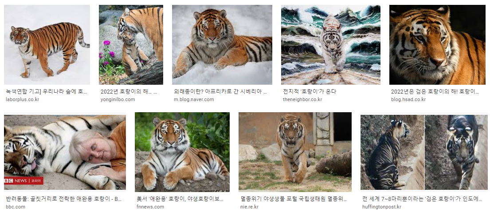
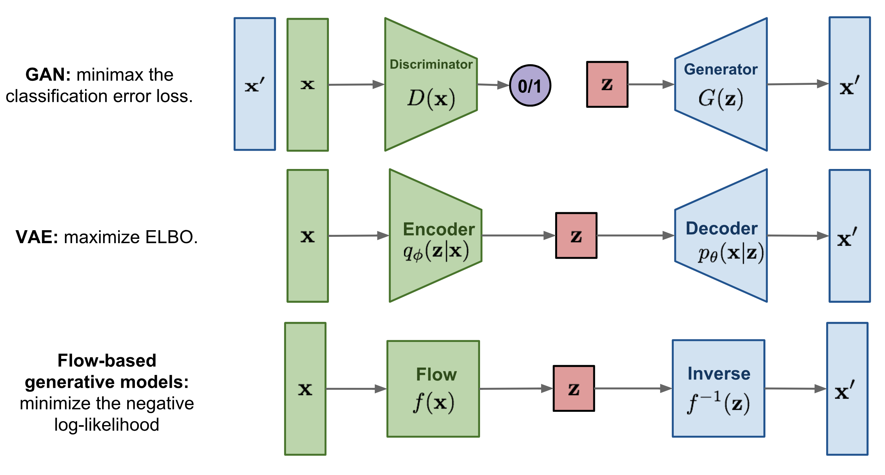
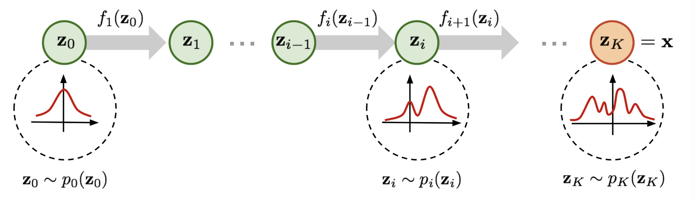
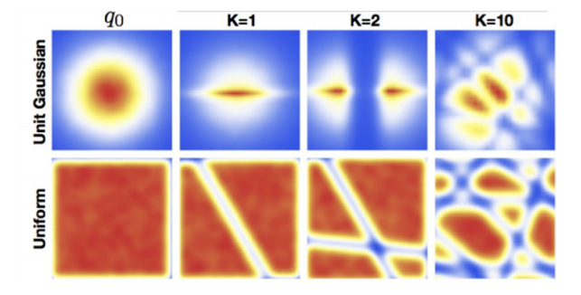

# Generative Model

## Generative Model이란

> A generative model is a statistical model of the joint probability distribution P(X,Y) on given observable variable X and target variable Y. (출처: [wikipedia](https://en.wikipedia.org/wiki/Generative_model))

아주 정확한 설명이라고 생각하지만 처음 보고 알아듣기는 힘들다.

예시를 통해 좀 더 쉽게 이해해보자.

구글에 호랑이를 검색한 결과이다. 보통 사람들은 위에 있는 각각의 사진들을 모두 **호랑이**라고 인식한다. 그리고 Generative Model 사상의 시작은 이러하다. (쉬운 설명을 위해 위 사진 모두 256x256 크기의 RGB 3채널 사진이라고 생각하자.)

> "사람들이 모두 **호랑이**라고 생각하는 사진들은 모두 특정한 분포를 따르지 않을까?"  
(좀 더 정확히 표현하자면 "모든 호랑이 사진들은 196,608(=256x256x3)개의 각각의 pixel 값들이 196608차원의 특정한 joint distribution을 따르지 않을까?")  
"그 분포를 알 수 있다면 해당 분포에서 random sampling을 하면 **호랑이** 사진이 나오지 않을까?"

좋은 아이디어라고 생각한다.  
하지만 문제가 있다. 196608차원 호랑이 분포를 어떻게 알 수 있단 말인가..?  
그래서 대부분의 Generative Model은 다음과 같은 생각을 하게 된다.

> $X \in \mathbb{R}^{196608}$의 분포를 찾기보단, $m$차원의 다변량정규분포를 따르는 새로운 확률변수 $Z$($Z \sim \mathcal{N}(0, I) \; (Z \in \mathbb{R}^m)$)에 대해 $g(Z) = X$를 만족하는 $g()$를 찾는게 빠르지 않을까? (그러면 sampling은 그냥 $\mathcal{N}(0, I)$에서 하면 되니까.)

정말 놀라운 아이디어다.

수식으로 정리해보자면

$$
\begin{align*}
& X \sim P_{tiger}(X) \qquad where \quad \Big( X \in \mathbb{R}^{196608} \Big) \ \& \ \Big( P_{tiger}(X) \ is \ PDF\ of \ tiger\ distribution \Big) \\
& Z \sim \mathcal{N}(0, I) \qquad where \quad \Big( Z \in \mathbb{R}^m \Big) \\
& g(Z) = X \qquad where \quad \Big( g \ is \ generative \ function \Big)
\end{align*}
$$

## Generative Model 종류

앞으로 다룰 3가지의 Generative Model 모두 위와 같은 아이디어를 따른다.  
다만 $g()$를 찾는 방법은 각각 다르다.

### GAN

Generator($g()$)는 계속해서 샘플을 생성해내며 Discriminator는 Generator가 만든 샘플의 진위 여부를 계속해서 확인한다. 경쟁적으로 학습하며 $g()$를 optimize한다.

### VAE

모래시계 형태를 갖는 model이 output을 input과 똑같이 return하도록 만든다. 이때 $z$의 분포를 특정하고, ELBO term을 이용하여 Likelihood를 Maximize하는 방향으로 모델을 (그리고 Decoder(=$g()$)를) optimize한다.

### Flow-Based Generative Model

$X$를 $Z$로 변환하는 $f()$를 학습하고 $f^{-1}()$을 $g()$로 활용한다.

### Linear Transformation에 대한 의문

굉장히 복잡한 분포인 $x$가 linear transform정도로 multivariate normal distribution을 따르게 바뀔 수 있을지 의문일 수도 있다. 이는 곧 딥러닝 모델이 이렇게 복잡한 분포에 맞게 수렴할 수 있을지에 대한 의문과도 연결된다.

위 그림을 보면 normal distribution과 uniform distribution을 linear transformation을 통해 복잡한 분포로 변화 시킨 모습을 볼 수 있다. 이를 역으로 수행하는 것 역시 가능하다.

## 마무리

세가지 Generative Model 모두 TTS에 굉장히 많이 활용된다. 한가지씩만 예를 들어보면  
**GAN**: [HiFi-GAN](https://arxiv.org/pdf/2010.05646.pdf)  
**VAE**: [VITS](https://arxiv.org/pdf/2106.06103.pdf)  
**Flow-Based Generative Model**: [Glow-TTS](https://arxiv.org/pdf/2005.11129.pdf)

모두 접하게 될 예정이며 각각의 자세한 특징은 그 때 다시 짚어볼 예정이다.
