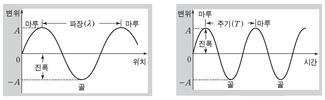
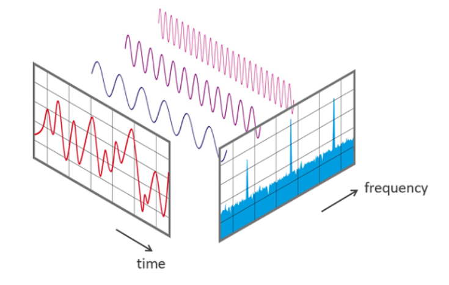
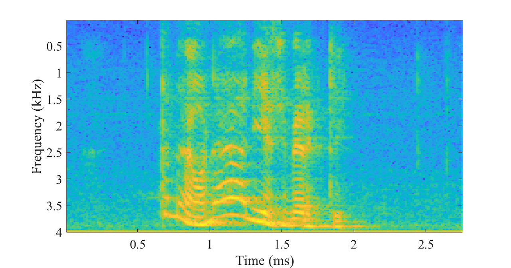
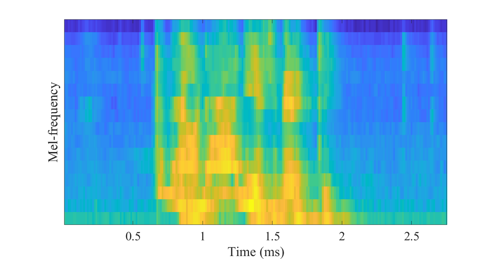

# TTS

## TTS 이해를 위한 배경 지식

### 파동

우선 파동의 요소부터 짚고 넘어가자.  
파동의 요소는 넓은 범위로 보면 **진폭, 파장, 주기, 진동수**가 있다.  

우선 **파장**과 **주기**는 단위를 길이로 볼 것인지, 시간으로 볼 것인지에 따라 다르게 부르며 앞으로 오디오 데이터를 다룰 것이기 때문에 시간단위의 주기로 바라보는 것이 편하다.  
그리고 **진폭**과 **진동수**는 오디오에서 각각 **dB(음량)**과 **Hz(주파수)**에 대응된다.

### Fourier Transform

> 푸리에 변환(Fourier transform, FT)은 시간이나 공간에 대한 함수를 시간 또는 공간 주파수 성분으로 분해하는 변환을 말한다. (출처: 위키백과)

오디오에서의 푸리에 변환은 시간에 대한 함수를 주파수 성분으로 분해하는 것을 의미한다.  
푸리에 변환은 세상 모든 파동(ex 오디오)을 규칙적인 파동으 합으로 분해할 수 있게 만들었다. 아래 그림을 보자.

빨간색 그래프를 raw audio format의 파동이라고 가정하겠다.  
이때 보라색 세개의 규칙적인 파동이 더해지면서 서로 보강간섭, 소멸간섭을 일으키며 빨간색 파동의 형태로 나타나는 것이다.  
이렇게 불규칙한 파동(빨간색 파동)을 규칙적인 파동들(보라색 파동들)의 합으로 분해하는 과정을 푸리에 변환이라고 생각하면 된다.

그럼 **시간에 대한 함수를 주파수 성분으로 분해**는 무슨의미인지 의문이 생긴다.  
이는 파란색 그래프를 그리는 방법을 생각해보면 된다.  
우선 가로축이 time에서 frequency로 바뀌었다. 따라서 각 보라색 파동이 가지는 진동수(frequency) x축에 무언가가 그려질 것이다. 그럼 얼만큼의 높이로 그릴지를 정해야하는데 이는 진폭(dB)이 영향을 미친다.  
이제 푸리에 변환이 뭔지 알았다.

푸리에 변환이 구체적으로 어떻게 이루어지는지는 [다음 영상](https://www.youtube.com/watch?v=spUNpyF58BY)을 보면 깊게 이해할 수 있다.  
수식적인 이해를 위해서는 *가장 아름다운 수식*으로 불리는 **오일러 공식** $e^{i\pi} + 1 = 0$을 이해해야한다.  
좀 더 깊게 이해하고 싶다면 [다음 영상](https://www.youtube.com/watch?v=kgTSUZjVqas)을 추천한다.

### STFT(Short Time Fourier Transform)

위에서 본 그림은 잘 생각해보면 약간의 이상한점이 있다.  
바로 규칙적인 파동인 보라색 파동이 파동의 시작부터 끝까지 이어진다는 점이다.  
우리가 앞으로 다룰 오디오들도 이런 형태일까? 당연히 아닐 확률이 높다. 같은 음정만 계속 반복하는 오디오는 아닐 것이 당연하고, 말을 하다가 쉬어가는 부분도 있을 것이다.  
만약 그렇게 된다면 파란색 그래프에 Time축은 없기 때문에 잠깐만 나타나던 오래 나타나던 나타는 모든 주파수를 그려야할 것이고 그렇게 되면 시간 측면의 Resolution이 나빠지게 된다.

그럼 어떻게 푸리에 변환을 적용해야할까?  
생각보다 단순하게 해결할 수 있는데, 짧은 시간으로 쪼개서 각각을 푸리에 변환을 하면 된다.  
그리고 그것을 STFT(Short Time Fourier Transform)라고 부른다.

### Spectrogram & Mel-Spectrogram

Spectrogram은 raw audio를 STFT수행한 결과이다.

푸리에 변환에서의 파란 그래프를 위에서 바라보고 높은곳은 밝게 칠하고 낮은곳은 어둡게 칠한 뒤 세로로 세워서 시간순으로 붙인 그림이라고 생각하면 편하다.  
즉, **X축은 Time Y축은 Hz 색깔은 dB**이다.  
한국어로 해석하자면 *X축 시간에는 Y축 진동수와 색깔만큼의 진폭을 가지는 파동들이 발견되었다.* 라고 할 수 있겠다.

#### Window Length

위 그림에 나타나있는 X축의 해당 시간은 무슨의미일까. 시간의 한 점은 아닐 것이다. 파동은 시간의 흐름으로 발생하니까 일정 시간만큼의 Window를 가지도록 파동을 잘라야할텐데 이 길이는 어떻게 정할까. 길어지면 길어질수록 시간 측면의 Resolution이 나빠지므로 STFT를 진행한다고 이미 얘기했다.

그러면 무조건 짧게하면 될까?  
당연히 아니다. 짧으면 오히려 주파수 측면의 Resolution이 나빠진다. 단순하게 생각해보면 Window보다도 긴 파장을 가지는 파동이 짧은 Window에 제대로 표현될까? 당연히 아니다.

따라서 Window Length는 시간 Resolution과 주파수 Resolution 간의 trade-off를 잘 고려하여 선택해야한다.

#### Overlap

Window를 구성할때 Window간의 겹침이 없으면 그 사이에 발생하는 파동들은 당연히 손실이 생길 것이다. 
이를 완화하기 위해 Window를 서로 일정부분 겹치도록 구성하는 Overlap을 사용한다.

#### Mel-Spectrogram (Mel-filter)

Mel-Spectrogram을 얘기하기 전에 두가지를 짚고 넘어가야한다.

- 인간의 가청주파수는 보통 20Hz ~ 20,000Hz 이다.
- 또한 음정이 변하면 Hz가 덧셈으로 변하는 것이 아니라 곱셈으로 변한다.  
(3옥타브 라(A)가 440Hz인데 2옥타브 라는 220Hz, 4옥타브 라는 880Hz이다.)

Mel-Spectrogram 및 Mel-filter의 기본 아이디어는 *인간이 인식하는 주요 파동만을 남겨도 비슷하지 않을까?* 에서 출발한다. 일종의 feature extraction이라고 봐도 된다.  
Mel-filter의 역할을 정말 간단하게 설명하면 다음과 같다.

- 가청 주파수를 일정범위 벗어나는 파동은 지운다.
- 로그 스케일을 씌워 Hz의 단위를 뭉갠다. (ex. 20~40, 40~80, 80~160, ...) 그리고 이렇게 뭉개진 Hz 단위(bins)의 개수를 **n_mels**라고 부른다. (보통 26, 40, 80 정도를 사용한다고 한다.)
- 추가로 dB역시 로그 스케일링을 진행한다. (Hz의 log scaling을 진행하는 이유와 같다.)

### Spectrogram이나 Mel-Spectrogram을 사용하는 이유

언뜻 생각해보면 정보의 손실이 있는 Spectrogram이나 Mel-Spectrogram을 사용하지 않고 raw audio를 그대로 사용해도 될 것 같다.

하지만 raw audio는 1초당 sample rate만큼의 값을 가진다. 그리고 보통 sample rate는 22050을 사용한다.

즉 10초짜리 오디오는 그 길이가 220500이다. 미래에는 어떨지 모르겠지만 이를 그 자체로 예측하는 것은 굉장히 비효율적이며 좋은 성능을 기대해볼 수도 없다.

따라서 Spectrogram이나 Mel-Spectrogram을 raw audio로 되돌리는 작업이 필요하다.

### Vocoder

raw audio가 Spectrogram 혹은 Mel-Spectrogram으로 변환된것을 다시 raw audio로 되돌리는 역할을 수행하는 것을 Vocoder라고 부른다.

STT에는 Vocoder가 필요하지 않다. 결국 만들어내고자하는 것이 Text이기 때문에 그렇다.  
하지만 TTS는 최종적으로 만들고자 하는 것이 Spectrogram이나 Mel-Spectrogram이 아니라 raw audio이기 때문에 Vocoder가 필수적이다.

Mel-Spectrogram을 완벽하게 raw audio로 복원하는 것은 논리적으로 불가능하다. (완벽한 역연산은 불가능하다.) 시간의 단위를 뭉갰기 때문에, 특히 Mel-Spectrogram은 특히 주파수 자체를 지우고 뭉갰기 때문에 그렇다.

하지만 어찌됐건 역으로 되돌리기는 한다.  
대표적인 고전 Vocoder로는 Griffin-lim이 있다. 이는 알고리즘적으로(혹은 수학적으로) Mel-filter와 STFT를 되돌린다고 한다.

그리고 최근에는 딥러닝 기반의 Vocoder를 만드는 것에 활발한 연구가 이루어지고 있다.
