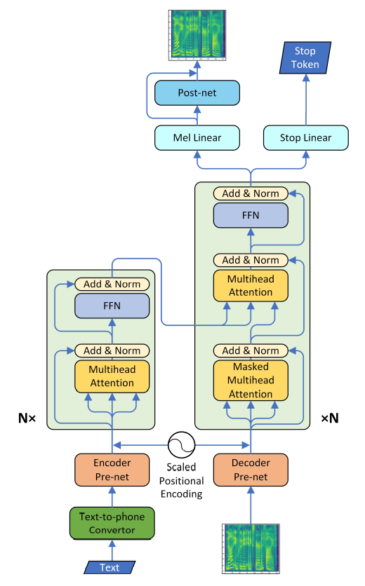
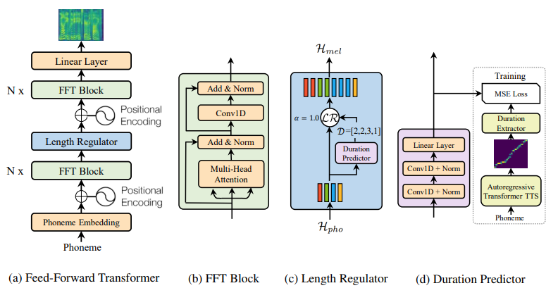
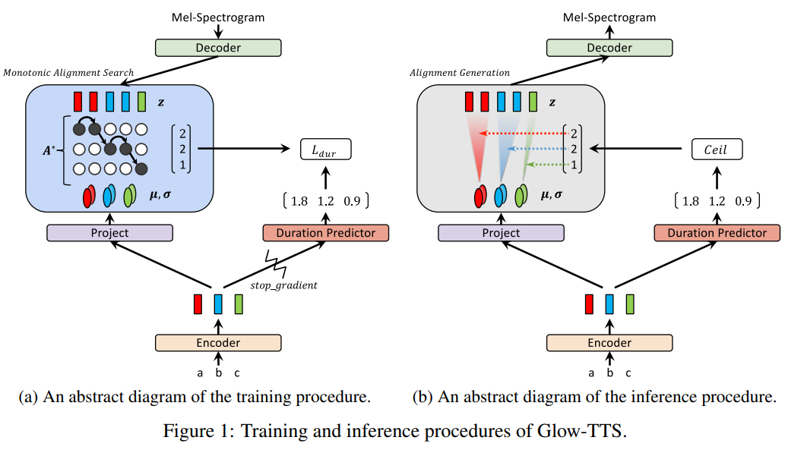
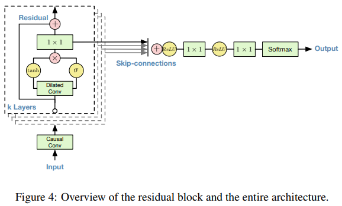
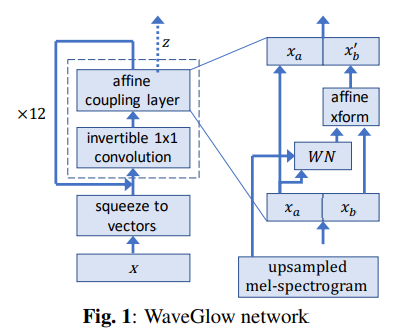
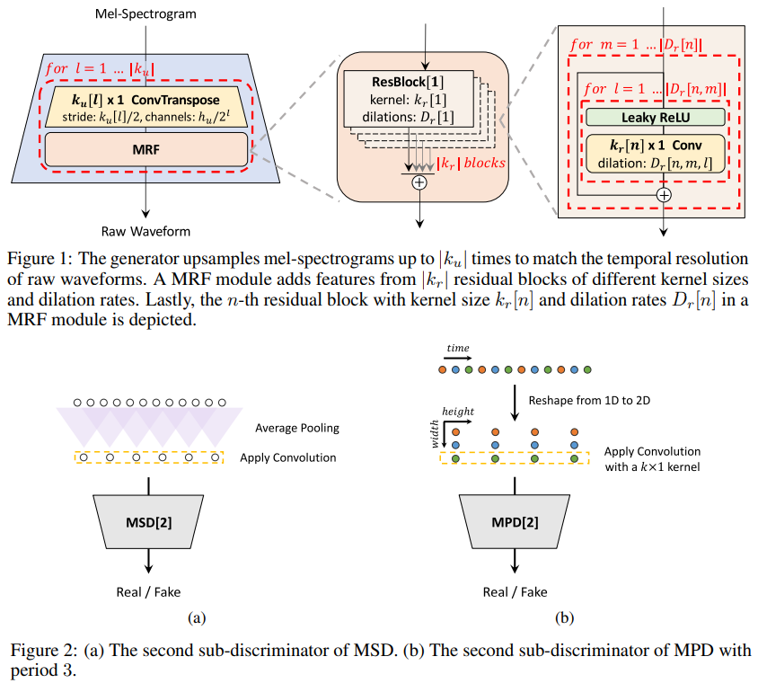
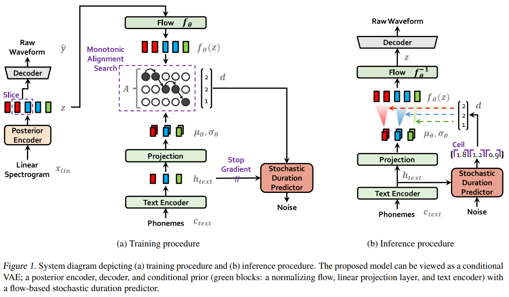

# TTS Model Overview

## Text to Mel

### Tacotron

딥러닝 기반 TTS의 조상격이다. RNN seq2seq + attention으로 이루어진 Autoregressive Model로 Training time과 Inference time이 매우 길다.

[**Detail**](https://ta.wiki.42maru.com/doc/tts-transformer-tts-3EPXURCo0n#h-tacotron)

### Transformer TTS

RNN seq2seq + attention을 transformer로 바꾼 형태이다. 덕분에 Tacotron에 비해 학습시간이 상당히 줄어들었지만 여전히 Inference를 Autoregressive하게 수행하기 때문에 Inference time이 길다.

[**Detail**](https://ta.wiki.42maru.com/doc/tts-transformer-tts-3EPXURCo0n#h-transformer-tts)

### FastSpeech

Autoregressive TTS의 Inference time을 해결한 Parallel TTS Model이다. 잘 훈련된 Autoregressive TTS에서 추출한 pre-trained attention maps를 활용하여 length를 늘려줌으로써 Inference를 병렬적으로 수행할 수 있게 하였다. 하지만 pre-trained well-aligned attention maps이 필요하다는 점과 이의 성능에 크게 좌우된다는 점이 단점이다.

[**Detail**](https://ta.wiki.42maru.com/doc/glow-tts-6gPOdk4KEv#h-fastspeech)

### Glow-TTS

pre-trained well-aligned attention maps이 없이도 Parallel synthesize를 가능하게 한 모델이다. MAS(Monotonic Alignment Search)를 활용하여 Duration label값을 얻어내며 Flow를 활용하여 Generate를 수행한다.

[**Detail**](https://ta.wiki.42maru.com/doc/glow-tts-6gPOdk4KEv)

## Mel to Wave (Vocoder)

### WaveNet

Causal Convolutional Layer와 Dilated Convolutional Layer를 이용하여 Mel-Spectrogram을 Raw Waveform으로 변환한다. 하지만 초창기 Text-to-Mel 모델들과 마찬가지로 Autoregressive하다는 점이 단점이다.

### WaveGlow

Flow를 활용하여 Mel-Spectrogram을 Raw Waveform으로 복원한다. Autoregressive하지 않기 때문에 WaveNet에 비해서 훨씬 빠른 Inference 속도를 가진다.

[**Detail**](https://ta.wiki.42maru.com/doc/waveglow-flow-based-generative-model-detail-lUgGWhut55)

### HiFi-GAN

GAN을 이용하여 학습한다. Discriminator에 MPD(Multi-Period Discriminator)와 MSD(Multi-Scale Discriminator)를 적용하여 이전의 GAN 기반 Vocoder들에 비해 비약적인 성능 증가를 얻었다. Generator의 구조가 단순하여 WaveGlow보다 Inference 속도도 빠르며 MOS 또한 앞선다.

[**Detail**](https://ta.wiki.42maru.com/doc/hifi-gan-ptkWHUOgcA)

## End to End

### VITS

VAE를 이용하여 Glow-TTS와 HiFi-GAN을 한번에 학습할 수 있도록 한 End-to-End 구조를 가진다. 이에 더해 Glow-TTS의 DDP(Deterministic Duration Predictor)를 개선하여 SDP(Stochastic Duration Predictor)를 사용한다. 이는 Text가 주어지면 무조건 같은 Duration만이 나왔던 DDP에 비해 훨씬 자연스러운 음성 합성이 가능하며 Speaker-dependant한 Duration을 학습함으로써 Multi-Speaker setting에서 더 좋은 효과를 보인다. 기존의 Two-stage Model에 비해 좋은 MOS를 보이며 Multi-Speaker setting에서는 더욱 더 그렇다.

[**Detail**](https://ta.wiki.42maru.com/doc/vits-itZ6cbbuWx)
